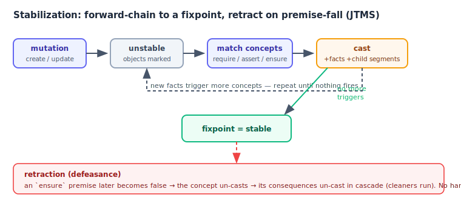
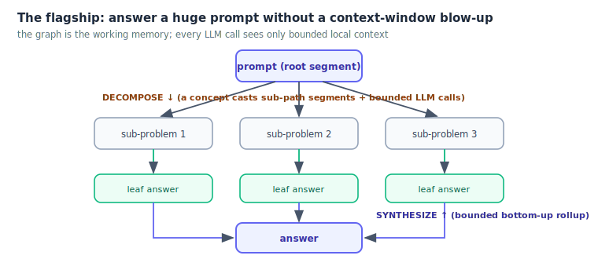
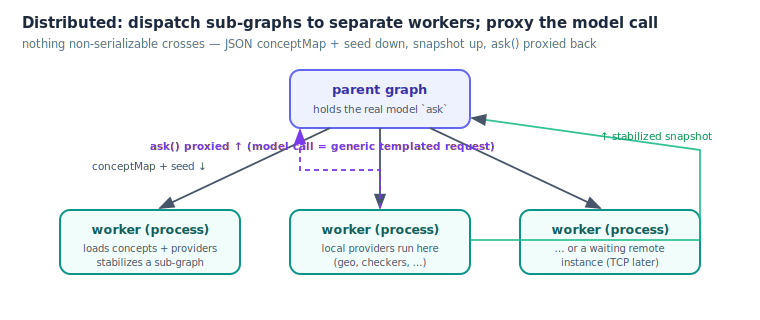

<h1 align="center">skynet-graph</h1>

<p align="center">
A rule-driven knowledge-graph engine — a <b>reasoning substrate</b> where data is
enriched by a grammar of declarative "experts" that cast and un-cast themselves as
the graph stabilizes to a fixpoint.
</p>

> [!WARNING]
> **This is active R&D, not a product.** The engine is solid and heavily tested, but
> the *model* (and especially **the right way to organize concepts is still WIP** —
> see [Concept strategy](#concept-strategy-is-wip)). APIs may move. It ships as a
> **library** to embed, plus a `sg` CLI to run it standalone.

---

## What it is

Graph objects — **nodes**, **segments** (directed edges), documents — carry **typed
facts**. **Concepts** are declarative JSON rules: each *casts* a transformation onto an
object when its preconditions hold (adding facts + child segments, which cascade-trigger
more concepts), and *un-casts* when a premise later falls. A forward-chaining
**stabilization** loop runs to a fixpoint. **Providers** (geo, DB, and a generic
`LLM::complete`) do the effectful work behind the rules.


Underneath, it is a well-known trio wired together: a **forward-chaining production
system** + a **JTMS** (justification-based truth maintenance — reactive, cascading
retraction) + **demand-driven incremental compute** (Adapton/Salsa-style), over a
typed-fact hypergraph. The bet is that this is a good substrate for **long-horizon,
auditable AI reasoning** where coherence-under-change matters.

### Stabilization & retraction — the heart



A mutation marks objects unstable; the loop matches applicable concepts and casts them,
which writes facts that trigger yet more concepts — repeat until nothing fires. When an
`ensure` premise later becomes false, the concept un-casts and its consequences un-cast
in cascade, with no hand-written rollback. State is revisioned, so you also get
`rollbackTo` / `diff` / `fork` / `merge` — "git for reasoning".

## What we hope to do with it

The flagship use is to **answer an enormous prompt without a context-window blow-up**:
the graph is the working memory, and each LLM call sees only bounded local context.



Seed a root segment (the prompt) → **decompose** into sub-problem segments (concepts cast
bounded LLM calls) → stabilize → **synthesize** bottom-up (bounded rollup) → answer. On
top of this the R&D has built: a **canonicalization barrier** (typed facts, not prose, on
dependency edges — so the memo actually hits), **verification** concepts (coherence ≠
truth → checkers + voting), **freshness/TTL** as facts, **declarative AI-authoring**
(`addConcept` + a validator + a CEGIS loop), and **safe live self-modification** (a
meta-concept can patch the rules mid-run, bounded and reversible).

## Run it distributed

Sub-graphs can stabilize in **separate worker processes**, and graph parts can be
dispatched to a pool of waiting workers. Nothing non-serializable crosses the boundary:
a worker rehydrates from a JSON concept-map + seed + its own provider directory, and the
one effect that can't be shipped — a parent-bound model `ask` — is **proxied** back.



## Observability

Every graph owns a leveled logger (`graph.logger`: `error > warn > log > info > verbose`, sinks,
`tail(n, {concept|applyId})`, a bounded ring buffer). Providers log with context via `scope.log` /
`concept.log(scope)` — apply-correlated, so you can pull *the logs a concept produced while applying*
without storing anything on the graph. The `sg` CLI (`run` and `studio`) prints a boot banner and a
live **status bar** (graph state, unstable node/segment counts, main-loop queue, rev, applies) over
scrolling colored logs, with `--log-level` / `--log-mode dashboard|plain` / `--log-file <.jsonl>`;
worker sub-graphs forward their logs to the parent. See [doc/API.md](doc/API.md#logging--diagnostics).

## Quick start

```bash
npm install            # no build step — pure CommonJS, runs natively on Node 18+
npm test               # 141 tests (node:test)

# run a graph standalone from plain folders (live status bar + colored logs on a TTY):
node bin/sg run --concepts ./concepts --builtins --seed ./my-seed.json
node bin/sg run --concepts ./concepts --builtins --log-level verbose --log-file run.jsonl
```

```js
const Graph = require('skynet-graph');

// boot from directories (concepts + providers), stabilize, read facts:
const g = Graph.fromDirs({
  concepts: './concepts',          // a folder of concept-set sub-dirs
  builtins: true,                  // wire the packaged Geo + LLM providers
  seed: { conceptMaps: [ /* nodes, segments, facts */ ] },
  conf: { onStabilize(graph) { console.log(graph.serialize().graph); } }
});

// or dispatch a sub-graph to a separate worker process:
const snapshot = await Graph.spawnGraph({ conceptMap, geo: true, seed });
```

See **[doc/usage.md](doc/usage.md)** for the full guide (concept sets, providers, the CLI,
history/fork/rollback, `patchConcept`, distributed execution).

## Concept strategy is WIP

The engine is the substrate; **how to organize concepts is the open research.** The
current bet is a semantically-meaningful, hierarchical corpus keyed on **human
vocabulary** (`Stuck`, `Supervisor`, …), with the *judgment* delegated to providers (a
better-model supervisor) while the rules handle *orchestration and coherence*. Treat the
shipped `concepts/common/` set as an illustrative example, **not** a recommended ontology.
Authoring-and-maintenance cost is the dominant risk; the validator + CEGIS authoring loop
exist to attack it. This part will change.

## Documentation

| Doc | What |
|---|---|
| [doc/architecture.md](doc/architecture.md) | How it works, in depth + the vision and honest limits |
| [doc/usage.md](doc/usage.md) | Practical guide — embedding, concept sets, providers, CLI, distributed exec |
| [doc/API.md](doc/API.md) | Public API reference (construction, lifecycle, history, fork/merge, patchConcept) |
| [doc/MODELISATION.md](doc/MODELISATION.md) | The model + the prioritized R&D roadmap |
| [doc/doc.md](doc/doc.md) | Concept-schema & DSL specification (reference) |
| [doc/WIP/](doc/WIP/) | The R&D working trail — critical studies, ideation, plans, the live handoff ledger |

## Layout

```
lib/
  graph/        the engine (filesystem-free, portable core) — Graph, objects, tasks, expr
  providers/    packaged effectful providers (geo, llm, canonicalize, verify) — host opt-in
  authoring/    concept loader + validator + CEGIS author + supervise (R&D tooling)
  sg/           the `sg` CLI + trace inspector
  runtime/      distributed sub-graphs (worker_threads + ask-proxy)
  load.js       directory loaders ;  index.js  the package facade (Graph + fromDirs + statics)
concepts/       example concept sets (the `common` set)
examples/       runnable demos (run-basic / run-prompt / run-problem)
bin/sg          CLI entry
```

## License

GNU AGPL v3 — see [LICENSE](./LICENSE).

Copyright 2026 Nathanael Braun &lt;pp9ping@gmail.com&gt;
