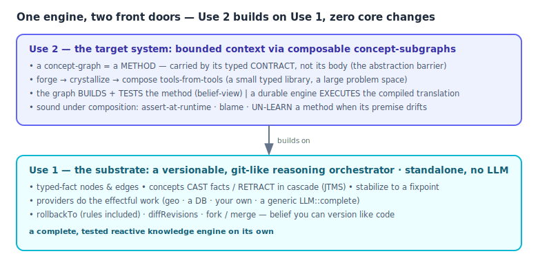
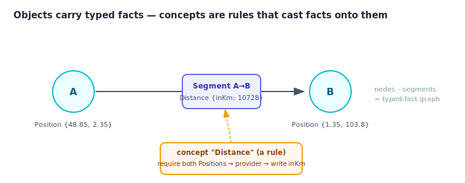

<h1 align="center">skynet-graph</h1>

<p align="center">
A neurosymbolic <b>reasoning graph</b>: typed-fact nodes and edges, enriched by declarative <b>concept</b>
rules that cast facts when their preconditions hold and <b>retract them, cascading, when a premise later
falls</b>. A forward-chaining loop stabilizes the graph to a fixpoint; every revision is snapshotted.
</p>

<p align="center">

</p>

<p align="center"><i>Active R&D · a CommonJS library to embed + an <code>sg</code> CLI · Node 18+, no build step · AGPL-3.0</i></p>

<p align="center">
<a href="https://doi.org/10.5281/zenodo.21032471"></a>
<a href="https://doi.org/10.5281/zenodo.21201877"></a>
</p>

---

## Two ways to use it

The library is **one engine with two front doors**. They share the same core; you can stop at the first.



### Use 1 — the substrate: a *versionable, git-like reasoning orchestrator*

The base library, **standalone, no LLM required**. Model a domain in declarative concept rules (JSONC), wire
deterministic providers (geo, a DB, your own), and let stabilization + retraction keep the belief state coherent
as data changes. Because every stabilization is **revision-snapshotted**, the reasoning itself is
version-controlled — the control you have over *code*, applied to *belief*:

- **`rollbackTo(rev)`** — rewind to any past revision, **concept rules included** (a rolled-back self-edit stays gone).
- **`diffRevisions(a, b)`** — see exactly which beliefs changed between two points; pinpoint where a conclusion went wrong.
- **`fork` / `merge`** — branch a sub-world with its own concept pool and merge back only a snapped interface (assume-guarantee).
- **automatic retraction (JTMS)** — a falsified premise un-casts itself *and its consequences*, in cascade, with no rollback code.

This is a complete, tested capability on its own — a reactive, typed, reversible knowledge engine.
→ **[doc/usage.md](doc/usage.md)** · model **[doc/architecture.md](doc/architecture.md)** · schema **[doc/doc.md](doc/doc.md)** · **[doc/API.md](doc/API.md)**

### Use 2 — the target system: *bounded context via composable concept-subgraphs*

The R&D goal, built **on Use 1**. The thesis: a hard problem blows up an LLM's context window; here a learned
**concept-graph is a method** — a reusable sub-graph you carry by its **typed contract, not its body**, so each
step sees only a bounded neighbourhood. The supervisor **forges** methods, **crystallizes** the recurrent ones
into reusable concept-tools, and **composes tools into bigger tools** — a small typed library covering a large
space of problems, that **un-learns** a method when its premise drifts.

- **A concept-graph = a two-faced method** — outer face: a *single method with a defeasible typed contract* (a black box); inner face: *productions* (for / while / map / fold). Bounded context = carrying the contract, not the body.
- **Build / execute separation** — the **graph builds + tests** the method (the belief-view: decidable, traceable, defeasible); a separate **durable workflow engine executes** a compiled translation (crash-resumable, at scale).
- **Soundness under composition** — methods compose on their typed contracts; a wrong learned contract is **asserted at runtime, blamed, and revised** (the un-learn moat no RAG / skill-library has).

→ **[doc/concept-as-graph.md](doc/concept-as-graph.md)**

---

## What it is, concretely

Nodes and segments (directed edges) carry **typed facts** (enums, ids, numbers, booleans). **Concepts** are
declarative JSON rules: each *casts* facts onto an object when its `require` / `assert` / `ensure` preconditions
hold — and **un-casts, cascading, when an `ensure` premise later falls** (truth maintenance, no hand-written
rollback). A forward-chaining loop **stabilizes** the graph to a fixpoint. **Providers** (geo, a DB, a generic
`LLM::complete`) do the effectful work behind the rules.



The discipline that everything keys on **discrete, typed facts** — never free prose — is load-bearing: it is
what makes the incremental memo hit, and it is the ceiling (**K1**) that bounds Use 2 (only recurrent, typed,
canonicalizable structure amortizes; genuinely novel reasoning stays in the model).

## Measured

**Bounded context (Use 2).** Recovering one code planted in each of N document sections, on a real local model
(`examples/poc/bounded-context.js`):

|                              | recall            | max tokens / call                        |
|------------------------------|-------------------|------------------------------------------|
| **engine**                   | **100 %** (10/10) | **894** — one shard, independent of size |
| baseline (carry-everything)  | 50 % (5/10)       | 4 286 — truncates, can't see past it     |

Per-call context stays **constant** as the problem grows — engine **O(N)** total vs a naive **O(N²)**.

**Amortization + drift (the durable executor, Use 2).** A recurrent typed stream of 24 cases with a mid-stream
policy drift, live local model:

|                          | model calls | wall  | correct on drift |
|--------------------------|------------:|------:|------------------|
| **engine** (typed reuse) | **6**       | 1.3 s | **12/12**        |
| retrieve-nearest + adapt | 24          | 3.2 s | **0/12** (stale) |

The typed-premise key re-derives on drift; surface-similarity retrieval serves a stale answer. Replays survive a
process restart at **0 calls**. *(Both bounds are proven by accounting + a fair baseline, not by overflowing the model.)*

## Quick start

```bash
npm install        # no build step — pure CommonJS, Node 18+
npm test           # 669 tests

node bin/sg run --concepts ./concepts --builtins --seed ./seed.json
```

```js
const Graph = require('skynet-graph');

// Use 1 — boot from folders of concept rules + providers, stabilize, read facts:
const g = Graph.fromDirs({
  concepts: './concepts',
  builtins: true,                                  // wire the packaged geo + LLM providers
  seed: { conceptMaps: [
    { _id: 'a', Node: true, Position: { lat: 48.85, lng: 2.35 } },
    { _id: 'b', Node: true, Position: { lat: 1.35,  lng: 103.8 } },
    { _id: 's', Segment: true, originNode: 'a', targetNode: 'b' },
  ]},
  conf: { onStabilize: g => console.log(g.serialize().graph) },   // s now carries Distance { inKm: 10728 }
});
```

The `LLM::complete` provider is backend-agnostic: inject any async `ask`, or use the bundled client
(`LLM_API=anthropic`, default; `LLM_API=openai` for vLLM / llama.cpp / LM-Studio).

## Docs

**Use 1 — the substrate**

| | |
|---|---|
| [doc/usage.md](doc/usage.md) | Practical guide — concept sets, providers, the CLI, fork / rollback / diff, distributed exec |
| [doc/architecture.md](doc/architecture.md) | How the engine works in depth + the reasoning regimes (opt-in) + the honest limits |
| [doc/API.md](doc/API.md) | Public API reference |
| [doc/doc.md](doc/doc.md) | Concept-schema reference (the rule language) |

**Use 2 — the target system**

| | |
|---|---|
| [doc/concept-as-graph.md](doc/concept-as-graph.md) | The conception: the two-faced method, bounded context by contract, forge / reuse, the durable executor, the un-learn moat, the creative loop (library dispatch → mount → adapt-or-forge), and the **Construct → Method flex programme** (interface-only dispatch · multi-path Construct · bidirectional widen · the ancestry oracle behind the bag-separator Σ_sep gate) |
| [doc/MODELISATION.md](doc/MODELISATION.md) | The full model + R&D roadmap |
| [doc/concept-learning.md](doc/concept-learning.md) | *(optional, shelved)* training concept-populations at the fixpoint |

> **Heads-up.** Active R&D. Use 1 is solid and tested; Use 2 is an advancing conception with measured PoCs (not a
> product). **How best to organize concepts is still open** — treat the shipped `concepts/` sets as illustrative,
> not a recommended ontology. `examples/poc/` holds the runnable problem-solving, durable-executor, and contract demos.

## Papers

The R&D is written up as two companion preprints (Nathanael Braun, 2026), open access on Zenodo,
each in English and French.

**“Defeasible Library Learning: Typed Methods with Runtime Contracts that Un-learn on Drift”** —
the system paper: the *life* of the typed method library (amortize, compose, un-learn on drift).
Reproducibility package: [`artifact/paper-dll/`](artifact/paper-dll/) (run with `npm test`).

**DOI v1: [10.5281/zenodo.21032471](https://doi.org/10.5281/zenodo.21032471)** · **v2 (editorial
revision + harness-generated figures): [10.5281/zenodo.21201723](https://doi.org/10.5281/zenodo.21201723)**

**“Sound online growth of a typed *isa* lattice from noisy LLM extraction, through candidate
elimination made noise-tolerant by a localized-blame admission gate”** — the companion
admission-gate paper: what may *enter* the library, one gate measured at three grains (slot
restriction, *isa* edge, surface alias). Reproducibility package:
[`artifact/paper-lattice/`](artifact/paper-lattice/) — the four experiment campaigns with their
content-addressed durable memos: every table replays bit-for-bit without a GPU.

**DOI: [10.5281/zenodo.21201877](https://doi.org/10.5281/zenodo.21201877)**

```bibtex
@misc{braun2026dll,
  author    = {Braun, Nathanael},
  title     = {Defeasible Library Learning: Typed Methods with Runtime Contracts that Un-learn on Drift},
  year      = {2026},
  publisher = {Zenodo},
  doi       = {10.5281/zenodo.21201723},
  url       = {https://doi.org/10.5281/zenodo.21201723}
}
@misc{braun2026lattice,
  author    = {Braun, Nathanael},
  title     = {Sound online growth of a typed isa lattice from noisy LLM extraction, through candidate elimination made noise-tolerant by a localized-blame admission gate},
  year      = {2026},
  publisher = {Zenodo},
  doi       = {10.5281/zenodo.21201877},
  url       = {https://doi.org/10.5281/zenodo.21201877}
}
```

## License

GNU AGPL-3.0-or-later — see [LICENSE](./LICENSE). © 2026 Nathanael Braun &lt;pp9ping@gmail.com&gt;
