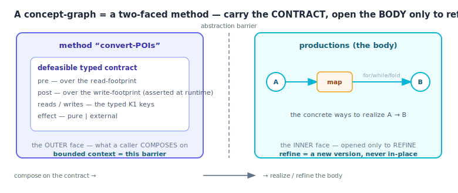
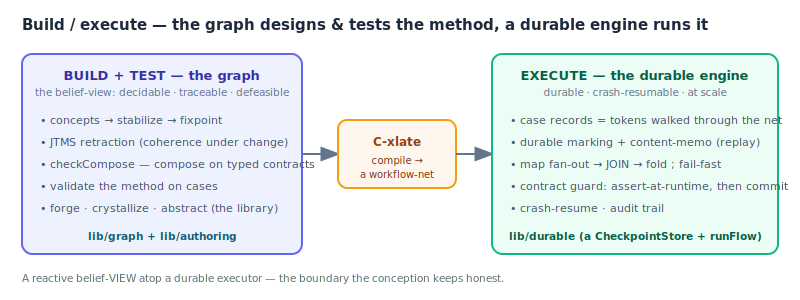

# Concept-as-graph — the target system (Use 2)

> **Audience:** a reader who knows the substrate (Use 1 — a rule-driven graph that stabilizes typed-fact concepts
> to a fixpoint, with JTMS retraction and git-like revisions; see [architecture.md](architecture.md)) and wants
> the high-level goal built on top of it. Everything here is **host-side and ZERO-CORE** — it does not touch
> `lib/graph/`, and it is **additive**: Use 1 needs none of it. The canonical, specialist-confronted design and
> the build LOGs are kept in the project's local R&D notes. This doc is the durable summary.

## 0. The thesis, in one paragraph

A hard problem blows up an LLM's context window. The fix here: a learned **concept-graph is a method** — a
reusable sub-graph that goes from a parameterized state **A** to a parameterized state **B**. To its *user* it is
a single black box with a **typed contract**; to its *author* it is a body of productions. A supervisor goes from
a human formulation to executed cases by **composing / forging / refining** methods, and **the bounded context is
the abstraction barrier** — you carry the *contract*, not the *body*, opening a box only to refine it. Bounded
throughout by **K1**: only recurrent, typed, canonicalizable structure amortizes; genuinely novel reasoning stays
in the model.


## 1. The core object — a two-faced method



A concept-graph is a **two-faced** object (formally an HRG non-terminal — Habel 1992; Drewes-Kreowski-Habel 1997):

- **Outer face — a method with a defeasible typed contract.** A *separation triple* (O'Hearn-Reynolds-Yang 2001):
  a **read-footprint**, a **write-footprint**, a **precondition** over the reads, a **postcondition** over the
  writes, and an **effect** tag. This is the black box a caller composes on. It is **defeasible**: for a *learned*
  method the post is an induced hypothesis — sound on observed cases, possibly wrong on the next — so the contract
  gives **eventual soundness** (assume-at-compose, **assert-at-runtime**, retract-and-blame), not static soundness.
- **Inner face — productions.** The concrete ways to realize A → B: `for` / `while` / `map` / `fold`. The grammar
  over these productions is decidable; their *execution* over runtime-sized data is a fuel-bounded executor
  (Turing-complete, totalized by a step budget). **Two regimes, never one badge.**

### Parameterization — typed named slots
A method is parameterized by other sub-graphs (the loop *body*, a predicate, an accumulator). This is
**higher-order in power, first-order in mechanics**: we never *infer* a body (undecidable — Huet 1975), the engine
*supplies* it by name → substitution. Four invariants keep it decidable and are **checked** by a lint
(`lib/authoring/method.js#lintMethod`): every slot is **(a) named (b) K1-typed (c) bound-by-ref, never solved-for
(d) tentacle-fixed**. The role of a slot — a **param** (typed, part of the contract + memo key) vs a **`coll`**
(the cases iterated over, *excluded* from the key) — is assigned by the method, not intrinsic to a field. Building
blocks: `applySubgraphArg` / `mapTemplate` (apply a sub-graph param, fan a body per element with fresh ids),
`selectCluster` (case-parameterized selection by typed gates).

The frontier itself is **declared, not inferred**, and **reified** as a first-class `FrontierSignature` on the
crystallized schema (`schema.frontier`, a sibling of `schema.contract` — it serializes with the tree and round-trips
through rollback): `{ params:[{name, sort, field, role, requiredFacts}], summaryFacts, appConditions }`. A param's
**`sort ∈ node-ref | method-ref | predicate-ref`** makes an endpoint and a *behavioral* param (a sub-method body, a
stop predicate) the **same** relativize/instantiate hole differing only by `sort` — so the library becomes an algebra
of combinators, dispatch is keyed on the canonical interface, and an untyped behavioral param is rejected at author
time (`lintFrontier`, reusing the lint above). `summaryFacts` (the sound post the abstraction barrier carries) and
`appConditions` (the parent NACs) are the index's discriminants.

## 2. Bounded context = the abstraction barrier

Composing abstract method-faces means **carrying the typed contract, not the body** — so the method library and
the bounded-context engine are *the same mechanism*. This is **by discipline, not automatic**: a bounded
projection at every join (`bounded-merge.js#boundedProject` crosses only the declared separator alphabet Σ_sep,
not the whole child), digests-not-bodies in the supervisor's context, and it is **only as strong as the
contracts** — an incomplete contract forces opening the box, and the bound is gone. The one principled bridge from
human prose into a typed goal (domain-recognize → decompose to start/goal → snap to vocabulary → out-of-vocab
gate) is the system's **soundness boundary** (still open — see §8).

## 3. Forge · reuse · compose — tools-from-tools

The library grows by a **wake/sleep** loop (DreamCoder, Ellis 2021; EBG, Mitchell 1986):

- **WAKE** — the supervisor selects + composes existing methods (path-search / HTN, gated by the typed contracts).
  0 model calls in-vocabulary; +1 bridge call per genuine gap.
- **SLEEP** — real **case traces** → **anti-unification / LGG** (Plotkin 1970; Stitch, Bowers 2023) → a typed
  parameterized method → the library. Admission is **MDL-gated in model-call currency** (`abstraction.evaluate`
  scores model calls, not `applies`), **memo-surface-preserving** (`memo-stability.js`, fail-closed), and
  **non-overlap / priority-ordered** (a distilled method's pre must be disjoint from incumbents, or it creates a
  critical pair that breaks composition-confluence — Plump 1993).
- **The multiplier — tools-from-tools.** The human capacity is to forge a composite tool (a non-terminal that
  isn't a primitive), then compose tools into bigger tools. That recursion lets a **K1-bounded** library punch
  above its ceiling: few typed composites → a huge combinatorial space, no single combination novel.
- **The micro-task floor.** Everything decomposes until each leaf is **either a cached/typed method OR a micro-task
  a small fast LLM does easily**. A *missing* contract is not a failure — drop a small-LLM micro-task in its place.
  So contract coverage is a **cost/coverage gradient**, not a soundness cliff (the runtime assert still guards).

The abstractivation tooling (`abstract.js`): `relativize` / `instantiate` (created ids → holes, frontier refs
bound at the call site), `antiUnify` (the Plotkin LGG soundness check), `emitMethodAsSubgraph` (serialize a
derived sub-graph into a re-mountable parameterized method via the engine-native `Graph#getMutationFromPath` — the
generalization of travel-path mounting). This is what makes cross-problem **structural** transfer sound + non-zero
(it was zero with a flat cache — the absolute ids didn't transfer).

The crystallizer's frontier is **declared, not inferred** (`mine.js#declaredCtx` reads each endpoint off its declared
field rather than scanning the literal-id surface gated on `knownIds`) — fixing the `$`-ref-endpoint and k-ary cases
the scan missed, and reifying the `FrontierSignature` (§1). Declaring re-opens an id-space hazard the `knownIds` scan
closed by construction, so a **soundness gate** refuses any method whose parameterized form would leak a learning id at
replay: an **un-holed** segment endpoint (an endpoint the declaration missed), a **base-prefix phantom** (an external
id colliding with `<base>_…` that `relativize` mis-folds into the base id-space — `hasHoles` cannot see it), or two
endpoints that **collapse** to one hole by value-coincidence. Each refusal was adversarial-review-reproduced; together
they restore *every created segment endpoint is base-derived or a bound, distinct frontier hole*.

## 4. Build / execute — the graph designs the method, a durable engine runs it



- **The graph BUILDS + TESTS the method** (the belief-view: decidable, traceable, defeasible). In-graph
  "execution" is *validation* of the algorithm on cases — concepts advanced by the one stabilization loop.
- **A separate durable WORKFLOW ENGINE EXECUTES** a compiled translation of the validated method (durable,
  crash-resumable, at scale). This is the **belief / durable boundary**: the belief-view is a reactive view over
  case *progress*; durable effects + exactly-once + crash-resume live in the executor underneath.

The durable executor (`lib/durable/`, ZERO-CORE, two backends — in-memory + `node:sqlite`):

| Piece | Role |
|---|---|
| **`checkpoint-store.js`** (Layer A) | the durable **marking** — tokens(runId, recordId, placeId, status, …) walked through a workflow-net; the content-addressed **memo** (key = FactsDigest, the durable sibling of `cache.js`); the createdRefs rollback set. Crash-safety = lease-expiry + `rollbackInflight`, with a **fencing token** (a monotonic persisted leaseId) so a re-claimed lease can't be corrupted by a zombie worker. |
| **`xlate.js`** (C-xlate) | `compileMethod(spec) → net` — a method spec → a workflow-net `{select, task, map, join, fold}`; `validateNet` is a structural lint. |
| **`interpreter.js`** (Layer B) | `runFlow(store, runId, net, …)` drains case records as tokens: typed `select` routing (via `expr.js`), content-memoized `task` micro-tasks, `map` fan-out, the fold-back **JOIN** (the cardinality fan-in), per-case determinism, fuel-bounded termination. |
| **`fold.js`** | the JOIN's monoid algebra (via `semiring.js`) — a commutative monoid fold is **order-independent** (non-deterministic throughput, deterministic belief); `concat`/`merge` are element-index-sorted. |
| **`audit.js`** (C-audit) | read-only inspection — the **derivation forest** per record, the verdict (done/failed/pending), the **blame** traceable to the exact step, run totals. The audit trail no surface-similarity store can give. |

**Soundness in the executor:** a **map ∘ reduce** equals the open-the-box computation; the JOIN is crash-resumable
at every cut; a failed shard **fail-fasts** its group (never a silent partial fold); a per-step **contract guard**
asserts the post *before* commit (a wrong learned post is quarantined, never committed downstream). Measured: a
recurrent 24-case stream costs **6 model calls vs 24** for retrieve-and-adapt, **12/12 correct on a mid-stream
drift vs 0/12** (stale), replaying across a process restart at **0 calls**.

## 5. Soundness under composition — C-contract & the un-learn moat

`lib/authoring/contract.js` is the defeasible separation-triple checker — the "central hole" of the conception,
built behind a specialist confrontation (theory / engine / adversary):

- **Assume at compose-time.** `checkCompose(M1, M2)` checks `post(M1) ⊨ pre(M2)` over every shared fact, by
  **per-key abstract-domain entailment** (interval + finite-domain — Cousot-Cousot 1977; **not** atom-by-atom, so
  `x>3 ∧ x<5 ⊨ x==4` and `x≥5 ⊭ x≥7` are both decided right). It **never false-accepts**: anything out of the
  monadic, ground fragment (disjunction, two-key relations, non-ground footprints, an under-determined post) →
  **`escalate`** (open the box / a micro-LLM), never a silent pass.
- **Assert at runtime.** `assertPost` is the runtime monitor — in the executor (assert-before-commit) and in the
  belief-view (the post realized as an `ensure`). Plus the gates the entailment structurally can't do: **G1**
  frame-completeness (the keys the body *actually touched* ⊆ the declared write), **G2** the effect-tag (an
  `external` post must be confirmed by a ground-truth oracle, not the internal fact), **G3** footprint-cycle
  rejection (Tarjan-SCC — no JTMS oscillation).
- **Retract + blame + revise = the moat.** On a violation the **JTMS retracts** the method (belief-view) or the
  executor **quarantines** the token (blame reason), and `reviseOnBlame` **specializes the precondition** with the
  counterexample's discriminating atom (CEGIS — not method removal). `satisfies` then excludes the failing case
  from selection while still admitting the valid ones. **This is principled UN-learning** — the differentiator no
  prose memory / RAG / skill-library has: a stale skill in a vector store stays retrievable; here the typed
  premise is *in* the belief, so when it falls the derivation retracts and the library narrows the method's claim.

The whole loop — **assume-compose / assert-settle / retract-blame / revise** — spans the build, execute, **and**
belief layers, on the real engine (`examples/poc/contract-compose.js`, `durable-contract.js`, `contract-unlearn.js`).

## 6. The supervisor control loop & the library

`authoring/master-loop.js` — a standing controller that climbs a **value-of-computation ladder** per problem and
takes the first arm that resolves at acceptable cost:

```
  MATCH    exact cache hit on the K1 signature              → 0 model calls
  RETRIEVE fuzzy recall → typed VERIFY                      → 0 (full) or partial cost
  FORGE    fork + LLM + crystallize into the library        → full cost; warms the library
  ESCALATE a method deopted K times → always re-forge / LLM → full cost, never cached (the floor)
```

| Module | Role |
|---|---|
| **`recall.js`** | FUZZY-RECALL → TYPED-VERIFY. Recall orders (embedding/similarity); verify admits (`full`/`partial`/`reject`). A high-similarity but structurally-different method is **rejected**, never falsely replayed — *fuzziness in recall, exactness in truth*. |
| **`mount.js`** | the 3-regime MOUNT policy: **instance** (fork-per-case, the safe default) / **inline** (`addConcept`, read-only frontier only) / **frozen** (warm-cache replay + deopt-guard) / **escalate** (the K1 floor), with hysteresis + a well-founded deopt-rank (termination). |
| **`../providers/cache.js`** | the derivation cache — content-addressed memo over a provider, keyed on the canonical justification of a cast (the fast/episodic half of CLS; the durable sibling lives in the executor's memo). |
| **`crystallize.js` · `mine.js` · `abstraction.js` · `memo-stability.js`** | FORGE → library (§3): mine producer→consumer chains, compose, MDL-gate, install fail-closed. |
| **`reaggregate.js`** | defeasible RE-AGGREGATION — a cleaner-on-retract un-pushes a contribution + re-folds, so a derived *summary* (not just the belief) updates on drift. |
| **`library.js`** | the **O(1) dispatch index** (consume `libraryKey`): given a target `FrontierSignature` (the abstract mechanism), a bucket lookup → refine by application-conditions over the call-site → **ranked** candidates (weighted). A *lookup*, **never a corpus search** (HRG-parsing is NP-complete — Lange-Welzl 1987). This is the structuring↔concept-DLL juncture. |
| **`combinator.js`** | the dispatch→**MOUNT** bridge: a higher-order concept fills its behavioral hole with a dispatched fragment via require-resolution + `applySubgraphArg` — so a concept **reuses another's** learned method when their signatures match (recombination at 0 calls). The re-fire guard is a distinct durable fact, **not** the self-flag (the `_name` marker uncasts on de-apply). |
| **`adapt.js`** | `adaptOrForge` — the retrieve-or-forge drive *over* the dispatch: RETRIEVE (a template for this signature = a hit, 0 calls) / FORGE-or-ADAPT (the model builds it, reusing dispatched neighbours = structural reuse + content forge) / VERIFIER-GATE (a sound contract) / index-back (**amortise**: the next encounter hits). The structure-mapping realization of the ladder above. |

**The two grammars are one, in two levels.** The supervisor's abstract mechanism is the *structuring* grammar (abstract
productions with non-terminal holes); the library is the *concept-DLL* grammar (learned terminals). They are not rivals
to reconcile (that implies a costly translator) but **two levels of one graph-grammar**; their juncture is a
**K1-canonical interface alphabet** — the `FrontierSignature` + app-conditions, a *snapped separator* (the impedance is
at the entrance: a prose scaffold needs C0; a typed scaffold couples cleanly). Formally this is **structure-mapping**
(Gentner 1983: the abstract mechanism = the relational structure, library methods = source domains, a dispatch = the
analogy) and **conceptual blending** (`antiUnify` = generalize-and-rebind). The result is **combinational + exploratory
creativity** (Boden 1990) over a learned grammar — *verifier-gated search*, with the genuinely-novel primitive deferred
to the model (K1) and a slow *transformational* loop alongside (crystallization invents new non-terminals).

**Persistence & portability** (`store.js` · `method-pack.js`): the warm library survives a restart (a write-through
`store` re-loads + replays at 0 calls) and **ships between deployments** as a `.sgc` **method package** (the sibling
of the authored-grammar `corpus-pack`). The version gate covers **both** replay paths (a stale-version method never
replays verbatim); the typed verify re-gates on the receiver, so a structurally-foreign method is rejected.

## 7. The two decidability regimes (keep them honest)

1. **A decidable method GRAMMAR** above (composition / parameterization — first-order named slots, a well-founded
   mount-rank). **2. A fuel-bounded EXECUTOR** at the case layer (while / fold over runtime-sized data =
   Turing-complete, totalized by a step budget; exhaustion is a *cutoff*, not a fixpoint). Determinism of
   *triggering* gives **confluence**, not termination, not decidability of plan-existence (recursive-HTN
   plan-existence is undecidable — Erol-Hendler-Nau 1996). Never one badge for both regimes.

## 8. Status & honest lines

**Built + measured (2026-07-01, ZERO-CORE throughout, 759 tests):** the middle spine (Bricks 1–3:
applySubgraphArg / lintMethod / selectCluster), the abstractivation slice (F6), the durable executor (Layer A +
B + the fold-back JOIN + fail-fast / fold-survivors / nested-fold + C-fail retry/escalate + audit), C-xlate,
C-contract (the checker · the §11.6 composition-soundness probe · the executor guard · the belief-view un-learn loop
· the **standing autonomous** revise loop, `relearn.js`), **C0 prose-intake** (the soundness front-door, `intake.js`),
the crystallization **structural miner** + the **declared-frontier** crystallizer with its reified `FrontierSignature`
(§1, §3), the supervisor loop + recall / mount / cache / reaggregate, and the **creative loop** (library **dispatch** +
combinator **mount** + `adaptOrForge`, §6), persistence + `.sgc` packs. The §11 stream gate **passes** on a live local
model (call-elision + wall-clock + durability + drift-soundness).

**The Construct → Method flex programme (built 2026-06-30, ZERO-CORE; each gated by an adversarial soundness review):**
the K1 ceiling read as a *gradient* — a loose, multi-path `Construct` crystallizes its **recurrent + typed**
fraction into an exact `Method`. **(§6.2) interface-only dispatch** — a loosened recall reaches a structurally-matching
in-bucket donor that the exact gate dropped, re-forges the differing content, and verifies the *adapted* method's own
contract (never replays the donor). **(§6.1) multi-path `Construct`** — a competition (propose N decompositions → pareto
`Select`) whose **clean-dominance survivor crystallizes** (a tie → flat-skip, a winner that flips → `signatureDetermined`
refuses): residency = isolated forks (the co-resident OR-forest = ATMS multi-context = FILED, justified — its one
case is the non-local frontier G1 already forbids). **(§6.4) the bidirectional patch** — the symmetric **widen**
(S-boundary climb) of the built narrow un-learn loop: ≥k verified positives generalise a method's pre to the LGG
(`widenOnVerified`, additive enum-union, methodId-gated), `recordWiden` demotes FROZEN→INSTANCE before the gate-relax,
and a reactive `Widen` loop (`widen.js`) drives it autonomously. **(§6.3) the ancestry oracle** — behind the now-sound
**E7/Σ_sep gate** (the bag-intersection separator horizon, not the lossy scalar treewidth / size-1 articulation cuts):
**(a)** monotone-safe digest-key enlargement gated by `separatorGate`; **(b)** content→param **promotion** — a leaf that
is a function of a below-horizon ancestor (`value(f)=N(s).g`, GOLEM ij-determinacy) is rebound to it, gated by a
**mandatory held-out strict-`===`** + an **exact relational post** (not the over-approximating band — the silent-
unsoundness spine the review found). Measured live (qwen3-8b): a real decomposition's structured-echo content promotes
(exact post), its novel content forges — the canon barrier read on the ancestry axis.

**The §6.1 / §6.2 deeper live measures (2026-07-01, qwen3-8b temp 0, deterministic).** **§6.2** — a real structural
forge reusing a surfaced donor skeleton generates **5.68× fewer completion tokens** (125→22) than a fresh whole-method
forge, the §6.2 gate holding (the "token win, not a call-count win" the layer promised). **§6.1** — the SELECTION-K1
fraction on real output (hardened by an adversarial review, verdict SOUND-WITH-CORRECTION): **winner-determinacy 2/3,
crystallizable 1/3** at Σ={taskClass} — the two axes kept separate (a determined-but-Pareto-tied winner is soundly
refused by the tie-gate, not a latency; an undetermined split can be a canon-granularity artefact). The fraction is a
property of the (workload, Σ) pair, and Regime-1 dispatch is *defeasible* (leans on the un-learn loop) — the honest
ceiling exhibited, not a defended scalar.

**Bounded subgraph extraction + embedded inference (2026-07-01, ZERO-CORE).** The fork-perf measure settled the scale
question: the fork deep-copy is O(working-graph) and **library-independent** (the conceptMap is passed by reference), so
forks don't dominate from a distilled mass; the real lever is the **multi-process ship** — `extractSubgraph`/`mergeSlice`
(`lib/authoring/extract.js`) = program slicing at the fork boundary (a k-hop ball + a **frozen frontier** = `contract.js`
G1 + an ATMS environment + a single-writer disjoint merge), ship-able to a worker process (27–245× cheaper than the whole
graph, cross-process proven). And the library can now run its **small functional model(s) in-process** —
`makeLocalAsk` (`lib/providers/llm-local.js`, node-llama-cpp/GGUF, proven on an RTX 5090), whose **grammar-constrained
decoding** enforces the canonicalization barrier at the *decode* level (a small model *cannot* emit a malformed typed
fact) — the self-contained-appliance endpoint and the signature-stability lever.

**Signature-stability screen (2026-07-01, ZERO-CORE) — the roadmap's 2-phase-minimum make-or-break, run + a decisive
finding.** *Does constrained decoding keep a small model's typed signature paraphrase-stable?* — instrumented live behind
an adversarial confront (formal + SOTA). Built the tracked paraphrase-stability profiler (`lib/authoring/emittability.js`,
the roadmap's Grammar-P1 instrument): unbiased-Simpson within-task collision + the pooled **V-measure homogeneity** that
catches the correctness-fatal COLLISION mode a naive within-task metric misses + a Fleiss-κ **vacuousness alarm** +
per-field marginals + a format-netting cross-arm compare. Four arms on vibethinker-3b (temp 0, deterministic) **INVERT the
roadmap's convergence #3**: grammar-constrained decoding is a signature-stability **hazard**, not its enabler. Format
closure is obtainable from a strong closed-vocab PROMPT alone (typedRate 1.00 on the 3B); once format is already closed the
grammar **distorts** the semantic choice (Park et al. 2024, Grammar-Aligned Decoding — κ 0.61 grammar vs 0.92 prompt-only,
flipping `severity`/`bugClass` across paraphrases the prompt-only arm keeps stable). ⇒ constrained decoding is **demoted to
format INSURANCE** (for unreliable prompt-compliance) with a measured distortion cost; the signature-stability lever is the
strong prompt + the (unchanged) Σ_sep / canon-vocabulary keystone. The screen passes on *stability IS achievable on a small
model* — via the prompt. The confront earned its keep: the naive arm-pair (grammar-vs-weak-free-text) reads "huge win" and
would have shipped "constrained decoding fixes stability"; the mechanism-isolating arm showed the win is pure format and the
semantics are hurt.

**⇒ The target-system ROADMAP** (`doc/WIP/studies/2026-07-01-composed-roadmap.md`) composes five grounded strategy axes
(compositional distillation · grammar/vocabulary design · small-LLM controller · evaluation · embedded inference) into a
staged plan whose spine is: one shared front gate (*does the real workload compose/recur?* — currently it does NOT, per
`hotspot.js`), the **interface-alphabet registry (Σ_sep) as keystone**, and **constrained decoding** as the cross-axis
enabler. The 2-phase minimum: the controller request/response bridge + the compose-gate + signature-stability-via-
constrained-decoding — because everything downstream is worthless if paraphrases fragment the key.

**STAGE-0 compositional gate (2026-07-01, ZERO-CORE) — the compress.js decision made honest.** The composed roadmap's ONE
shared front kill-gate (*does the workload COMPOSE?*) now has a cheap instrument: `lib/authoring/compose-hotspot.js`, the
depth-≥2 analog of `hotspot.js`. RE-PAIR over dispatch sequences → {compose-candidate · **already-flat-covered** (the
off-ramp: a composite spanning only ONE whole-task, which whole-task memo already serves) · unstable · too-rare} + a Minton
call-utility (`savedCalls ≈ distinctTasks−1`). The load-bearing condition (self-confronted): a persisted depth-≥2 method
pays ONLY when a sub-composite recurs across **distinct** whole-tasks. Result: it finds + quantifies shared sub-composites
(incl. a depth-3 via the RE-PAIR hierarchy) on a compositional workload, but on the EXISTING whole-task-chain workloads
returns **no candidate** → sharpening `hotspot.js`'s depth-1 finding: the current workloads compose neither at depth 1 nor
cross-task. The depth-≥2 hold/replay substrate already exists (`adapt.js#blendMethods`→`indexMethod`→`combinator.js#dispatchConcept`;
`synthesizeByBlend` to depth-3 at 0 calls) — so `compress.js` is now the ONLY missing half, and it is GATED behind this
detector run on a REAL compositional trace.

**Still genuinely open (gated):** the **compositional distillation ENGINE** `compress.js` (the corpus-wide DreamCoder/Stitch
abstraction sleep — the genuinely-missing operator that mints a recurring composite into one persisted method; **now gated
behind `compose-hotspot.js` returning a candidate on a real trace**, no longer a blind build); a **real-model streaming
`adaptOrForge`** measurement (calls × correct-under-drift); §6.3(b)
**mapping-φ** promotion; the **EAGER in-core `SubGraph`/`ZoomSegment` object** (FILED, justified). Whole-graph COW is
**deprioritized** (the deep-copy is cheap + library-independent — the multi-process extraction is the built lever instead).

**Hold these lines.** *Eventual*, not static, soundness for learned methods — via a load-bearing runtime monitor
over a **sound-but-incomplete** compose gate (deciding fragment-membership is undecidable — Rice; so "compose
without opening the box" is never an unconditional claim). A reactive **belief-view atop a durable executor** (not
itself one). Bounded by **K1**: amortization of recurrent typed methods, **not** capability extension — the win is
LLM-call/token **elision + drift-robustness + auditability**, not CPU speed. Bounded context is by **discipline**
(the fold-digest window), as strong as the contracts.

## 9. Formal foundations — the reference frame (a super-seed)

Not a glossary: a **generative composite of ~9 formal systems**, each seeding one layer of the design, cross-checked by
two adversarial SOTA passes (2026-07-01). Every piece skynet already has maps to a named formal object; exactly ONE
operator is missing and exactly ONE thing is open research. Use this as the compass — it says *how* to build each layer;
the STAGE-0 gate (§8, `compose-hotspot`) says *when* it is warranted.

| layer | formal home | status in skynet |
|---|---|---|
| **engine** (cast→fixpoint, synchronized phases, membrane=frontier) | **P-system / membrane computing** (Păun 1998/2000) — a *confluent/deterministic* one (so the non-deterministic power results do NOT transfer) | built (`Graph`, taskflow, `extractSubgraph`) |
| **representation** (slot = typed sub-path, FrontierSignature = interface) | **hyperedge-replacement grammar (HRG)** — slot = nonterminal hyperedge, frontier = tentacles, `blendMethods` = a production, `synthesizeByBlend` = μ-descent generation | **already an HRG, un-named** (`abstract.js`, `adapt.js`, `combinator.js`) |
| **pairwise detector** | **anti-unification / Plotkin LGG** — 1st-order = **unique ∧ polynomial** (the crux; leaving 1st order forfeits both) | built (`abstract.js#antiUnify`) |
| **the MISSING operator** (`compress.js`) | **corpus-MDL compression sleep** — Stitch (Bowers et al. POPL 2023) / SUBDUE (Cook & Holder JAIR 1994) branch-and-bound over `antiUnify` (the *structural* generalization of RE-PAIR, which is the 1-D special case) | **to build, gated on the STAGE-0 structural detector** |
| **forge** (under objective pressure) | **type-directed synthesis** — SyGuS (Alur 2013), Synquid (Polikarpova 2016), Myth (2015) — the **C-contract IS the refinement-type spec** | built (`adaptOrForge`, `crystallizeStructural`) |
| **higher-order contract** (loop-in-loop) | parametric-in-argument-contract skeleton — **higher-order frame rule** (Birkedal 2005 / Iris), **effect polymorphism** (Lucassen & Gifford 1988), refinement-on-arrow | **SOUND (static) · CONSERVATIVE**; adopt verbatim |
| **defeasible revision** (collapse→blame→re-qualify/forge) | **blame calculus** (Wadler-Findler 2009) + **higher-order contracts** (Findler-Felleisen 2002) + **CEGIS** (Solar-Lezama) | **OPEN — the genuine research contribution** (retractable argument-contract, uncovered by classical results) |
| **retention / library selection** | **Chemical Organization Theory** (Dittrich & Speroni 2007) on AlChemy (Fontana-Buss 1994) — crystallize iff **closed ∧ self-maintaining**; closure ≈ the typed barrier; the organization **lattice** ≈ defeasance/drift | to wire onto `crystallize`/`method-pack` |
| **LLM role** | **propose + name + document** (LILO/AutoDoc, ICLR 2024) — never own compression or soundness | to discipline |
| **diagnostic** | **canalization / attractors** (Kauffman 1969) — typed-fact discipline = canalization ⇒ drift-robustness; `divergent` = limit cycle (caveat: 2025 coherence-gap — a crystallized method may be *less* robust than re-deriving) | lens (metrics) |
| **vocabulary topology** (granularity / degeneracy / flexibility) | **Information Bottleneck** (Zaslavsky et al. 2018 — a frontier/diagnostic, NOT a generator) · granularity = **MDL-compressivity** of the solved-trace corpus (Stitch) · **Locatello 2019** impossibility (the typed-canon bias must be injected) · degeneracy-at-search not retained (Edelman-Gally; babble e-graph) · **CLS** core=slow-protected not frozen (McClelland 1995) · learn-the-form (Kemp-Tenenbaum 2008) via Kirby compress↔expressify | the STAGE-1 Σ_sep registry, ELEVATED (see the graft G-1) |

**The five decisions it seeds.** (1) `compress.js` = **first-order antiUnify + a Stitch/SUBDUE MDL sleep**, NOT RE-PAIR;
the flat `compose-hotspot` is a cheap 1-D SCREEN, the real detector is structural. (2) The higher-order contract = the
**parametric skeleton (adopt verbatim) + defeasible revision** (the collapse/blame/CEGIS-supervisor loop) — *that* is the
novelty; do NOT claim to solve precise higher-order inference (nobody has). (3) **Retention = a COT organization gate**
(closed ∧ self-maintaining) on crystallization. (4) The **LLM proposes + names/documents**, never owns compression or
correctness. (5) The **vocabulary is a multi-granular, redundant, flexible topology** (COT organizations = "languages";
untranslatables = organization-relative concepts; multiple co-resident organizations = the re-opened membrane multi-context).

**The guardrails (hold these).** • **Stay first-order** at the detector/contract level — E-AU / higher-order-AU /
full-graph RLGG forfeit uniqueness, polynomial cost, AND contract decidability (graph-motif detection is NP-hard). Put
redundancy/equivalence (e-graphs) at the *vocabulary* level, first-order at the *compression/contract* level. • **The
frame is a MAP, not a green light** — its seductive coherence must not override the STAGE-0 gate: on the current workloads
nothing composes, so `compress.js` stays FILED until a real trace shows candidates. • **No spontaneous emergence** — these
frameworks are selectionless at the object level; skynet is goal-directed: it **forges under objective pressure + retains
per a COT closure test**, purposive construction filtered by a self-closing stability criterion. • **Soundness ⊕
flexibility** — a FROZEN typed core (signature stability) + a FLEXIBLE, redundant, multi-granular interior (the learning
substrate); the granularity split between them is the load-bearing design variable.
