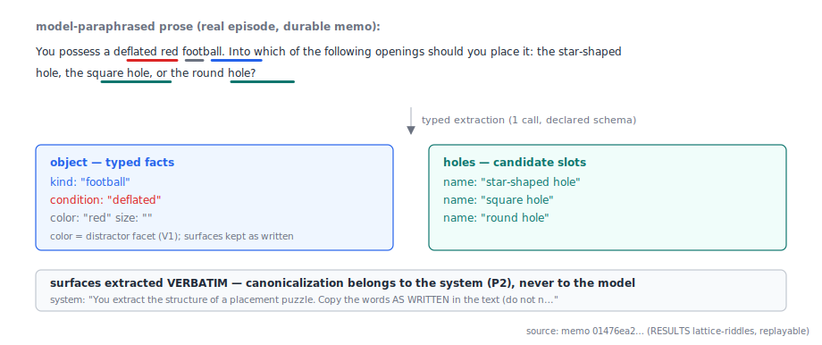
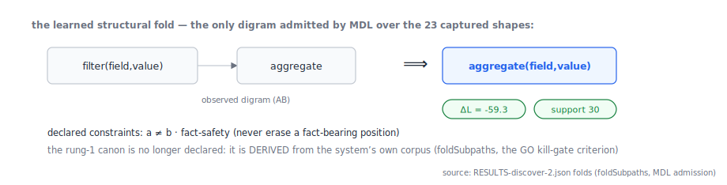
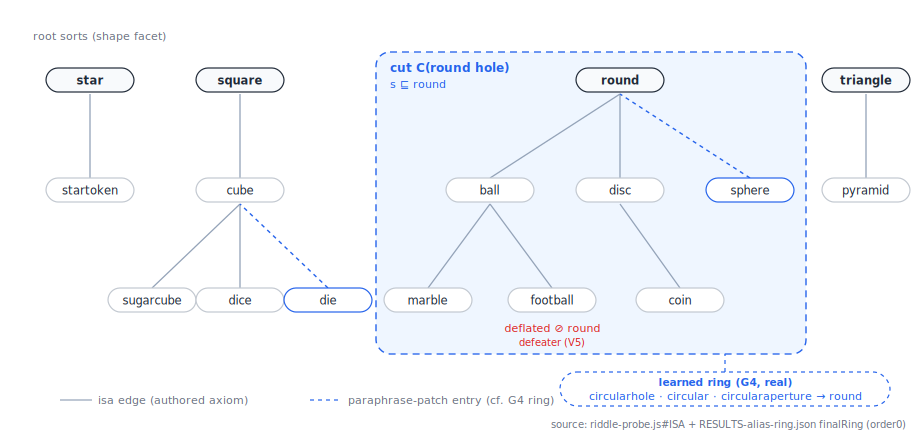
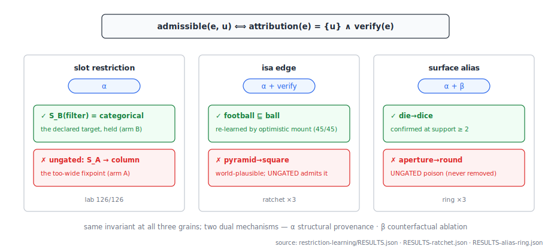
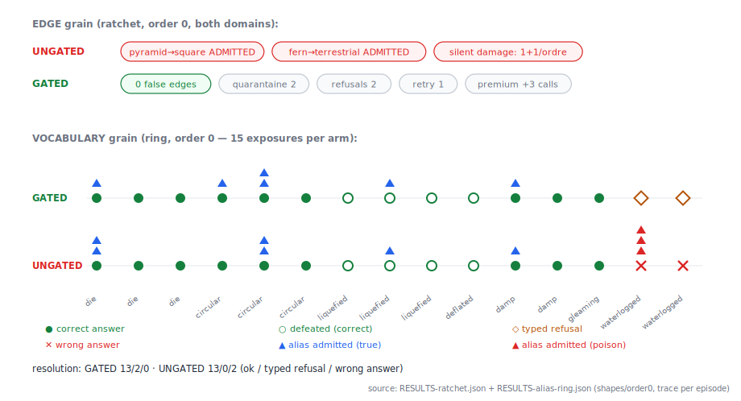
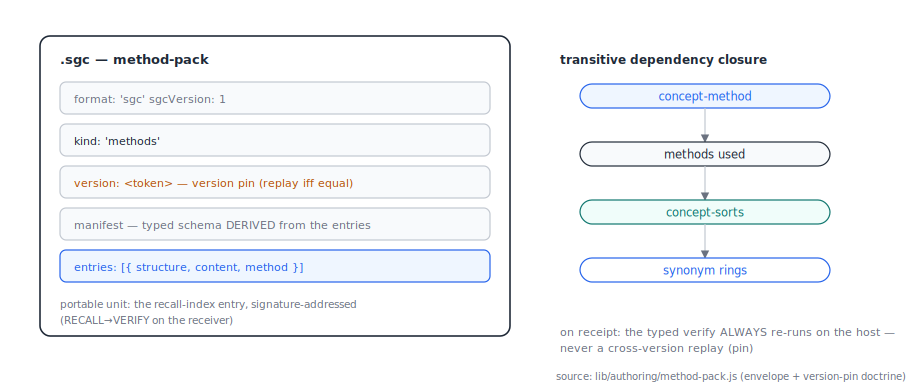

# Sound online growth of a typed *isa* lattice from noisy LLM extraction, through candidate elimination made noise-tolerant by a localized-blame admission gate

**Nathanael Braun** — independent researcher

> **Draft v0.3 (EN) — 2026-07-04. This English version is realigned on the FRENCH MASTER TEXT
> (`.fr.md`, same base name), which carries the owner's correction passes.** Do not circulate before
> deposit. Figures F1–F8 are generated from the recorded experimental artifacts (Appendix A). The
> companion code and replayable traces accompany the deposit.

---

## Abstract

A language model knows a great deal and asserts it without restraint; a knowledge base asserts only
what it can defend, but everything must be written into it by hand. Systems that couple the two
currently choose between two failure modes. Either the symbolic side never learns — every sort,
every synonym remains an authoring cost. Or the model writes into the base itself, and the base
gradually absorbs its *world-plausibility*: plausible-sounding facts that nothing supports. The
textbook case of this second mode is NELL, the longest-running self-growing knowledge-base
experiment: years of autonomous growth, plausible-but-false facts admitted with no correction
channel, and a drift that neither co-training nor human checks ever stopped.

This article presents the third option, and measures it. The host structure is a **typed *isa*
lattice**: a hierarchy of sorts ("a marble is a ball, a ball is a round thing") on which tasks
declare their requirements. Three kinds of units must be able to enter it along the way: a **slot
restriction** (which sorts a task role accepts), an ***isa* edge** (a parent-child link between
sorts), and a **surface alias** (a synonym of a declared vocabulary word). The need is precise: grow
these three units online, from the noisy extractions of a small local language model, without
absorbing the model's ontology. The instrument is a single admission rule: **a piece of evidence is
admitted for a unit only if its success or failure is uniquely attributable to that unit — by
structural provenance or by counterfactual ablation — and verifies against the declared oracle.**
One gate, three grains. The theoretical justification takes three steps. One: candidate elimination,
the classical algorithm for learning such restrictions, is provably intolerant to noise — a single
false negative expels the right answer forever. Two: the noise of an LLM pipeline is **incompetence
noise** — one-sided (it only manufactures false failures) and competence-correlated (rare cases fail
systematically) — precisely the kind that statistical noise models do not cover. Three: localizing
blame replaces the noisy query over a whole conjunction with a clean query over the single
responsible literal; the residual noise on admitted negatives then reduces to the confounded-episode
case — bounded by a defeasible two-tier envelope, recoverable by retraction, never zero.

The evidence follows three levels. In a deterministic laboratory (no model, exact pre-registered
expectations), the gate halves over-generalization without ever refusing a good task, while the
control that admits every failure self-seals on rare cases. Under live conditions, with an embedded
27-billion-parameter model as the sole organ of world knowledge: 300/300 tasks against 245/300 for
the model alone, the model's deficit concentrated exactly where one must refuse, retract a default,
or follow the ontology in depth; and zero false edges, zero false aliases admitted on permuted
streams, where the ungated variant absorbs the model's ontology and then answers wrongly with no
correction channel left — NELL's drift, reproduced in miniature, then blocked. On the third-party
benchmark DeFAb, the typed path scores 34/35 (30/35 of them with no model call at all) against 30/35
for the direct model, and every loss of the direct model is an over-general cut — the error class
the gate forbids by construction. A reproduction across nine local models (four families, three
quantizations and two architectures) shows that the decider, the gate and the fail-closed refusal
all generalize; only coverage tracks extraction capability. There remains the economics: what
retrieval pipelines re-pay in context on every call, this system compiles once into a typed,
versioned library, auditable to the episode — knowledge accumulates outside the context window, and
it is the gate that makes this accumulation safe. None of the bricks is new; the composite is: an
LLM that extracts, a lattice that decides, and a gate that lets the lattice grow without drifting.

**Keywords:** selectional restrictions; version spaces; candidate elimination; *isa* lattice;
defeasible reasoning; knowledge-base drift; blame attribution; neurosymbolic systems; online
learning; LLM extraction.

---

## 1. Introduction

### 1.1 Who decides, and who learns

Large language models are excellent organs of world knowledge and rather poor arbiters of that
knowledge. The example that will serve throughout this article is a placement riddle: a prose
instruction describes an object ("the yellow ball") and a set of typed holes (round, square, star);
the task is to say which hole the object goes into — or to refuse, if none accepts it. Ask a good
model to place a ball: it answers correctly almost every time. Ask it to place a *pyramid* when none
of the offered holes accepts it: the same model produces a fluent, plausible, wrong answer — a
canonical pyramid does indeed have a square base, and world-plausibility is precisely what the model
optimizes. Turning on *reasoning* (the thinking budget of recent models, which we will write rb)
does not repair this case; it makes it more eloquent.

The failure is not ignorance. It is that the model follows the world it has read, not the
specification it was given — with and without reasoning (we measure this in §6.3).

The classical remedy is to let a symbolic structure decide: extract typed facts from the prose,
match them deterministically against a declared ontology, and refuse in a typed way when nothing
matches. This division of labor is old and sound, and recent neurosymbolic pipelines implement it
well (§2). It does, however, carry a structural cost that its own practitioners name explicitly; the
knowledge base is a *manual bottleneck*. This "manual bottleneck" means that every sort, every
subsumption edge, every surface synonym must be written by hand. The obvious, naive escape — letting
the model write the missing edges itself — is one of the great documented catastrophes of the field:
NELL. NELL was the longest-running self-growing knowledge-base experiment, and it drifted despite
co-training and periodic human correction, because nothing in its admission path could tell a fact
the world supports from a fact the model finds plausible.

This article is about the admission path. We keep the division of labor (the model extracts, the
lattice decides) and add the third capability this division seemed to forbid: **the lattice grows
online, from the model's noisy proposals, without absorbing the model's ontology.** The instrument
is thus a single admission rule, applied at three grains of the structure.

### 1.2 The claim

> A defeasible generalization drawn from an LLM episode — a slot restriction, an *isa* edge, or a
> surface alias — is admitted **if and only if** its success or failure is *uniquely attributable*
> to that single unit (by structural provenance or by counterfactual ablation) **and** verifies
> against the declared oracle.

We call this rule the **localized-attribution admission gate**. The theoretical content of the
article is the following chain, developed in §4 and priced in §5:

1. Our hypothesis class consists of conjunctions of cuts over a finite, fixed *isa* lattice — a
   *slot* is a typed role of a task schema (the object to place, the receiving hole); a *cut* is
   the set of sorts a slot admits, downward-closed in the lattice. Since this class has finite
   elasticity, it is therefore identifiable in the limit from positive examples alone. Thus,
   negative evidence is *not* a logical necessity; it buys convergence speed and control of the
   generalization frontier. Note, moreover, that this guarantee covers *cut selection* within a
   given lattice; the *growth* of the lattice itself belongs to a different regime, which we will
   describe in §4.2.
2. The negative evidence an LLM pipeline actually produces is noisy in the worst way: one-sided (a
   valid sort fails because the model was incompetent on it, not because it is wrong) and
   competence-correlated (rare, hard sorts fail systematically). This is not random classification
   noise; statistical tolerance results do not transfer, and classical candidate elimination is
   provably fragile to a single error of this kind.
3. Localization repairs this by construction rather than statistically: an episode failure is
   therefore admitted as a negative for slot *i* only when the execution contract localizes the
   violated atom on *i*. Thus one can convert a noisy membership query over the whole conjunction
   into a clean query over the responsible literal; the noise on *admitted* negatives then stops
   being the model's incompetence rate and becomes the false-admit rate of the admission predicate
   itself — what §4.5 names the *episode confound*, bounds with a two-tier envelope, and makes
   recoverable by retraction. Let us note it right away: this rate is not zero, and no "noise-free
   case" rate is restored in the PAC sense (§4.4 states exactly what is bought).
4. The same rule, applied symmetrically, governs:
   - positive credit (a success credits only the slots whose atoms were actually exercised);
   - *isa*-edge admission (an edge proposed by the model is *optimistically mounted* — that is,
     tried immediately rather than held pending proof —, verified, and credited only on episodes
     whose verdict cannot be due to anything else);
   - and surface-alias admission (an out-of-vocabulary word joins a synonym *ring* — that is, the
     alias ring attached to a sort's key — only if it is load-bearing under counterfactual
     ablation: the verdict passes with it, fails without it).

   One gate, three grains — a unification of invariant, not of implementation.

Everything else in the system is deliberately old:

- Fillmore's role-typed slots;
- Mitchell's version spaces;
- an *isa* lattice as subsumption order;
- defeasible edges labeled with source and confidence;
- and retraction by truth maintenance.

The contribution is the composite and its gate — and the fact that the whole loop runs on a single
small local model.

### 1.3 How the evidence is organized

The article follows its evidence through three levels, from most controlled to most exposed:

- **Theory (§4).** What is learnable, under what noise, and why localization is the principled
  remedy — with the known results this rests on, and the exact points where they fail to transfer.
- **The deterministic laboratory (§5).** The learning rule isolated from any model: four arms on
  identical permuted streams, 126/126 exact pre-registered checks. This is where the gate's value is
  *priced* — what it buys, what it costs, and what the unsound alternatives do in its place.
- **Existence under live conditions (§6–§7).** The full circuit with an embedded
  27-billion-parameter model as extractor and proposer: constancy over fresh instances, domains and
  volume (§6), the drift baselines at both grains (§6.5–§6.6), and external validity on a
  third-party benchmark with a machine-verifiable oracle (§7).

We state the scope honestly right now: the live results are existence results, on declared toy
lattices, at existence-level N in several cells, with the oracle circularity the setup implies —
which we flag wherever it exists. What the three levels establish together is not that the mechanism
is complete, nor that its constants are final — but that it exists, that it is priced, and that it
survives contact with a third-party oracle.

---

## 2. Related work, and the mechanism delta

The bricks used here are decades old; we therefore claim none of them:

- the defeasible inheritance and retraction date back to Reiter;
- version spaces and candidate elimination were formalized by Mitchell;
- selectional restrictions as learnable cuts over a hierarchy, by Resnik's information-theoretic
  model over WordNet;
- and noise-tolerant inductive logic programming is likewise mature (Popper; the MDL induction from
  noisy data of Hocquette et al.).

The rest of this section, however, situates the composite described in this article among its
neighborhoods and must therefore — because they are well populated — name for each the exact
*delta* rather than an empty cell. Five neighborhoods are to be visited — online LLM+solver
pipelines, the defeasance evaluations, self-growing knowledge bases, learning selectional
restrictions, and version spaces under noise — and a table recapitulates the position at the end of
the section.

**LLM + symbolic solver, online.** The first neighborhood is also the strongest current line of
work: coupling an LLM front-end to a logic-programming engine. Four landmarks stand out:

- Logic-LM and Logic-LM++ translate the problem into solver input and self-refine on solver errors
  — a repair of *formulation*, per problem, with no persistent memory and no blame;
- the closest mechanism twin is the self-correcting LLM-as-ASP-programmer pipeline
  (arXiv:2604.27960).

  It natively expresses defaults and exceptions (ASP is non-monotonic) and is explicit about its
  own bounds:

  - one-shot correction, per session;
  - not a learning system;
  - no blame attribution;
  - no defeasible revision of *learned* knowledge;

- the s(CASP)-socialbot line and ProSLM have native defeasance and typed abstention — over a
  hand-written base and rules, a bottleneck their authors name;
- the sound-and-complete neurosymbolic reasoner of arXiv:2507.09751 delivers the fidelity face of
  our claim.

  It offers abstention on inconsistent or uncertain cases and fidelity to a declared theory, with
  the LLM housed *inside* the semantics' interpretation function — but the theory remains static:
  nothing in it learns a rule, an edge or an alias.

**The defeasance evaluations.** The second neighborhood builds no system: it measures. Three
evaluations there document, at volume, the same failure:

- DeFAb (arXiv:2606.18557) — the one we reuse as an external oracle in §7;
- DEFREASING (NAACL 2025);
- the generics-and-defaults study (arXiv:2508.13718).

The documented failure: current LLMs fail defeasible *overrides* — they do not retract a default
when a modifier defeats it. These evaluations are foils in the strict sense: they establish the
failure our demonstration exercises.

Because this cell is both occupied and well measured, *defeasance is this article's demonstration,
never its contribution*.

**Self-growing knowledge bases.** The third neighborhood is that of the problem itself — bases that
grow on their own. NELL (introduced in §1.1) is its textbook case, positive and cautionary at once;
three lines live there today:

- NELL's direct heir exists: DySECT (arXiv:2603.06915, from the NELL team).

  It continuously grows a self-expanding base from LLM-extracted triples, in a closed
  extraction↔knowledge loop — with no admission gate anywhere in the write path; this is exactly
  the configuration whose drift §6.5–§6.6 measure, and the contrast this article instruments;

- recent taxonomy-induction work (SC-Taxo; the LLMs4OL challenge series) treats structural
  inconsistencies and semantic misalignment with coherence filters — global consistency, not
  per-unit localization;
- provenance-favoring graph completion (TGComplete, arXiv:2606.15833) is the closest parent of an
  admission gate: it verifies a candidate through a lightweight retrieval loop and *abstains* when
  textual support is missing.

The delta with this closest parent is precise: its verification is documentary support at
completion time; there is no optimistic mount, no per-unit localized credit/blame, and no defeasible
retraction of what has been admitted.

**Learning selectional restrictions.** The fourth neighborhood is the very object we learn, and its
history takes two steps:

- learning theory stopped at the corpus-batch setting of the 1990s (Resnik; class-based
  estimation);
- the neural era first turned the question into *probing*, then reopened it on the learning side:
  arXiv:2011.02417 shows that a fine-tuned model forms robust selectional generalizations after one
  or two instances of a novel word.

  That is a real neighbor of our question, with a clean delta: the learning there lives in the
  weights — neither auditable, nor attributable, nor retractable.

Online learning of restrictions *from failures*, with localized blame, externalized into an
inspectable structure, remains — as far as our review reaches — without an occupant.

**Version spaces under noise.** The last neighborhood is the closest to the title, and it would be
dishonest to keep it quiet: candidate elimination has had noise-tolerant variants for twenty-five
years —

- Sebag's disjunctive version spaces (one space per positive, classification by vote);
- Hirsh's generalized version spaces (bounded inconsistency absorbed by merging);
- rough version spaces (approximation bounds);
- robust k-DNF via belief merging.

This whole family makes candidate elimination noise-tolerant by **relaxing the boundary** —
statistically, by vote, approximation or merging.

Our mechanism is orthogonal: the boundary stays strict, and it is the **admission channel** that
filters — a negative enters only when it carries a structural attribution to a single literal,
verified. Likewise, the per-unit counterfactual ablation (β, §4.4) joins the recent wave of
counterfactual/Shapley credit assignment in multi-stage pipelines — used here not as post-hoc
explanation, but as an *admission criterion* for structural units.

The position, in one table:

| Twin | Has | Lacks |
|---|---|---|
| Self-correcting LLM-as-ASP-programmer (2604.27960) | extraction → online solver, correction loop, natively non-monotonic | persistent learning · blame · defeasible revision of learned rules |
| Sound-and-complete neurosymbolic (2507.09751) | soundness, abstention, fidelity (LLM in the interpretation) | any learning (static theory) · credit/blame |
| ProSLM / s(CASP)-socialbot | extraction ÷ application, native defeasance | hand-written base (named bottleneck) · learning |
| NELL / DySECT (2603.06915) | online growth at scale, closed loop | a sound admission path (drift) |
| TGComplete (2606.15833) | verify-and-abstain at completion, provenance | optimistic mount · per-unit credit/blame · retraction |
| Noise-tolerant VS (Sebag; Hirsh; rough VS) | candidate elimination under noise | the boundary is relaxed; nothing is attributed or audited |
| Popper / MDL-noise ILP (Hocquette et al.) | noise-tolerant induction, with exceptions | any link to an online LLM intake |

Novelty is therefore claimed at the **mechanism delta**, not the cell: (c) online growth of lattice
edges from LLM extraction **with** a localized-attribution admission path — where the self-growing
line (NELL, DySECT) writes without a gate and the verifying line (TGComplete) verifies without
learning; and (c′) localization **as the admission criterion** making candidate elimination
tolerant to incompetence noise — where the noisy-version-space family relaxes the boundary instead
of filtering the channel.

What our review found nowhere is the *noise model* itself — one-sided, competence-correlated —
named as the reason statistical tolerance does not transfer (§4.3).

We claim neither typed refusal, nor extract-then-decide pipelines, nor defeasible reasoning: all
three exist. We claim the gate, and the measured composite.

---

## 3. The system by example

This section walks the whole circuit once — from input prose to the two kinds of learning — so that
the formal and experimental sections land on prepared ground. The running example is the placement
riddle of §1.1 (an object described in prose, typed holes, place or refuse), the very family the
experimental part then measures at volume. Eight panels follow in circuit order; each points to the
section that carries its evidence, and every figure is generated from the recorded traces of the
real runs (Appendix A).

**The host system, in one paragraph.** The substrate is a rule-driven knowledge-graph engine in
which every unit of structure is a *concept*. This article needs only three pieces of it:

- the **concept-sorts** — the nodes of the *isa* lattice (sorts, categories, facets), whose
  parent-child edges *are* the subsumption relation, and on whose keys the synonym rings live;
- the **intake** — the typed extraction and its canonicalization barrier (panels 1–2);
- and the **admission gate**.

Epistemic status is a qualifier, never a type: every sort, edge or alias is either an *axiom*
(authored) or *learned* — defeasible, labeled `{source, confidence}`, retractable. The same engine
and the same discipline carry our companion system article [Braun 2026], which documents the rest of
the substrate (learned methods with role-typed slots, method-pack export); figures F3, F7 and F8
illustrate this host context and **carry no claim of the present article**.

*Figure F3 (host context, [Braun 2026]) — the anatomy of a concept-method: the post-canon shape of a
discovered "compare" frame, with its role-typed slots — the holes of the LGG (the least general
generalization, §4.1). Generated from `RESULTS-discover-2.json`.*

**Panel 1 — from prose to typed facts.** An episode begins as paraphrased prose — the paraphrase is
produced by the model itself, so the surface is never ours:

> "Would you slide the sun-yellow ball into the circular opening?"

A dedicated extraction prompt returns typed facts, and only typed facts: an object of sort `ball`
carrying the facet `color=yellow` (a *facet* is a transverse property — color, size, shape — that
qualifies an object without being its sort); a set of holes `{star, square, round}`; a requested
placement. Two disciplines apply at this boundary. First, the *typed-fact discipline*: everything
downstream keys on discrete, typed facts — enums, identifiers, booleans — never on prose, so every
decision is memoizable and replayable. Second, surfaces are extracted **verbatim**: the model
reports the words the prose used ("circular opening") and is not allowed to canonicalize them —
canonicalization is the system's job, and keeping it out of the model's hands is what will later
make alias learning attributable (§6.6).

*Figure F1 — a real episode (durable memo, replayable): the model-paraphrased prose, annotated, and
its verbatim typed extraction — the sort, the defeating condition, the distractor facet, the holes.*

**Panel 2 — the canonicalization barrier.** Extracted surfaces are snapped onto the lattice's
declared vocabulary: an exact match snaps; a *unique* containment snaps; everything else — including
an *ambiguous* containment, such as a bare hypernym that several sorts contain — stays
out-of-vocabulary (OOV), kept raw, fail-closed. OOV is not an error state; it is the honest channel
by which unknown surfaces reach the learning machinery instead of silently corrupting the match
(§6.4 shows what the ambiguous-containment rule prevents; §6.6 shows what OOV feeds).

*Figure F7 (host context, [Braun 2026]) — the same barrier, structural face: the digram fold
`[filter → aggregate] ⟹ aggregate(field,value)`, the only fold admitted by a minimum-description-
length (MDL) criterion over the host system's captured shapes (ΔL = −59.3, support 30; seven other
digrams rejected). The structural canon there is no longer declared: it is learned. No claim of the
present article rests on this figure.*

**Panel 3 — the lattice, and a restriction as a cut.** The declared ontology is a finite *isa*
lattice of concept-sorts: `marble ⊑ ball ⊑ round-thing`, `die ⊑ cubic-thing`, with facets such as
`shape` and `size` alongside. A *selectional restriction* for a slot is a **cut** through this
lattice: the round hole accepts everything `round-thing` subsumes; a deeper riddle ("slide the sugar
cube…") is unsolvable without the depth-2 chain `sugar ⊑ cube ⊑ cubic-thing` — which is exactly how
the probes make the lattice load-bearing by construction (§6.2). Edges carry their epistemic
qualifier: authored edges are axioms; learned edges are defeasible, `{source, confidence}`.

*Figure F2 — the declared isa lattice of the shapes domain (read from the probe source), the round
hole's restriction drawn as a cut, the defeater `deflated ⊘ round` (V5), and the synonym ring
actually learned in the ring run (`circularhole · circular · circularaperture → round`), attached to
the sort's key.*

**Panel 4 — the deterministic match, layered resolution.** Matching a typed object against the
holes' cuts is a deterministic lattice walk — zero model calls, a few microseconds, memoizable under
the typed-fact discipline. When a cut admits the object, the task is **mounted**: the solution is
instantiated on trial and then exercised — a *mount*, and it is its execution contract that will
produce the credit or blame evidence. The resolution doctrine is layered, and this order is
load-bearing: **the *isa* path is authoritative as soon as the sort is known; explicitly extracted
facets serve only as a fallback for out-of-vocabulary sorts.** The reason is measured in §6: if
explicit facets can override the lattice, the model's world knowledge leaks through the extraction
("a ball is round, I'll write `shape=round`") and the lattice silently stops being the decider
*(figure F4, left panel)*.

**Panel 5 — the typed refusal.** Give the system a pyramid and the holes `{star, round, crescent}`:
no cut admits it. The answer is not a guess; it is a typed refusal — `impracticable`, with a
structured hint naming the missing requirement ("no hole accepts sort `pyramid`; closest cuts: …").
Returning a placement here is, by definition, a structural hallucination. §6.3 hardens this cell
until the direct model has no world-plausible escape left — and it still fabricates a placement in
2 out of 6 instances, in both reasoning regimes, where the typed path refuses 6 out of 6.

*Figure F4 — two real episodes from the parametric probe: on the left the successful mount (t24 —
the params placed into the role-typed slots, correct answer, zero firing beyond the mount); on the
right the starved mount (t26, injection — the missing role produces a typed hint, never a
plausible-looking answer: 9/9, 0 hallucinations).*

**Panel 6 — defeasance, and its vacuity guard.** "Put the *deflated* football into the round hole."
The condition `deflated` is extracted as a typed fact; a defeater edge `deflated ⊘ round` fires; the
default conclusion is retracted, and — in the remap variant — re-derived to the flat slot where the
deflated ball now fits. The direct model, at both reasoning budgets, pattern-matches *through* the
modifier ("a ball is round") in the majority of instances (§6.3). The mechanism has the guard the
demonstration needs: *benign* modifiers (wet, shiny, brand-new — surviving paraphrase as damp,
gleaming, fresh) must defeat **nothing**, and defeat nothing (3/3 per domain) — the system
discriminates defeaters; it has not simply learned "modifier ⇒ refusal".

**Panel 7 — learning a missing edge.** To *ablate* the lattice is to deliberately remove the edges
under a sort, simulating an incomplete ontology — the normal case of a deployed system. Do so, then
give the system "put the trout into one of the enclosures": the strict lattice path now fails
closed, and it is in this failure that learning begins. The model is asked for the missing
placement; the proposal (`trout ⊑ fish`, `fish ⊑ aquatic`) is **optimistically mounted**, exercised,
verified against the episode's oracle, and *credited only if the episode localizes the success on
that edge* — no co-present unknown, no confounded verdict. Admission is provisional at first
support; confirmation requires a second, de-confounded exposure. A later localized blame retracts
it. This circuit recovers **39/39** ablated edges across the §6.2 probes (the no-match and
defeasible cells ablate nothing by construction — there is no edge under a refusal), and — the point
of the article — admits **zero** false ones on the same streams where the ungated variant absorbs
the equivalent of six cells' worth (§6.5).

**Panel 8 — learning a surface alias.** Paraphrases manufacture vocabulary constantly: "die"
arrives as "dice", "round" as "circular", "melted" as "liquefied". Every unknown surface lands OOV
(panel 2) and becomes a proposal for the **synonym ring** of a lattice key. The gate here is
counterfactual and per-unit: the alias is admitted only if the episode's verdict *passes with it and
fails without it* — an ablation executed deterministically on the lattice-pure path, at zero model
calls — then confirmed at support ≥ 2 over verified reuses. On the real stream, this admits exactly
the six spec-true aliases the stream produces (including two nobody had planted — the paraphrase
invented them, the gate caught them anyway), and refuses the model's spontaneous world-plausible
snapping (`aperture/cavity/hole → round`), which the ungated variant absorbs for good — two wrong
downstream answers and a poisoned ring *(figure F6, §6.6 — the ratchet timeline: UNGATED drifting,
GATED converting the same episodes into typed refusals and retractions)*.

**The sentence the example was built to earn.** The slot restriction of panel 4, the *isa* edge of
panel 7 and the alias of panel 8 are admitted by the *same* rule — unique attribution plus
verification — realized by two mechanisms: structural provenance where the structure can name its
unit, counterfactual ablation where it cannot. One gate, three grains *(figure F5, §4.4)*. The rest
of the article prices this sentence (§4–§5), then defends it under live conditions (§6–§7).

---

## 4. The formal layer

This section follows the questions in the order they arose while building the system:

- which objects, first (§4.1)?
- what is learnable over these objects, and with exactly what scope (§4.2)?
- that scope acquired, what noise breaks the classical learner one would want to use there (§4.3)?
- that noise named, why is localization the principled remedy, and what exactly does it buy (§4.4)?
- the remedy in place, what can "sound" still mean once its residual hole is admitted (§4.5)?
- and finally, does the same reasoning hold on the success side (§4.6)?

Each answer motivates the next question — each floor is the foundation of the next — and each
subsection reopens on its question.

### 4.1 The objects

The first question: over which objects does everything play out?

To answer it, fix a finite lattice of sorts `(L, ⊑)`: formally, a finite poset where multiple
parents are allowed (joins are not necessarily unique, which will matter below). A vocabulary aside,
before going further: *sort* is meant in the technical sense of many-sorted logics — the declared
type of an object, heir to LOGIN's sort lattice (Aït-Kaci & Nasr 1986) — and, in the engine, these
sorts are the concept-sorts under the `childConcepts` subsumption. Aside closed; the objects, then.
A task schema exposes `r` role-typed slots. A **restriction** for slot `i` is a cut `C_i ⊆ L`; a
sort `s` satisfies it iff `s ⊑ c` for some `c ∈ C_i`. A complete restriction is the conjunction over
slots — a *monomial of sort cuts*. The language is deliberately capped at monomials (cuts per slot,
possibly k-CNF above): learning arbitrary DNF over sorts is NP-hard (Pitt–Valiant), and the cap is
checked at authoring time.

Learning maintains, per slot, `S_i = LGG` of the verified positives — the least general
generalization, computed by joins in `L`; since joins are not unique in a multi-parent poset, `S_i`
is a set of **parallel cuts**, collapsed only by evidence (parallel is safe; collapse is a
collision). The G boundary of the version space is **never materialized**: for conjunctions it can
be exponential even in trivial cases (Haussler), and for our class it is useless — `S` plus the
exclusions *is* the hypothesis.

### 4.2 Learnability without negatives — and its exact scope

The objects in place, the question becomes: what is learnable over them, and with exactly what
scope? **Scope first, because it separates the easy from the hard.** This whole subsection concerns
*cut selection* within a **fixed** lattice; the *growth* of the lattice (edges, aliases — the
contribution of the article) changes the hypothesis family mid-course, and the in-the-limit
guarantee would have to be re-established for the augmented family — we do not do so. The growth
layer carries **no in-the-limit identification guarantee** in this article: its soundness is the
recoverability of §4.5, and its evidence is empirical (§6.5–§6.6). This is consistent with §8, and
it is said here so the theorem does not appear to cover what it does not cover.

Back to the fixed lattice, then. The class of per-slot cuts is **finite**, which gives it finite
elasticity trivially; the general theorems (Angluin 1980; Wright 1989; Motoki–Shinohara–Wright 1991
— finite elasticity is preserved under finite unions and conjunctions) will only earn their place
the day the *growing* family is treated. Consequently, the class is identifiable in the limit **from
positive data alone**; Gold's negative result does not apply — it bites superfinite classes, not
this one. As an idealized reference: for the subclass with *one* literal per slot,
`m = O((1/ε)(r·d·ln b + ln(1/δ)))` examples suffice in the i.i.d. regime (Haussler 1988) — linear in
depth `d`, logarithmic in branching `b` over `r` slots. This formula calls for two pieces of
honesty. On the one hand it uses `ln|H| ≈ r·d·ln b`, valid for a single-ancestor cut per slot — the
**parallel cuts** of §4.1's multi-parent poset grow `|H|` well beyond that. On the other hand its
i.i.d. is not our online stream, permuted and competence-correlated. It serves as a landmark, never
as a guarantee. With *informative* negatives, exact identification takes only `O(r·(d+b))`
well-placed examples.

The design consequence deserves the emphasis, because it inverts the usual framing: **negative
evidence is not a logical necessity for this class.** Positives identify in the limit on their own.
What failure-derived negatives buy is *speed* and *frontier control* — how fast `S` stops
over-generalizing, and whether it converges to the declared target or to something looser.

That is exactly what §5 measures: the LGG-only arm *converges* — to the wrong fixed point, too
broad.

### 4.3 The noise that breaks candidate elimination

The learnable is delimited; the next question: what noise breaks the classical learner one would
want to use here? To see it, start from the source. Where do negatives come from in an LLM pipeline?
From a mounted restriction whose execution contract fails. That is a **membership query** (MQ) in
Angluin's sense, but degenerate: one-sided (only the "no" is informative, and only on the sorts that
*arrive*), distribution-restricted (no arbitrary queries), with no equivalence oracle. The absence
of EQ is benign — simulable by sampling. The noise is not.

The failure channel is **incompetence noise**: a *valid* sort gets labeled negative because the
model botched the episode for reasons of its own, not because the sort violates the restriction.
This noise is (i) one-sided — it only manufactures false negatives, which push the frontier
*downward*, toward over-tightening — and (ii) **competence-correlated** — rare, hard sorts fail
systematically, not at a fixed flip rate. Both properties matter:

- Classical candidate elimination is provably fragile to *any* mislabeled example: a single bad
  negative can permanently expel the target concept from the version space (Mitchell). Naive CE is
  unsound here — that is a theorem-grade statement, not a caution.
- Let us name the noise exactly, because the right library shelf depends on it. It is **one-sided
  classification noise with an instance-dependent rate**: zero on verified positives, rising with
  the sort's rarity and difficulty, up to the agnostic regime on sorts the model fails
  systematically — a Massart–Nédélec-style profile, never a constant rate. One-sidedness is what
  saves the edifice: positives remain trustworthy, so the LGG-of-positives remains sound.
- This noise fits neither classical box. It is not *random*: the remedies for random classification
  noise (disagreement minimization at cost ×1/(1−2η)²; conjunction robustness via statistical
  queries) assume an example-independent rate, which competence correlation violates — **the
  statistical guarantees do not transfer**.
- Nor is it *malicious* in the Kearns–Li sense: nothing adversarially corrupts the data channel,
  and invoking their impossibility bound literally would doom the gate itself, which reads the same
  channel. The real rescue, developed in §4.4, is therefore not a better noise model: it is the
  replacement of the noisy oracle by a deterministic one.
- K-corroboration (requiring K failures before admitting a negative) tests `P(failure | sort)` — it
  filters random noise and *lets through* systematic noise: K correlated failures of the same rare
  sort clear the bar and over-tighten anyway, at K times the cost, on sorts too rare to recur K
  times.

And one-sidedness has a dynamic consequence every design must face: **over-generalization
self-corrects** (an `S` too broad will eventually cover a bad arrival, fail, and be re-cut), but
**over-tightening is self-sealing** — a sort rejected in error is never mounted again, so the
positive that would exonerate it is never collected.

The asymmetry is not cosmetic; it decides which errors are recoverable.

### 4.4 The gate

The noise is named; the question becomes: why is localization the principled remedy, and what
exactly does it buy? The principled remedy is not a noise model but credit assignment:

> **Admission rule.** A piece of evidence `e` from an episode is admissible for unit `u` **iff**
> `attribution(e) = {u}` — the success or failure is uniquely attributable to `u` — **and**
> `verify(e)` holds against the declared oracle.

On the blame side, the mechanism is as follows: an episode failure becomes a negative for slot `i`
only when the execution contract **localizes the violated atom** on `i` — all failing atoms point
to the same role. A failure whose causes form a disjunction (several possible slots, or any
co-present unknown, such as an unresolved OOV word) is **discarded**, never down-weighted.

The effect is structural. A noisy membership query over the whole conjunction becomes a clean query
over the single responsible literal: on admitted negatives, the noisy oracle (the model) is
*replaced* by a deterministic one (the contract). Let us state exactly what this buys: the noise on
admitted negatives is no longer the model's incompetence rate, but the **false-admit rate of the
admission predicate itself** — the episode confound, defined and bounded in §4.5, audited,
recoverable by retraction. That rate is not zero. And no "noise-free case" rate is restored, because
§4.2 provides none: identification in the limit is qualitative, and the reference PAC bound assumes
an i.i.d. the stream violates.

That is the whole trick, and it is deliberately non-statistical.

The filter has a cost, which must be faced. Discarded (non-localized) episodes concentrate on rare,
hard sorts; those sorts therefore collect their clean negatives *more slowly*. The competence bias
thus reappears — but as a speed cost, never as an unsound admission — and it is the optimistic half
of §4.5 that keeps it from becoming self-sealing again.

Attribution is realized by two mechanisms, and their distribution is worth naming because the three
grains distribute over them (formal *duality*, for its part, is reserved for the credit/blame pair
of §4.6):

- **(α) Structural provenance** — the atom carries a label naming its unit (per-slot postcondition
  provenance, minted when the structure is declared). Where the structure can name the unit,
  attribution is a lookup.
- **(β) Counterfactual ablation** — the verdict changes iff the unit changes:
  `verdict(P) ∧ ¬verdict(P∖{u})`, evaluated deterministically on the lattice-pure path, fallbacks
  disabled (a redundant fallback path would mask decisiveness). The spirit is Pearl's intervention;
  the guarantee, though, is a program-analysis statement — a deterministic single-case
  counterfactual, not a distributional do-effect.

Slot restrictions use α; *isa*-edge admission uses α plus verification; alias admission uses
**both** — α as forward credit provenance, β as the per-unit decisiveness test. α and β have
different soundness bases (a label minted at declaration; a decisiveness exercised at the episode):
they are two attribution mechanisms discharging the same admission predicate. The unification claim
sits at the level of the **invariant** (unique attribution ∧ verification), never of the
implementation.

*Figure F5 — the gate at its three grains: the same admission predicate, with, for each grain, a
unit actually admitted and a unit actually refused in our runs — the cut held by arm B against arm
A's drift (lab), the re-learned edge against `pyramid→square` (ratchet), the confirmed alias
`die→dice` against the poison `aperture→round` (ring, §6.6).*

### 4.5 What "sound" means here: recoverability, and its two-tier envelope

The remedy is in place; it remains to say what "sound" can still mean. A per-episode admission test
cannot be sound in the strongest sense, and we do not claim it. The residual hole is called the
**episode confound**, and it is defined thus: a false unit can pass a single counterfactual test
when the episode's correct answer is fixed by an orthogonal factor that the false unit happens to
reproduce by accident. Checking agreement is not enough to rule it out, because the proposal and its
fit to the verdict come from the same correlated source — the LLM's world-model. The envelope that
bounds this hole is two-tiered, and defeasible:

- **Provisional at support 1**: admitted, but quarantined — never load-bearing for scoring a fresh
  episode;
- **Confirmed at support ≥ 2** over episodes with *different* orthogonal factors (de-confounded
  re-exposure), via verified-reuse credit — and *confirmed* still means *defeasible*: a later
  localized blame retracts;
- **Blame admissibility mirrors credit admissibility**: an episode with a co-present unknown cause
  (an OOV hole in the very structure being scored) localizes nothing, so it can neither credit nor
  blame — without this rule, a *correct* learned alias oscillated admitted↔retracted under
  paraphrase attrition in our runs (§6.6); that is how the rule earned its place in the library
  rather than in a footnote.

One limit of this envelope must be promoted to the rank it deserves: **it is the open problem of
this admission.** De-confounded re-exposure neutralizes *independent* confounds — two episodes whose
orthogonal factors differ do not reproduce the same accident. But §4.3's adversary is *systematic
and competence-correlated*: a bias the model reproduces on every episode (proposal and
verdict-fitting come from the same world-model) can pass confirmation at support ≥ 2. Our empirical
zeros show that this systematic-confound rate is *low on these streams*; they are not a bound, and
they read by the rule of three (Hanley–Lippman-Hand): zero false over N exposures bounds the rate at
< 3/N at 95% — never at zero. *Strong* de-confounding (a verifier independent of the proposer, from
a different model family) is the first item of future work.

Soundness, as sold in this article, is therefore **recoverability**: no admission is irreversible,
every admission is auditable back to the episode that produced it, and the poisoning path that
requires no further interaction — the NELL signature — is closed. The self-sealing direction (§4.3)
is handled by the dual policy: **optimism under uncertainty** — rejected sorts are re-mounted at
doubling horizons, so a false blame costs extra mounts rather than a truth expelled forever. §5
prices both policies.

### 4.6 The dual of credit

Last question of the formal layer: does the same reasoning hold on the success side? Blame is only
half the rule. Let us first name the case that traps credit: the **zero-side** success — the
episode's global verdict passes while one of the slots worked on zero data (its filter matched no
rows). That slot has demonstrated nothing about its sort. Naive credit, which credits every slot of
a composite on each global success, nevertheless generalizes `S` over it: it over-credits exactly
where nothing was exercised. The dual rule — **positive credit only for roles whose atoms carry
exercised provenance** — is the same localization at opposite polarity, with a deliberate asymmetry:
credit is per-atom (a verified atom is direct evidence for its own role), while blame requires
unanimity (a failure remains a disjunction of causes until it is localized). §5.3 prices this dual:
the naive arm silently admits unverified generalizations, exactly at the zero-side successes; the
localized arm pays a transient lag (one arrival per zero-side event) and converges to the evidence
cut.

---

## 5. The deterministic laboratory

Before any model enters the loop, the learning rule itself goes on the bench: pure code, zero GPU,
exact pre-registered expectations, permuted streams. The question is not whether the rule *works* —
§4.2 says the LGG alone identifies in the limit — but what the gate *buys and costs* against its
unsound alternatives, cell by cell, never on average.

Because the article compares many arms, here they all are, one line each:

| Arm | What it is | Where |
|---|---|---|
| A / B / C / D | deterministic lab: LGG-only / + gate / + every-failure-negative / B + optimism | §5.1–§5.2 |
| P-glob / P-loc | credit lab: success credits everything / per-atom localized credit | §5.3 |
| SYS | the full typed path (the model extracts, the lattice decides) | §6–§7 |
| ABLATED | SYS on an amputated lattice: must fail closed, then learn through the gate | §6.2 |
| DIRECT | the model alone, same prose, reasoning budget 0 or 1024 (written rb) | §6–§7 |
| RAG | DIRECT + the full declared ontology in the prompt | §7.1 |
| UNGATED / GATED | growth without the gate (the model writes the unit) / through the gate | §6.5–§6.6 |
| SYS-extract | DeFAb: prose → model extraction → then the typed selector | §7.3 |

### 5.1 The apparatus

The objects first: two declared lattices, with branching ≥ 3 under every target cut and one
deliberate multi-parent pair (to exercise §4.1's parallel cuts); three stream permutations; two
noise regimes. The heart of the apparatus is then that each episode returns **two divergent oracle
atoms**: a *permissive* surface success (a bad filter can match rows by accident — the false
positive that lifts an LGG) and a deep per-slot contract, which *localizes*. This divergence is
necessary: if the admission oracle and the blame contract always said the same thing, all arms would
see the same stream, the wedge between arms could not exist, and the experiment would be empty.
Finally the noise, two channels, both **rare-correlated** by design: N1 flips the first occurrence
of each rare sort into a non-localizable failure (∝ 1/frequency — §4.3's competence profile); N2
flips blame onto the *good-rare* sort of the other slot (false blame at rate ρ). The learner reads
only the pass/fail atoms — never the type table.

Four arms on bit-identical streams:

| Arm | Rule |
|---|---|
| **A** | LGG-only (positives alone — §4.2's baseline) |
| **B** | + negatives admitted **only** if blame-localized (the gate) |
| **C** | + *every* failure admitted as a negative (the unsound control) |
| **D** | B + optimism (doubling-horizon re-mount of rejected sorts) |

### 5.2 The results — 126/126 exact pre-registered checks

Four dynamics were predicted; all four are measured in every cell:

1. **The wedge exists and is worth its theoretical bound.**

   A's over-generalization errors: **16** (every bad arrival — the LGG alone never brakes). B:
   **8** at ρ=0 — exactly one unavoidable first exposure per (facet × bad sort), the floor. The gate
   buys **−50% over-generalization at zero over-tightening** (good tasks refused by B: 0, identical
   to A).

2. **A converges — to the wrong fixed point.**

   In every cell, `S_filter(A)` settles on `column` (lifted there by the permissive oracle's
   accidental matches); `S_filter(B)` holds `categorical`, the declared target. The wedge is not "A
   does not learn"; it is "A learns *too broad*, stably" — which is worse, because it looks like
   convergence.

3. **The unsound control self-seals, monotonically, on the rare.**

   C refuses 2 to 14 *good* tasks per cell, concentrated exactly on the rare sorts N1 hit — and
   never recovers them. B at ρ=0: zero. This is §4.3's asymmetry made visible, and it is the
   measured answer to "why not just count every failure as a negative".

4. **False blame degrades B; optimism recovers it, at a visible premium.**

   At ρ>0, B seals good-rares (3 per cell); D ends with ≤ sealed (2–3) at the price of 2 extra
   mounts and an over-generalization of 5–6 versus 4. The insurance is not free — and at ρ=0,
   D ≡ B: the premium is only paid when there is something to insure.

One unforeseen dynamic is recorded, because it will return in the live metrics: at ρ>0, B's
over-generalization *goes down* (8→4) — a bad seal on a good-rare collaterally refuses the bad
events that carry that sort on the other slot. A false blame can "protect" by accident while
inflating over-tightening.

Moral: the two error counters are always read together; either one, alone, can be flattered by the
other's failure.

### 5.3 The dual of credit, priced — 108/108 exact checks, 18 cells

Same discipline, opposite polarity. The streams are built with **zero-side successes** — global PASS
while one slot matched nothing (the signature actually observed under live conditions: a comparison
episode with one side empty because the requested entity is absent from the data). Arms: P-glob (the
success credits both slots) versus P-loc (credit only through exercised per-atom provenance); the
blame gate is active and identical in both arms — which is itself a result: **credit poison cannot
be caught back through the blame channel** on these streams. Results: P-glob's unverified admissions
equal the number of zero-side events, and its `S` lifts toward the too-broad cut; P-loc admits
nothing undue and converges to the evidence cut, at the price of a transient lag of one arrival per
zero-side event, with equal endpoints as soon as the first exercised evidence arrives. The control
stream without zero-sides makes the arms bit-identical — it is the divergence, not the mechanism,
that creates the wedge, exactly as in §5.1.

### 5.4 The failure envelope of the gate itself — deterministic control, 12/12

Finally, the gate itself is attacked deterministically: a forced-confound episode admits a false
alias (§4.5's hole, made real); the envelope then retracts it, following the full cycle —
provisional admission, then localized blame, retraction, unblocking, and re-admission of the
displaced correct unit. The per-unit counterfactual admits the load-bearing alias and refuses the
one that is empty-in-episode; a masking fallback is unmasked by lattice-pure scoring. All twelve
transitions land as pre-registered. The confound hole is *real*; the claim survives because the
envelope bounds it — which is precisely §4.5's recoverability semantics, exercised.

---

## 6. Existence under live conditions

The laboratory prices the rule; the live level asks whether the whole circuit — extraction,
canonicalization, lattice decision, refusal, defeasance, and the two grains of learning — holds
together when a real model supplies every noisy input. A single embedded model plays every role
(extractor, paraphraser, proposer, and the DIRECT baseline): an open-weights 27-billion-parameter
model quantized to 2 bits, run locally, reasoning budget 0 unless stated (written rb). Every episode
is durably memoized: all results replay bit-for-bit. The path: the protocol (§6.1), constancy and
the two kinds of learning on fresh instances (§6.2), oracle hardening (§6.3), volume over three
domains (§6.4), then the two drift baselines — the edge ratchet (§6.5) and the alias ring (§6.6).
The generality of these results *across extractors* is measured separately, on nine models, in §7.4.

### 6.1 The protocol

The task family of §3: placement riddles over declared toy lattices, in four variants that each
isolate a mechanism, plus a fifth for defeasance:

- **V1** facet distractor — a salient, irrelevant color;
- **V2** depth-2 *isa* — the prose names only the subtype: unsolvable without the chain, the
  lattice is load-bearing by construction;
- **V3** no-match — the typed-refusal cell;
- **V4** axis product — shape alone is ambiguous, size discriminates;
- **V5** the defeasible modifiers, with their benign controls.

Three arms run them:

- **SYS** — the typed path: the model only extracts, the lattice decides;
- **ABLATED** — the sort's edges removed: must fail closed, then learn them through the gate;
- **DIRECT** — the model answers alone, same paraphrased prose.

The prose is always paraphrased by the model — the surface is never ours. Where the oracle is the
declared lattice itself, the circularity is owned and stated: those cells measure the *division of
labor* (extraction × match × fail-closed × learning), not world knowledge; the external oracle
lives in §7.

### 6.2 Constancy, defeasance, edge learning

On fresh instances and on a full domain transposition (animals/enclosures: `trout ⊑ fish ⊑
aquatic`, an aviary, a terrarium):

| cell | SYS | ABLATED (strict path) | DIRECT |
|---|---|---|---|
| shapes V1–V4, fresh (24) | **24/24** | fail-closed 18/18 → learned and solved 18/18 | 20/24 |
| shapes V5 defeasible (3) | **3/3 retracted** | — | 1/3 (2 hallucinations) |
| shapes V5 benign (3) | **3/3 mounted** | 3/3 → 3/3 | 3/3 |
| animals V1–V4, transposed (24) | **24/24** | fail-closed 18/18 → learned and solved 18/18 | 16/24 |

(Counting convention, ABLATED column: the V3 no-match cell ablates nothing — there is no edge under
a refusal — so each domain exposes 18 ablatable edges across its 24 V1–V4 tasks.)

Three readings come out of this table. Constancy: SYS scores 54/54, zero structural hallucinations,
on fresh instances as on a fully transposed domain. Learning: the ablated arm recovers **39/39**
missing edges across probes 1–2 (18 shapes + 18 animals + 3 benign) via the optimistic-mount +
localized-credit circuit, and every pre-learning failure is closed — never a wrong hole. Defeasance:
DIRECT pattern-matches through "deflated" in 2 cases out of 3, while the typed path extracts the
condition 3/3, defeats, retracts — and the benign controls defeat nothing, so the discrimination is
real.

The honest reading *in favor* of the baseline deserves its own sentence: DIRECT scores 40/54 on this
table (42/54 on the memo-served replay — inter-process nondeterminism, §8; the shipped memo replays
42), so the model alone is almost as knowledgeable.

The typed path's value concentrates precisely where knowing is not the question: refusal, fidelity,
auditability and learnability.

### 6.3 Hardening the oracles — and what it revealed about both regimes

A first reading of V3 ("the model hallucinates on no-match") did not survive our own scrutiny, and
the correction is more interesting than the original cell. With reasoning on, the model's V3 answers
are *world-plausible*: a canonical pyramid does have a square base ("it fits base-first"); ferns do
live in terrariums. Those oracles were contestable; we hardened them until no world-plausible escape
remained — and the collapse of the artifact is reported as such:

| hardened cell | SYS | DIRECT rb=0 | DIRECT reasoning |
|---|---|---|---|
| V3h-shapes (square hole removed) | **6/6 none** | 6/6 | 6/6 — the old V3's "hallucinations" were the *oracle's* artifact |
| V3h-animals (terrarium removed) | **6/6 none** | 4/6 (2 hallucinations) | 4/6 (2 hallucinations) |
| V5h-remap (deflated: round→flat slot, positive gold) | **9/9** (6 retract+remap · 3 benign) | 3/9 | 3/9 |

Two results carry into every later section. First, the refusal cell that survives (V3h-animals) is
non-empty and incontestable: every escape removed, the direct model still fabricates a placement in
2 cases out of 6 — **in both reasoning regimes** — where the typed path refuses 6 out of 6. Second,
and more generally: reasoning repairs the model's *knowledge* cells, not its *fidelity* cells. The
clean statement of the contrast is not "the model hallucinates"; it is **"the model follows
world-plausibility; the typed path follows the declared specification — in both regimes."** This
reframing strengthens the governance reading of the claim (fidelity to a declared ontology is what a
regulated deployment needs), and it is the honest reframing.

### 6.4 Volume and a virgin domain — 300/300 versus 245/300

Scaled to n=24 per cell over three domains — the third (plugs/sockets: `europlug ⊑ round-pin …`,
defeater "bent", world-aligned by §6.3's lesson) onboarded from scratch — with exact 95%
Clopper–Pearson intervals:

| 16 cells, n=300 | SYS | DIRECT rb=0 |
|---|---|---|
| **total** | **300/300** [99–100%] | 245/300 [77–86%] |

The direct model's deficit concentrates exactly on the claim's cells: animals-V3 no-match **0/24
with 24 hallucinations**; V5-defeasible 1/3 and 0/3 on the defeater domains; plugs-V2 12/24 (the
model does not know the pin geometry the declared lattice states).

The third domain deserves its own paragraph, because it tests something other than volume: it was
onboarded *from scratch* — ontology, vocabulary and tasks written for the occasion — and this
onboarding paid three instrument-grade findings, each folded back into the library. One: an
ambiguous containment must stay OOV (a bare hypernym surface used to snap onto an arbitrary sort and
*overwrite* a correct explicit category; fail-closed settled it). Two: multi-word sorts require the
domain to declare its sort hints at intake. Three: scoring goes by hole identity, never by position
index. We report them for a precise reason: all three failures fell exactly into the classes the
architecture predicts — surface vocabulary toward the ring, structure toward the canonicalization
barrier, and never a silent wrong mount. That is evidence about the *shape* of the design, not just
its numbers.

Two reservations deserve to be said. First, V5 stays at n=3 per cell — existence, not a rate.
Second, the honest reading of perfect cells: the pooled interval aggregates 16 non-exchangeable
cells (four of them at n=3), and a perfect cell never demonstrates a zero rate. By the rule of three
(Hanley–Lippman-Hand), 0 failures out of 24 bounds the true failure rate at ≤ 12% (95%, one-sided),
0 out of 6 at ≤ 39%, 0 out of 3 at ≤ 63%.

That is why the article never concludes from a single perfect cell, and reads the direct model's
deficit where it concentrates: refusal, defeasance and depth.

### 6.5 The ratchet — "the model writes the edge itself" versus the gate

The decisive baseline for any self-growth claim is the obvious shortcut: the model proposes the
missing edge and the system takes it as is. The temptation is legitimate — §6.2 just showed that the
model alone solves most riddles on its world knowledge; if it knows where the trout goes, why a gate
on `trout ⊑ fish`? Two arms on identical streams, two domains × three permutations, answer:

| ×3 orders | UNGATED (the model writes the edge) | GATED (localization + verification) |
|---|---|---|
| false edges admitted | **6/6 cells** (pyramid→square · fern→terrestrial — the model's world-plausible ontology, absorbed) | **0 everywhere** |
| silent downstream damage (wrong answers at 0 calls, uncorrectable) | 1–2 per cell, order-robust | 0 (residual: 1 in 2 cells — the vocabulary hole below) |
| premium | — | +1 to +3 calls per cell (quarantines, refusals, one retry) |
| amortization | ≤1 proposal/sort ✓ | identical ✓ — correct edges admit and serve the same |

The ungated arm reproduces the NELL signature in miniature: plausible-but-false edges enter, then
answer later episodes at zero calls, with no correction channel left — a *silent* damage, the kind
no downstream check ever sees. The gate admits zero false edges on the same streams, at a bounded
premium, and — the architectural point — correct edges admit and amortize identically: the gate is a
ratchet, not an average.

Its single residual damage traces back to a defeater word arriving as an unforeseen synonym
("melted" → "liquefied") — the fourth independent occurrence of the same need in one evening (sorts,
hole names, facet words, defeater conditions) — which is exactly the motivation for extending the
gate to the vocabulary grain.

### 6.6 The learned alias ring — the same gate at the vocabulary grain

The full circuit reads in five steps:

1. a surface variant arrives OOV, and it is *exogenous* — the source prose carries it, since
   surfaces are extracted verbatim (the ring canonicalizes, never the model);
2. the OOV becomes an alias proposal, phrased context-free in the facet's language, with no
   constrained grammar;
3. the **per-unit counterfactual intervention** decides, deterministically and at zero calls — `u`
   is admissible iff `verdict(P) ∧ ¬verdict(P∖{u})`, scored on the lattice-pure path, fallbacks
   disabled;
4. admission is provisional, then confirmed at support ≥ 2 over verified reuses;
5. a localized, OOV-free blame retracts.

Fifteen episodes, three stream orders:

| ×3 orders | GATED | UNGATED |
|---|---|---|
| admissions | exactly the **6 spec-true aliases** the stream produces | the same 6 **+ 3 poisons** |
| false aliases admitted / confirmed | **0 / 0** | **3** (aperture/cavity/hole→round), never removed |
| task resolution (ok / typed refusal / wrong) | **13 / 2 / 0** | 13 / 0 / **2** |
| cost | 14 proposals/arm, ≤1 per (key, token), re-proposals blocked by memo | identical |

*Figure F6 — the ratchet, generated from the real traces (order 0): on top the edge grain (UNGATED
absorbs `pyramid→square` and `fern→terrestrial`, silent damage; GATED zero false edges at a bounded
premium); below the ring timeline (§6.6), exposure by exposure — true admissions (▲ blue), the
poison absorbed by UNGATED alone (▲ red, the "waterlogged" episodes), wrong answers (✕) converted
into typed refusals (◇) on the GATED side, at equal resolution 13 == 13.*

Three observations give this table its weight. First, two of the six admitted aliases had been
planted by nobody — the paraphrase invented them (sphere→ball, circular-aperture→round) and the gate
caught them anyway; the mechanism does not depend on knowing where its work will come from. Second,
the poison itself arrived through a channel nobody had planted: the model spontaneously snaps
generic hole words (`aperture`, `cavity`, `hole`) onto `round` — pure world-plausibility, on an
incontestable oracle (no spec anywhere says an opening is round). The ungated arm absorbs all three,
in every order: two wrong downstream answers plus a permanently poisoned ring — the NELL signature
at the *vocabulary* grain, under live conditions. Third, at equal resolution (13 == 13), **the gate
costs zero availability on this stream and converts the wrong answers into typed refusals** (GATED's
two typed refusals are exactly the two tasks UNGATED answers *wrong*) — the trade a governed
deployment wants to make.

The exact scope deserves its own sentence. It is the same localized-attribution gate (§4.4), applied
unchanged at the surface-vocabulary grain — the invariant, never an implementation identity. The
ring targets the **exogenous** surface variance of the source prose; the facts *emitted* by the
model are already canonicalized by the strong extraction prompt, and a ring there would be
redundant. Admission soundness remains *recoverability*: §4.5's episode confound exists, and the
two-tier envelope plus the 12/12 deterministic control bound it. One last count remains: paraphrase
attrition — the re-exposures where the paraphrase does not reproduce the expected variant, so the
episode can neither credit nor blame — consumed 5 of the 15 re-exposures; it is counted and
reported, never silent.

---

## 7. Baseline arms and external validity

Four objections structure this section, each answered by an arm or a campaign. *"Just let the model
reason"* — §6.3 and below: reasoning repairs knowledge, not fidelity. *"Just put the ontology in the
prompt"* — §7.1. *"Your oracle is your own lattice"* — §7.3. *"You only have one model"* — §7.4.

### 7.1 The ontology in context (the RAG arm)

The complete declared ontology (taxonomy, holes, exceptions, and the lowest-derivable rule) is
placed in the prompt, marked "authoritative", on the same 54 memo-served tasks:

| cell | RAG-context | DIRECT | SYS |
|---|---|---|---|
| V1/V2/V4 knowledge (×2 domains) | 36/36 | 32/36 | 36/36 |
| V5 defeasible + benign | 6/6 | 4/6 | 6/6 |
| V3 no-match, shapes | **0/6** (3 hallucinations + 3 broken formats) | 6/6 | 6/6 |
| V3 no-match, animals | **3/6** (3 hallucinations) | 0/6 | 6/6 |
| **total** | **45/54** | 42/54 | **54/54** |

Let us start with the honesty: context helps *on average* (45 > 42). It repairs exactly the
knowledge cells — V1/V2 rise to 6/6, and the exception supplied in the prompt settles V5. The claim
is about where it fails, and its failures concentrate on the claim's own cells, in two distinct
modes, verified on the raw outputs. First mode: context *induces derivation chatter* that breaks the
answer discipline — on the pyramid cell, the model recites its derivation instead of answering in
the requested format (0/6, including 3 broken formats); we had already met this family of collapses
elsewhere: context added at the semantic touchpoint produces narration instead of an answer. Second
mode: world-plausibility *survives* a context marked "authoritative" — the fern is placed
"terrestrial" against the ontology supplied in the very prompt (3/6). The lesson of both modes fits
in one sentence: even equipped with its ontology, the model is not a reliable evaluator of it.

The deterministic matcher therefore justifies itself first on the *correctness* of the governance
cells. The economics come next, and they are structural. Context pays one model call per episode,
forever; the typed match memoizes to zero calls, with an audit trail and localized learning.
Wall-clock tells the same story: the slow item in all our measurements is the LLM-per-episode arm —
up to ~12 s per call under genuine reasoning on this stack — while the typed path at steady state is
memo-served in near-zero time.

And the economics generalize: an ontology carried in the prompt is a recurring cost that grows with
what the system knows; an ontology carried in the library is an asset — knowledge accumulates
outside the context window, and per-call context stays bounded no matter how much has been learned
(measured in the companion system article [Braun 2026]).

### 7.2 The static-rules arm

The foil of the learning claim is the same typed path with a **frozen** lattice (the
ProSLM/s(CASP) configuration). On full declared lattices it is simply SYS: 54/54 — the soundness
story of static pipelines, reproduced. On the ablated starts it stays at zero *by construction* —
closed forever — where the gated circuit recovers 39/39 edges and the tasks behind them (§6.2). The
delta between these two lines *is* contribution (c), isolated: everything else in the two arms is
the same code.

### 7.3 External validity — the typed path on DeFAb

Both riddle oracles are ours; the external test is not. **DeFAb** (Cooper & Velasquez 2026) provides
defeasible-reasoning instances whose gold labels are certified by the authors' polynomial-time
solver — a third-party, machine-verifiable oracle with zero circularity with our golds. Their
headline number: rule-based solver 100%, against 65% for frontier LLMs — degrading to 23.5% under
rendering variation.

We use its Level-3: defeater abduction. An instance gives a theory, an anomaly (a conclusion the
rules predict but that should not hold), and six candidate exception rules, typed — one gold and
five distractors (too-broad cut, wrong head, irrelevant, positive, wrong condition). The right one
must be chosen. This task maps directly onto our gate: the right candidate is the one that is
*load-bearing* (the ring admission's decisiveness test), on the *right slot and right polarity*,
**conservative** (it kills no preserved expectation of any covered individual — the
vacuity/over-generalization tooth) and *minimal* (fewest posited facts, then coverage). The residual
formal ties (≤ 2 verified candidates) go to the model — §3's layered doctrine, at the knowledge
frontier only.

| arm (N=35, three domains) | total | notes |
|---|---|---|
| **SYS (gate + in-set tie-break)** | **34/35** | 30/35 purely structural, at **zero** model calls |
| SYS-extract (prose → extraction → gate) | 33/35 | extraction noise costs one cell, fail-closed |
| DIRECT rb=0 | 30/35 | |
| DIRECT reasoning | 30/35 | reasoning moves the errors around; it does not fix them |

Attribution matters more than the margin: **all five DIRECT losses are over-general cuts**
(`no_novel` ×3, `broad` ×2 — defeaters that would kill the preserved default of *another* covered
individual; the per-instance typing of the direct model's choices is replayed from the memo and
shipped in the artifact with the deposit).

That is exactly the error class the gate's conservativity tooth forbids *by construction* — the
article's mechanism, measured on someone else's oracle. SYS's single loss is a near-synonym pair *by
benchmark design*; we report it as is — retouching the prompt to flip one cell would be gold
fitting.

On Level-2 (374 dev instances), the typed selector scores **374/374 at zero calls** — their symbolic
solver's regime — while the published frontier number is 77.2%, and 19.1% under their hardest
rendering modality; on our clean rendering, even the local 27B saturates (30/30 sampled), which
places the frontier failure in **rendering variance, not knowledge** — precisely the exogenous
surface variance our canonicalization barrier and learned ring target in our own pipeline. Let us
state the reservations exactly: the benchmark's first published slice ("tier 0"), selection mode
(their published numbers are in generation mode — not comparable; our comparison is internal, same
model, same protocol); their evaluation harness is not public at the time of writing, so the
verifier semantics were reimplemented from the instance fields and are flagged as a reproduction
limit for the deposit.

### 7.4 The cross-model campaign — three layers, three sensitivities

A single model played every role so far — the article's most obvious external-validity confound. We
therefore replayed the entire live protocol (§6–§7), identically and memo-isolated per model, on
**nine local models** covering four families (Qwen, Google, Mistral, Microsoft), three quantizations
of one family ("extreme" 2-bit, 2-bit, 6-bit), two architectures (dense and mixture-of-experts with
~3 billion active parameters) and two size brackets (12 to 35 billion) — with a reproduction control
first replaying the paper's model bit-for-bit (the harness is faithful):

| model (family, quant) | §6.4 SYS | §6.4 DIRECT | wrong mounts (shapes-V3) | DeFAb pure §7.3 | GATED false edges |
|---|---|---|---|---|---|
| Qwen 27B Q2 (paper, control) | **300/300** | 245/300 | **0** (24/24 refusals) | 30/35 | **0** |
| Qwen 27B IQ2 (extreme 2-bit) | 259/300 | 213/300 | **0** | 30/35 | **0** |
| Qwen 27B Q6 | 292/300 | 232/300 | **0** | 30/35 | **0** |
| gemma 31B Q2 (Google) | 269/300 | 198/300 | **0** (after the fix, below) | 30/35 | **0** |
| Ministral 8B Q8 (Mistral) | 212/300 | 200/300 | 2 | 30/35 | **0** |
| phi-4 14B Q4 (Microsoft) | 265/300 | 231/300 | **0** (after the fix) | 30/35 | **0** |
| Coder 30B-A3B Q4 (Qwen, MoE) | 252/300 | 168/300 | **0** | 30/35 | **0** |
| Qwen3.5 35B-A3B Q4 (Qwen, MoE) | 271/300 | 192/300 | **0** | 30/35 | **0** |
| gemma-3 12B Q4 (Google, small) | **79/300** | 50/300 | **0** | 30/35 | **0** |

The verdict fits in three layers, with opposite sensitivities:

1. **The deterministic decider is invariant by construction — confirmed.** DeFAb structural-pure:
   30/35 identical across all nine models; the L2 selector, 374/374 everywhere; the §5 lab never
   touches a model.
2. **The gate is probative multi-family — the strong result.** Zero false edges admitted across the
   nine models, while every family *emits* poison — and **the same** (`pyramid→square`,
   `fern→terrestrial`; the extreme-2-bit variant emits twice as much, the gate still holds at
   zero). A world-plausibility bias shared across families is exactly the case where a gate beats a
   choice of model.
3. **End-to-end fail-closed soundness holds across the four families — after a one-line fix
   reminded us who decides.** What that fix demonstrates deserves its own paragraph, below.

This fix is a result, not an anecdote, and here is what it demonstrates. On the first pass, gemma
and phi-4 produced 24 wrong mounts on the shapes-V3 cell where Qwen refused 24/24 — same pipeline,
same rules; the memoized trace, replayable at zero GPU, localized the cause outside the models (the
explicit-facet fallback also fired for *in-vocabulary* sorts, against §3 P4's doctrine; Qwen only
escaped it by an accident of style, it leaves the facet empty); a one-line guard — the doctrine as
stated — brings all four families back to **zero wrong mounts**, with no regression. Three things
are thereby demonstrated, and each carries beyond the episode. Soundness lives in the
*deterministic path*, not in the model: fixing one line fixes four families — a model whose
plausibility leaks cannot be fixed that way. Only an extractor from a *different family* could
expose the gap between the stated doctrine and its implementation: that is the methodological
argument for cross-model validation itself. And the entire diagnosis ran on the memoized trace,
without a single GPU call: the typed-fact discipline paying off exactly where it promised to.

The last three rows of the table add the architecture axis and the size axis. Two
mixture-of-experts models (~3 billion active parameters) hold all three layers, at middling
coverage. The most instructive case is the dense 12-billion model: its coverage collapses —
**79/300** — yet it produces *not one* wrong mount and admits *not one* false edge, while its
ungated arm absorbs **thirty** (ten silent wrong downstream answers). The weaker the extractor, the
more the gate pays; unable even to propose an alias, it fails into pure typed refusals. That is
graceful fail-closed degradation at its sharpest.

This extension also forces two honest nuances. First: **the governance gap on refusal narrows with
model generation.** The most recent model tested scores 6/6 on §6.3's hardened refusal cells, in
both regimes — but it stays modifier-blind on defeasible re-derivation (1/9 against the typed path's
9/9) and keeps the over-general-cut losses on DeFAb (29/35 against 34/35): the claim's load-bearing
cells stay load-bearing. Second: the "zero wrong mounts" is scoped to the refusal/volume cells. The
*re-derivation* cell under a defeater (V5h-remap, §6.3) keeps a residual that grows as the extractor
weakens (down to 0/9 for the 12B) — counted and reported separately, never silent.

Let us state the exact scope: **end-to-end SYS soundness is conditioned on extraction** — the
lattice decides correctly *given* the extracted facts, the gate and the decider are invariant, and
what varies with the extractor's capability (and quantization) is **coverage**, which degrades
gracefully and fail-closed (Qwen 300 > gemma 269 > phi-4 265 > Ministral 212 > gemma-12B 79; the
Qwen IQ2→Q2→Q6 ladder produces no wrong mount at any rung).

This campaign strengthens generality *across extractors* — families, quantizations, architectures,
sizes; it says nothing about generality *across domains and tasks* — §8's limit, unchanged.

---

## 8. Limits, threats, and the governance reading

**The scale of the evidence.** Every live result is an existence result: declared toy lattices,
N=6–24 per cell (V5: n=3), one family of task schemas per domain. The §7.4 campaign extends validity
*across extractors* (four model families, three quantizations of one family); it does not extend
validity *across domains and tasks*, which remains the primary limit. Part of a given extractor's
"incompetence noise" may moreover be quantization damage rather than capability — the Qwen
extreme-2-bit→6-bit ladder varies coverage at constant soundness, which bounds that part without
eliminating it. The volume section (§6.4) gives tight intervals *within* this task family; nothing
here estimates cross-family rates. The population-scale study (vocabulary growth laws over hundreds
of episodes) is a separate campaign, not claimed by this article.

**Oracle circularity, where it exists.** The riddle cells whose oracle is the declared lattice
measure the division of labor, not knowledge; this is said at every table. The cells that carry the
external claim are the hardened refusal cell (§6.3), the drift baselines of the ratchet and the ring
(§6.5–6.6, where the oracle is the declared spec against which drift is defined), and DeFAb (§7.3,
third-party oracle).

**Admission soundness is recoverability.** The episode confound (§4.5) is a real hole of
single-episode counterfactual admission; the two-tier envelope bounds it and the deterministic
control exercises the full poison→retraction→recovery cycle, but a unit that never re-presents
de-confounded can persist in the provisional state. We count the "admitted, never re-exercised" as
an at-risk compartment, rather than pretending it is empty.

**Attrition and nondeterminism.** Paraphrase attrition consumed re-exposures in the ring runs (5/15
— counted, reported); confirmation support is therefore conservative. Model outputs vary across
processes on this GPU stack; all comparisons are within-process with durable memoization, and
replays are bit-exact given the memo.

**The costs not lifted.** The lattice must still be declared before it can grow — the
ontology-authoring cost is reduced (edges, aliases and, in the larger host system, frames are
learned), not removed. The gate's premium is bounded and measured on these streams (+1 to +3 calls
per cell; zero availability cost on the ring stream); adversarial streams could price it
differently.

**The governance reading.** §6.3's reframed contrast — the model follows world-plausibility, the
typed path follows the declared specification, in both reasoning regimes — is, we believe, the
durable value proposition. A deployment that must answer *"why did the system say no?"* gets:

- a typed refusal naming the missing requirement;
- an admission audit of every learned unit, back to the episodes that earned it;
- a retraction path for every unit that stops earning it;
- and a knowledge substrate that grows with use without absorbing its extractor's ontology —
  accumulating outside the context window, at bounded per-call context, so working memory never
  saturates, however long the deployment runs.

None of this requires the model to be honest about its own knowledge — only the gate to be strict
about attribution.

*Figure F8 (host context, [Braun 2026]) — the substrate's export and audit unit: the `.sgc`
method-pack ships a concept-method with the transitive closure of its dependencies — used methods,
concept-sorts, rings — its contract and its provenance; the version pin forbids cross-version
replay, and typed verification always re-runs at the receiving host. No claim of the present article
rests on this figure.*

---

## 9. Conclusion

Candidate elimination has been sound and fragile for forty years; large language models are
knowledgeable and unfaithful today. The composite between the two — an LLM that only extracts and
proposes, a typed *isa* lattice that decides, and an admission gate that admits a generalization
only when its evidence is uniquely attributable and verified — turns out to be more than the sum.
The lattice keeps the model's fidelity failures out of the *answers*: 300/300 against 245/300, the
refusal cells at 6/6 against 4/6 in both reasoning regimes. The gate keeps them out of the
*knowledge*: zero false edges and zero false aliases where the ungated ratchet absorbs the model's
ontology and propagates silent damage — NELL's drift, reproduced in miniature then blocked, at both
grains, with identical poison across four model families. The mechanism is priced in a deterministic
laboratory (−50% over-generalization at zero over-tightening; the unsound control self-seals;
localization is what makes the difference, on the blame side as on the credit side), and it survives
a third-party oracle, where every loss of the direct model is precisely the over-general cut the
gate's conservativity tooth forbids.

One gate, three grains: the restriction, the edge, the alias. What was missing between a knowledge
base that cannot learn and a model that cannot be trusted was never more intelligence — it was an
admission rule.

---

## Appendix A — The figures (generated and integrated)

All eight figures are **generated from the recorded artifacts** of the real runs (the result JSONs,
the durable memo, the lattice declaration in the probe source, the final rings, the computed LGGs)
by the script `figures/generate-figures.js` (zero dependencies, shipped with the deposit) — never
redrawn from memory. Every SVG embeds its provenance as a comment. Regenerate:
`node figures/generate-figures.js`. Reading note: the prose examples in the body are English
renderings; the figure tokens are the actual surfaces the model emitted in the runs.

- **F1** (§3 P1) — a paraphrased sentence, annotated: prose spans → typed facts; object and slot
  indicators. Source: an intake trace from the riddle RESULTS.
- **F2** (§3 P3, §4.1) — the shapes lattice with a restriction drawn as a cut; defeasible edges
  marked `{source, confidence}`. Source: the declared lattice + a learned-edge record.
- **F3** (§3 host) — anatomy of a concept-method: subpath forest, role-typed slots, parallel
  qualification segments. Source: a method crystallized from the parametric-reuse artifacts.
- **F4** (§3 P4/P5) — the mount: successful (params→slots, zero firing) versus starved (→ typed
  hint). Source: mount traces, both outcomes.
- **F5** (§4.4) — THE gate, three columns (slot / edge / alias): same invariant (unique attribution
  ∧ verification), attribution mechanisms α/β marked per grain. Schematic, but the three example
  rows are real admitted units.
- **F6** (§6.5–6.6) — the ratchet timeline: UNGATED absorbing false units and answering wrongly at
  zero calls, versus GATED refusing, quarantining, retracting. Source: RESULTS-ratchet +
  RESULTS-alias-ring, per episode.
- **F7** (§3 P2, canon) — an affinity/digram fold: `[filter→aggregate]` folded by MDL admission.
  Source: the fold's admission record (ΔL, support).
- **F8** (§8) — a method-pack export: a concept-method with the transitive closure of its
  dependencies (methods, sorts, rings) + contract + provenance. Source: an `.sgc` pack.

## Appendix B — Reproducibility

The main runs use an embedded open-weights model (27 billion parameters, 2-bit quantization),
reasoning budget 0 unless stated (reasoning arm: budget 1024, answer budget sized above the thinking
budget — an early arm that starved the answer is reported and discarded in the logs). The §7.4
campaign replays the protocol on the other models with the same harness, each model isolated in its
own result artifacts, the durable memo shared and keyed per model; the inference backend is the
official upstream implementation, KV cache at full precision — audited at the live-process level to
rule out any modified build. Every model call is durably memoized (content-addressed); every table
replays bit-for-bit from the shipped memo. The deterministic laboratory and the control experiments
are pure code (zero GPU). The DeFAb data is public (MIT); the authors' evaluation harness was not
available at the time of writing — our verifier semantics is reimplemented from the instance fields
and flagged as such (§7.3). [v0.3 note: artifact-bundle structure + DOI to be finalized at deposit.]

## References

*(author lists and pages to be completed at deposit; arXiv identifiers as resolved by the prior-art
pass of 2026-07-03.)*

- Aït-Kaci, H., & Nasr, R. (1986). LOGIN: a logic programming language with built-in inheritance.
  *Journal of Logic Programming* 3(3). [the sort lattice]
- Angluin, D. (1980). Inductive inference of formal languages from positive data. *Information and
  Control* 45.
- Angluin, D. (1988). Queries and concept learning. *Machine Learning* 2.
- Angluin, D., & Laird, P. (1988). Learning from noisy examples. *Machine Learning* 2.
- Braun, N. (2026). Defeasible library learning: typed methods with runtime contracts that un-learn
  on drift. Zenodo preprint. [the companion system article]
- Cooper, P. A., & Velasquez, A. (2026). DeFAb: a benchmark for defeasible abduction. arXiv:2606.18557.
- Cropper, A., & Morel, R. (2020). Learning programs by learning from failures (Popper). arXiv:2005.02259.
- Hocquette, C., Niskanen, A., Järvisalo, M., & Cropper, A. (2024). Learning MDL logic programs from
  noisy data (MaxSynth). *AAAI 2024*. arXiv:2308.09393.
- DEFREASING (2025). *NAACL 2025*, long.529. [defeasible-reasoning evaluation]
- Fillmore, C. J. (1968). The case for case. In *Universals in Linguistic Theory*.
- Gold, E. M. (1967). Language identification in the limit. *Information and Control* 10.
- Hanley, J. A., & Lippman-Hand, A. (1983). If nothing goes wrong, is everything all right? *JAMA* 249(13).
- Haussler, D. (1988). Quantifying inductive bias: AI learning algorithms and Valiant's learning
  framework. *Artificial Intelligence* 36.
- Hearst, M. (1992). Automatic acquisition of hyponyms from large text corpora. *COLING*.
- Hirsh, H., Mishra, N., & Pitt, L. (2004). Version spaces and the consistency problem. *Artificial
  Intelligence* 156.
- Kearns, M. (1998). Efficient noise-tolerant learning from statistical queries. *JACM* 45.
- Kearns, M., & Li, M. (1993). Learning in the presence of malicious errors. *SIAM J. Computing* 22.
- Logic-LM: Pan, L., et al. (2023). arXiv:2305.12295 (EMNLP Findings); Logic-LM++: arXiv:2407.02514.
- Ishay, A., & Lee, J. (2026). LLMs as ASP programmers: self-correction enables task-agnostic
  nonmonotonic reasoning. arXiv:2604.27960.
- SC-Taxo (2026). Hierarchical taxonomy generation under semantic consistency constraints using
  LLMs. arXiv:2605.00620. [the LLMs4OL challenge series is distinct — reference to complete at
  deposit]
- DySECT: Amin-Naseri, M., Kim, H., & Hruschka, E. (2026). A dynamic self-evolving extraction
  system. arXiv:2603.06915. [self-expanding base growth with no admission gate]
- Generics and defaults (2025). arXiv:2508.13718. [LLMs fail defeasible overrides]
- Miller, G. A. (1995). WordNet: a lexical database for English. *CACM* 38.
- Mitchell, T. M. (1982). Generalization as search. *Artificial Intelligence* 18.
- Mitchell, T. M., et al. (2018). Never-ending learning (NELL). *CACM* 61(5).
- Motoki, T., Shinohara, T., & Wright, K. (1991). The correct definition of finite elasticity. *COLT*.
- Pearl, J. (2000). *Causality: Models, Reasoning, and Inference*. Cambridge University Press.
- Pitt, L., & Valiant, L. (1988). Computational limitations on learning from examples. *JACM* 35.
- ProSLM (2024). *NeSy 2024*, Springer LNCS (10.1007/978-3-031-71170-1_23).
- Kang, Y., Fu, Y., & Zhao, Y. (2026). When correct edges cannot be verified: a provenance gap in
  incomplete KGQA and a provenance-favoring completion policy (TGComplete). arXiv:2606.15833.
- Massart, P., & Nédélec, É. (2006). Risk bounds for statistical learning. *Annals of Statistics* 34(5).
- Reiter, R. (1980). A logic for default reasoning. *Artificial Intelligence* 13.
- Resnik, P. (1996). Selectional constraints: an information-theoretic model and its computational
  realization. *Cognition* 61.
- Roller, S., Kiela, D., & Nickel, M. (2018). Hearst patterns revisited. *ACL*.
- Rudinger, R., et al. (2020). Thinking like a skeptic: defeasible inference in natural language
  (δ-NLI). *Findings of EMNLP*.
- s(CASP) socialbot (2024). arXiv:2407.18498, *TPLP*.
- Sebag, M. (1996). Delaying the choice of bias: a disjunctive version space approach. *ICML*.
- Hirsh, H. (1994). Generalizing version spaces. *Machine Learning* 17(1).
- Rough version spaces: Concept learning with approximation (2002). *LNCS* (Springer). [authors to
  complete at deposit]
- Few-shot learning of selectional-preference classes by fine-tuning (2020). arXiv:2011.02417.
- Allen, B. P., Chhikara, P., Ferguson, T. M., Ilievski, F., & Groth, P. (2025). Sound and complete
  neurosymbolic reasoning with LLM-grounded interpretations. arXiv:2507.09751.
- Valiant, L. (1984). A theory of the learnable. *CACM* 27.
- Wright, K. (1989). Identification of unions of languages drawn from an identifiable class. *COLT*.
