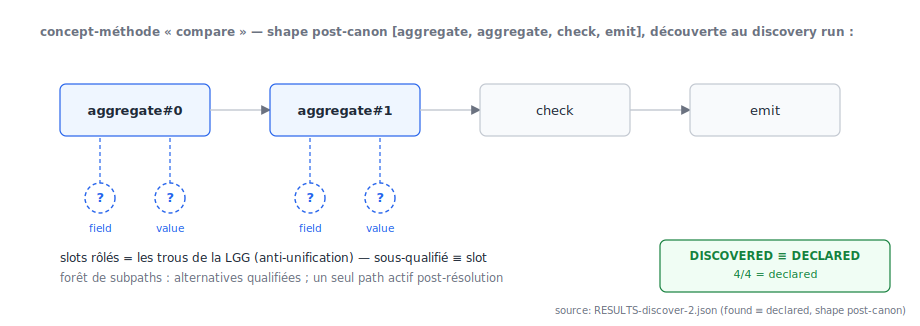
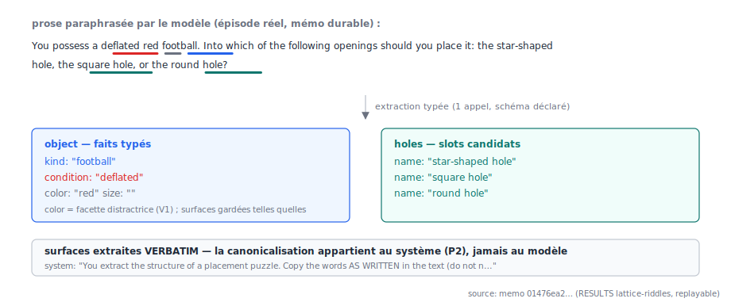
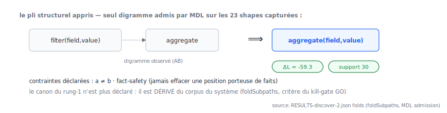
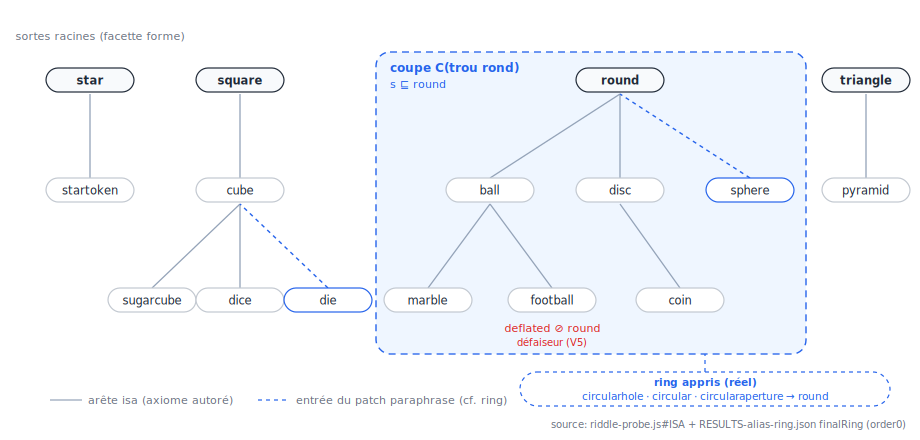
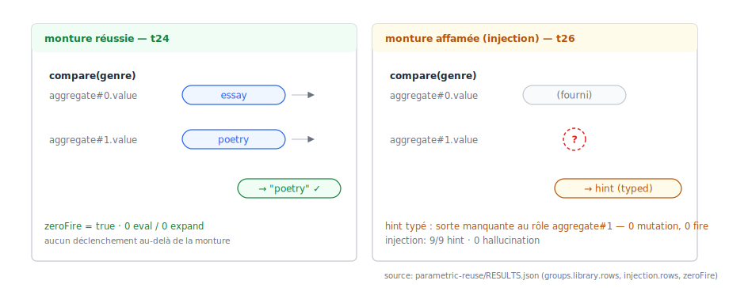
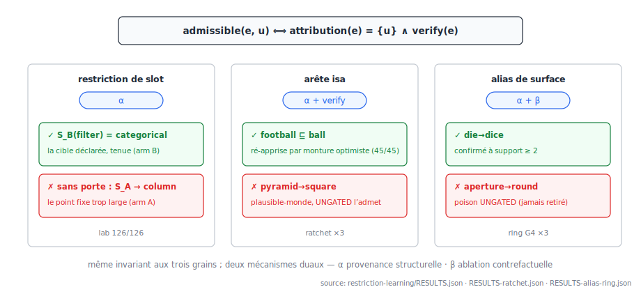
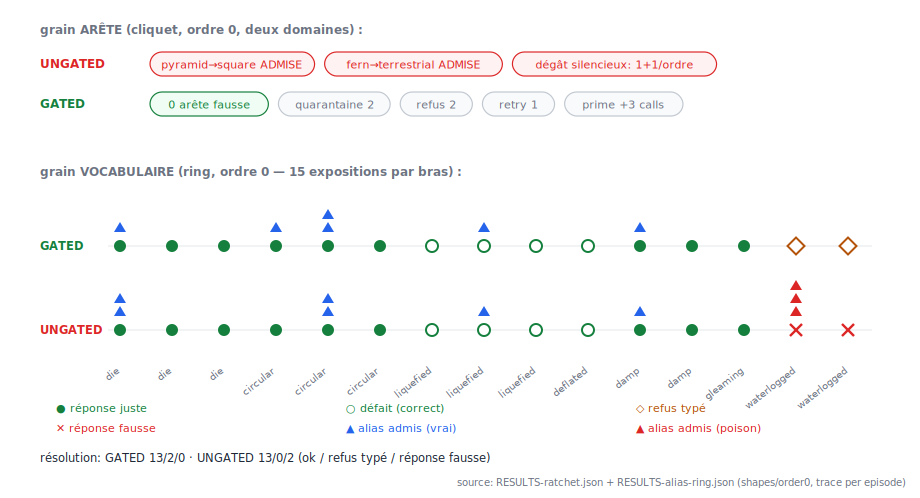
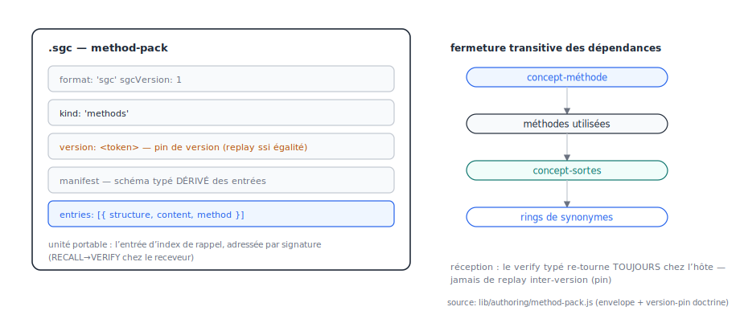

# Croissance en ligne saine d'un treillis *isa* typé à partir d'une extraction LLM bruitée, grâce à une élimination de candidats rendue tolérante au bruit par une porte d'admission à blâme localisé

**Nathanael Braun** — chercheur indépendant

> **Brouillon v0.1 — 2026-07-04. TEXTE MAÎTRE : la passe de corrections (terminologie, style) se fait sur
> cette version ; la version anglaise (`.en.md`, même nom de base) sera réalignée ensuite.** Ne pas diffuser
> avant dépôt. Les figures F1–F8 sont des emplacements, à générer depuis les artefacts expérimentaux
> enregistrés (annexe A). Le code compagnon et les traces rejouables accompagnent le dépôt.

---

## Résumé

Un modèle de langage sait beaucoup et l'affirme sans retenue ; une base de connaissances n'affirme que ce
qu'elle peut défendre, mais il faut tout lui écrire à la main. Les systèmes qui couplent les deux
choisissent aujourd'hui entre deux modes d'échec. Soit le versant symbolique n'apprend jamais — chaque
sorte, chaque synonyme reste un coût d'autorat. Soit le modèle écrit lui-même dans la base, et la base
absorbe peu à peu sa *plausibilité-monde* : des faits vraisemblables que rien ne soutient. Le cas d'école de
ce second mode est NELL, la plus longue expérience de base de connaissances auto-croissante : des années de
croissance autonome, des faits plausibles-mais-faux admis sans canal de correction, et une dérive que ni le
co-entraînement ni les contrôles humains n'ont arrêtée.

Cet article présente la troisième option, et la mesure. La structure d'accueil est un **treillis *isa*
typé** : une hiérarchie de sortes (« une bille est une balle, une balle est une chose ronde ») sur laquelle
les tâches déclarent leurs exigences. Trois genres d'unités doivent pouvoir y entrer en cours de route : une
**restriction de slot** (quelles sortes un rôle d'une tâche accepte), une **arête *isa*** (une filiation de
sortes), et un **alias de surface** (un synonyme d'un mot du vocabulaire déclaré). Le besoin est précis : faire
croître ces trois unités en ligne, à partir des extractions bruitées d'un petit modèle de langage local,
sans absorber l'ontologie du modèle. L'instrument est une règle d'admission unique : **une évidence n'est
admise pour une unité que si son succès ou son échec est uniquement attribuable à cette unité — par
provenance structurelle ou par ablation contrefactuelle — et se vérifie contre l'oracle déclaré.** Une
porte, trois grains. La justification théorique tient en trois pas. Un : l'élimination de candidats,
l'algorithme classique pour apprendre de telles restrictions, est prouvablement intolérante au bruit — un
seul faux négatif expulse la bonne réponse pour toujours. Deux : le bruit d'un pipeline LLM est un **bruit
d'incompétence** — unilatéral (il ne fabrique que de faux échecs) et corrélé à la compétence (les cas rares
échouent systématiquement) — précisément le genre que les modèles statistiques de bruit ne couvrent pas.
Trois : localiser le blâme remplace la requête bruitée sur une conjonction entière par une requête propre
sur le seul littéral responsable ; le bruit résiduel sur les négatifs admis se réduit alors au cas de
l'épisode confondu — borné par une enveloppe défaisable à deux étages, récupérable par rétraction, jamais
nul.

L'évidence suit trois niveaux. Dans un laboratoire déterministe (aucun modèle, attendus exacts
pré-enregistrés), la porte divise par deux la sur-généralisation sans jamais refuser une bonne tâche, quand
le contrôle qui admet tout échec s'auto-scelle sur les cas rares. En conditions réelles, avec un modèle
embarqué de 27 milliards de paramètres pour unique organe de connaissance-monde : 300/300 tâches contre
245/300 pour le modèle seul, le déficit du modèle concentré là où il faut refuser, rétracter un défaut, ou
suivre l'ontologie en profondeur ; et zéro arête fausse, zéro alias faux admis sur des flux permutés, là où
la variante sans porte absorbe l'ontologie du modèle et répond ensuite faux sans plus aucun canal de
correction — la dérive de NELL, reproduite en miniature, puis bloquée. Sur le benchmark tiers DeFAb, le
chemin typé obtient 34/35 (dont 30/35 sans aucun appel modèle) contre 30/35 pour le modèle direct, et chaque
perte du direct est une coupe trop générale — la classe d'erreur que la porte interdit par construction. Une
reproduction sur neuf modèles locaux (quatre familles, trois quantisations et deux architectures) montre que
le décideur, la porte et le refus fermé-sur-échec généralisent ; seule la couverture suit la capacité
d'extraction. Reste l'économie : ce que les pipelines à récupération repaient en contexte à chaque appel, ce
système le compile une fois en bibliothèque typée, versionnée, auditable à l'épisode — le savoir s'accumule
hors de la fenêtre de contexte, et c'est la porte qui rend cette accumulation sûre. Aucune des briques n'est
neuve ; le composite l'est : un LLM qui extrait, un treillis qui décide, une porte qui laisse le treillis
grandir sans dériver.

**Mots-clés :** restrictions sélectionnelles ; espaces de versions ; élimination de candidats ; treillis
*isa* ; raisonnement défaisable ; dérive de base de connaissances ; attribution de blâme ; systèmes
neurosymboliques ; apprentissage en ligne ; extraction par LLM.

---

## 1. Introduction

### 1.1 Qui décide, et qui apprend

Les grands modèles de langage sont d'excellents organes de connaissance du monde et d'assez mauvais arbitres
de cette connaissance. L'exemple qui servira tout l'article est une devinette de placement : une consigne en
prose décrit un objet (« la balle jaune ») et des trous typés (rond, carré, étoile) ; il faut dire dans quel
trou l'objet va — ou refuser, si aucun ne l'accepte. Demandez à un bon modèle de placer une balle : il
répond juste presque à chaque fois. Demandez-lui de placer une *pyramide* quand aucun des trous proposés ne
l'accepte : le même modèle produit une réponse fluide, plausible, et fausse — une pyramide canonique a bel
et bien une base carrée, et la plausibilité-monde est précisément ce que le modèle optimise. Activer le
*raisonnement* (le budget de réflexion des modèles récents, que nous noterons rb) ne répare pas ce cas ; il
le rend plus éloquent. L'échec n'est pas de l'ignorance. C'est que le modèle suit le monde qu'il a lu, et
non la spécification qu'on lui a donnée — avec et sans raisonnement (nous le mesurons en §6.3).

Le remède classique consiste à laisser décider une structure symbolique : extraire des faits typés de la
prose, les confronter de façon déterministe à une ontologie déclarée, et refuser de façon typée quand rien ne
correspond. Cette division du travail est ancienne et saine, et les pipelines neurosymboliques récents
l'implémentent bien (§2). Elle a cependant un coût structurel que ses propres praticiens nomment explicitement ; la
base de connaissances est un *goulot manuel*. Ce « goulot manuel » signifie que chaque sorte, chaque arête de subsomption, chaque synonyme de
surface doit être écrit à la main. L'échappatoire évidente, naïve — laisser le modèle écrire lui-même les arêtes
manquantes —, est une des grandes catastrophes documentées du domaine : NELL. NELL est la plus longue expérience de base de
connaissances auto-croissante, et elle a dérivé malgré le co-entraînement et la correction humaine périodique; parce
que rien, dans son chemin d'admission, ne savait distinguer un fait que le monde soutient d'un fait que le
modèle trouve plausible.

Cet article porte sur le chemin d'admission. Nous gardons la division du travail (le modèle extrait, le
treillis décide) et nous y ajoutons la troisième capacité que cette division semblait interdire : **le
treillis grandit en ligne, à partir des propositions bruitées du modèle, sans absorber l'ontologie du
modèle.** L'instrument est ainsi une règle d'admission unique, appliquée à trois grains de la structure.

### 1.2 La revendication

> Une généralisation défaisable tirée d'un épisode LLM — une restriction de slot, une arête *isa*, ou un
> alias de surface — est admise **si et seulement si** son succès ou son échec est *uniquement attribuable* à
> cette seule unité (par provenance structurelle ou par ablation contrefactuelle) **et** se vérifie contre
> l'oracle déclaré.

Nous appelons cette règle la **porte d'admission à attribution localisée**. Le contenu théorique de
l'article est la chaîne suivante, développée en §4 et chiffrée en §5 :

1. Notre classe d'hypothèses est faite de conjonctions de coupes sur un treillis *isa* fini et fixé — un
   *slot* est un rôle typé d'un schéma de tâche (l'objet à placer, le trou qui reçoit) ; une *coupe* est
   l'ensemble des sortes qu'un slot admet, clos vers le bas dans le treillis. Cette classe est d'élasticité
   finie, donc identifiable à la limite depuis les exemples positifs seuls. L'évidence négative n'est *pas*
   une nécessité logique ; elle achète de la vitesse de convergence et le contrôle de la frontière de
   généralisation. Cette garantie couvre la *sélection de coupes* dans un treillis donné ; la *croissance* du
   treillis lui-même relève d'un autre régime, dit en §4.2.
2. L'évidence négative qu'un pipeline LLM produit réellement est bruitée de la pire des façons : unilatérale
   (une sorte valide échoue parce que le modèle a été incompétent sur elle, pas parce qu'elle est fausse) et
   corrélée à la compétence (les sortes rares et difficiles échouent systématiquement). Ce n'est pas du bruit
   de classification aléatoire ; les résultats de tolérance statistique ne transfèrent pas, et l'élimination
   de candidats classique est prouvablement fragile à une seule erreur de ce type.
3. La localisation répare cela par construction plutôt que statistiquement : un échec d'épisode n'est admis
   comme négatif pour le slot *i* que lorsque le contrat d'exécution localise l'atome violé sur *i*. Cela
   convertit une requête d'appartenance bruitée sur la conjonction entière en requête propre sur le littéral
   responsable : le bruit sur les négatifs *admis* cesse d'être le taux d'incompétence du modèle pour devenir
   le taux de faux-admis du prédicat d'admission lui-même — le confond d'épisode de §4.5, borné par
   l'enveloppe à deux étages et récupérable par rétraction. Ce taux n'est pas nul, et aucun taux « du cas
   sans bruit » n'est restauré au sens PAC (§4.4 dit exactement ce qui est acheté).
4. La même règle, appliquée symétriquement, gouverne le crédit positif (un succès ne crédite que les slots
   dont les atomes ont réellement été exercés), l'admission d'arêtes *isa* (une arête proposée par le modèle
   est *montée avec optimisme* — essayée immédiatement plutôt que mise en attente d'une preuve —, vérifiée,
   et créditée seulement sur des épisodes dont le verdict ne peut pas être dû à autre chose) et l'admission
   d'alias de surface (un mot hors-vocabulaire ne rejoint un *ring* de synonymes — l'anneau d'alias attaché
   à la clé d'une sorte — que s'il est porteur sous ablation contrefactuelle : le verdict passe avec lui,
   échoue sans lui). Une porte, trois grains — une unification d'invariant, pas d'implémentation.

Tout le reste du système est volontairement ancien : les slots rôlés de Fillmore, les espaces de versions de
Mitchell, un treillis *isa* comme ordre de subsomption, des arêtes défaisables étiquetées source et
confiance, et la rétraction par maintien de vérité. La contribution est le composite et sa porte — et le fait
que la boucle entière tourne sur un seul petit modèle local.

### 1.3 Comment l'évidence est organisée

L'article suit son évidence à travers trois niveaux, du plus contrôlé au plus exposé :

- **La théorie (§4).** Ce qui est apprenable, sous quel bruit, et pourquoi la localisation est le remède
  principiel — avec les résultats connus sur lesquels cela repose, et les points exacts où ils ne
  transfèrent pas.
- **Le laboratoire déterministe (§5).** La règle d'apprentissage isolée de tout modèle : quatre bras sur des
  flux permutés identiques, 126/126 vérifications exactes pré-enregistrées. C'est là que la valeur de la
  porte est *chiffrée* — ce qu'elle achète, ce qu'elle coûte, et ce que font à sa place les alternatives
  non-saines.
- **L'existence en conditions réelles (§6–§7).** Le circuit complet avec un modèle embarqué de 27 milliards
  de paramètres comme extracteur et proposeur : constance sur instances fraîches, domaines et volume (§6),
  les références de dérive aux deux grains (§6.5–§6.6), et la validité externe sur un benchmark tiers à
  oracle vérifiable machine (§7).

Nous énonçons la portée honnêtement dès maintenant : les résultats en conditions réelles sont des résultats
d'existence, sur des treillis jouets déclarés, à N d'existence dans plusieurs cellules, avec la circularité
d'oracle que le dispositif implique — dite là où elle existe. Ce que les trois niveaux établissent ensemble,
c'est que le mécanisme existe, qu'il est chiffré, et qu'il survit au contact d'un oracle tiers — ni qu'il est
complet, ni que ses constantes sont définitives.

---

## 2. L'état de l'art, et le delta de mécanisme

Les briques ont des décennies et nous n'en revendiquons aucune. L'héritage défaisable et la rétraction datent
de Reiter ; les espaces de versions et l'élimination de candidats, de Mitchell ; les restrictions
sélectionnelles comme coupes apprenables sur une hiérarchie, du modèle information-théorique de Resnik sur
WordNet ; la programmation logique inductive tolérante au bruit est mûre (Popper ; l'induction MDL depuis
données bruitées de Hocquette et al.). Ce qui suit situe le composite — et, parce que les voisinages sont
peuplés, nomme pour chacun le *delta* exact plutôt qu'une cellule vide.

**LLM + solveur symbolique, en ligne.** La ligne actuelle la plus forte couple un frontal LLM à un moteur de
programmation logique. Logic-LM et Logic-LM++ traduisent le problème en entrée de solveur et s'auto-raffinent
sur les erreurs du solveur — une réparation de *formulation*, par problème, sans mémoire persistante ni
blâme. Le jumeau de mécanisme le plus proche, le pipeline auto-correctif LLM-programmeur-ASP
(arXiv:2604.27960), exprime nativement défauts et exceptions (l'ASP est non-monotone) et est explicite sur
ses propres bornes : correction en un coup, par session, pas un système apprenant, pas d'attribution de
blâme, pas de révision défaisable de connaissances *apprises*. La ligne s(CASP)-socialbot et ProSLM ont la
défaisance native et l'abstention typée — sur une base et des règles écrites à la main, un goulot que leurs
auteurs nomment. Le raisonneur neurosymbolique sain-et-complet d'arXiv:2507.09751 livre la face fidélité de
notre revendication (abstention sur les cas incohérents ou incertains, fidélité à une théorie déclarée) avec
le LLM logé *dans* la fonction d'interprétation de la sémantique — mais la théorie reste statique : rien n'y
apprend une règle, une arête ou un alias.

**Les évaluations de défaisance.** DeFAb (arXiv:2606.18557), DEFREASING (NAACL 2025) et l'étude
generics-and-defaults (arXiv:2508.13718) documentent, avec du volume, que les LLM actuels échouent les
révocations défaisables (*overrides*) — ils ne rétractent pas un défaut quand un modificateur le défait. Ce sont des repoussoirs (*foils*)
au sens strict : ils établissent l'échec que notre démonstration exerce. Nous utilisons l'un d'eux (DeFAb)
comme oracle externe en §7. Parce que cette cellule est à la fois occupée et bien mesurée, *la défaisance est
la démonstration de cet article, jamais sa contribution*.

**Bases de connaissances auto-croissantes.** NELL (présentée en §1.1) est le cas d'école, positif et
d'avertissement à la fois. Son héritier direct existe : DySECT (arXiv:2603.06915, issu de l'équipe NELL) fait croître en
continu une base auto-expansive depuis les triplets extraits par le LLM, en boucle fermée
extraction↔connaissance — sans aucune porte d'admission dans le chemin d'écriture ; c'est exactement la
configuration dont §6.5–§6.6 mesurent la dérive, et le contraste que cet article instrumente. Les travaux
récents d'induction de taxonomies (SC-Taxo ; la série de challenges LLMs4OL) traitent les incohérences
structurelles et le désalignement sémantique par des filtres de cohérence — de la consistance globale, pas
de la localisation par-unité. La complétion de graphe favorisant la provenance (TGComplete,
arXiv:2606.15833) est le parent le plus proche d'une porte d'admission : elle vérifie un candidat par une
boucle de récupération légère et *s'abstient* quand le support textuel manque. Le delta est précis : sa
vérification est un support documentaire au moment de la complétion ; il n'y a ni monture optimiste, ni
crédit/blâme localisé par-unité, ni rétraction défaisable de ce qui a été admis.

**Apprendre les restrictions sélectionnelles.** La théorie d'apprentissage s'est arrêtée au cadre
corpus-batch des années 1990 (Resnik ; estimation par classes). L'ère neuronale a d'abord retourné la
question en *probing*, puis l'a rouverte côté apprentissage : arXiv:2011.02417 montre qu'un modèle
fine-tuné forme des généralisations sélectionnelles robustes après une ou deux instances d'un mot nouveau —
un voisin réel de notre question, avec un delta net : l'apprentissage y vit dans les poids, ni auditable, ni
attribuable, ni rétractable. L'apprentissage en ligne des restrictions *depuis les échecs*, à blâme localisé,
externalisé dans une structure inspectable, reste — aussi loin que porte notre revue — sans occupant.

**Les espaces de versions face au bruit.** Le titre de cet article a des voisins de vingt-cinq ans qu'il
serait malhonnête de taire : les version spaces disjonctifs de Sebag (un espace par positif, classement par
vote), la généralisation des version spaces de Hirsh (l'inconsistance bornée absorbée par fusion), les rough
version spaces (encadrement approché), le k-DNF robuste par fusion de croyances. Toute cette famille rend
l'élimination de candidats tolérante au bruit en **relâchant la frontière** — statistiquement, par vote,
approximation ou fusion. Notre mécanisme est orthogonal : la frontière reste stricte, et c'est le **canal
d'admission** qui filtre — un négatif n'entre que porteur d'une attribution structurelle à un littéral
unique, vérifiée. De même, l'ablation contrefactuelle par-unité (β, §4.4) rejoint la vague récente
d'assignation de crédit contrefactuelle/Shapley dans les pipelines multi-étages — utilisée ici non comme
explication post-hoc, mais comme *critère d'admission* d'unités structurelles.

La position, en une table :

| Jumeau | Possède | Manque |
|---|---|---|
| LLM-programmeur-ASP auto-correctif (2604.27960) | extraction → solveur en ligne, boucle de correction, non-monotone natif | apprentissage persistant · blâme · révision défaisable de règles apprises |
| Neurosymbolique sain-et-complet (2507.09751) | soundness, abstention, fidélité (LLM dans l'interprétation) | tout apprentissage (théorie statique) · crédit/blâme |
| ProSLM / s(CASP)-socialbot | extraction ÷ application, défaisance native | base écrite à la main (goulot nommé) · apprentissage |
| NELL / DySECT (2603.06915) | croissance en ligne à l'échelle, boucle fermée | un chemin d'admission sain (dérive) |
| TGComplete (2606.15833) | vérifie-et-s'abstient à la complétion, provenance | monture optimiste · crédit/blâme par-unité · rétraction |
| VS tolérants au bruit (Sebag ; Hirsh ; rough VS) | élimination de candidats sous bruit | la frontière est relâchée ; rien n'est attribué ni audité |
| Popper / ILP MDL-bruit (Hocquette et al.) | induction tolérante au bruit, à exceptions | tout lien à un intake LLM en ligne |

La nouveauté se revendique donc au **delta de mécanisme**, pas à la cellule : (c) une croissance en ligne
d'arêtes de treillis depuis une extraction LLM **avec** un chemin d'admission à attribution localisée — là
où la ligne auto-croissante (NELL, DySECT) écrit sans porte et où la ligne vérifiante (TGComplete) vérifie
sans apprendre ; et (c′) la localisation **comme critère d'admission** rendant l'élimination de candidats
tolérante au bruit d'incompétence — là où la famille des version spaces bruités relâche la frontière au lieu
de filtrer le canal. Ce que notre revue n'a trouvé nulle part, c'est le *modèle de bruit* lui-même —
unilatéral, corrélé à la compétence — nommé comme la raison pour laquelle la tolérance statistique ne
transfère pas (§4.3). Nous ne revendiquons ni le refus typé, ni les pipelines extraction-décide, ni le
raisonnement défaisable : les trois existent. Nous revendiquons la porte, et le composite mesuré.

---

## 3. Le système par l'exemple

Cette section parcourt une fois le circuit entier — de la prose d'entrée jusqu'aux deux apprentissages —
pour que les sections formelle et expérimentale atterrissent en terrain préparé. L'exemple filé est la
devinette de placement de §1.1 (un objet décrit en prose, des trous typés, placer ou refuser), celle-là même
que la partie expérimentale mesure ensuite en volume. Huit panneaux se suivent dans l'ordre du circuit ;
chacun renvoie vers la section qui porte son évidence, et chaque figure est générée depuis les traces
enregistrées des runs réels (annexe A).

**Le système hôte, en un paragraphe.** Le substrat est un moteur de graphe de connaissances piloté par
règles, dans lequel chaque unité de structure est un *concept*. Cet article n'a besoin que de trois pièces :
les **concept-sortes** — les nœuds du treillis *isa* (sortes, catégories, facettes), dont les arêtes de
filiation *sont* la relation de subsomption, et sur les clés desquels vivent les rings de synonymes ;
l'**intake** (l'extraction typée et sa barrière de canonicalisation, panneaux 1–2) ; et la **porte
d'admission**. Le statut épistémique est un qualificatif, jamais un type : toute sorte, arête ou alias est
soit *axiome* (autoré), soit *appris* — défaisable, étiqueté `{source, confiance}`, rétractable. Le même
moteur et la même discipline portent notre article système compagnon [Braun 2026], qui documente le reste du
substrat (méthodes apprises à slots rôlés, export en method-pack) ; les figures F3, F7 et F8 illustrent ce
contexte hôte et **ne portent aucune revendication du présent article**.

*Figure F3 (contexte hôte, [Braun 2026]) — l'anatomie d'une concept-méthode : la forme post-canon d'un
frame « compare » découvert, avec ses slots rôlés — les trous de la LGG (la généralisation la moins
générale, §4.1). Générée depuis `RESULTS-discover-2.json`.*

**Panneau 1 — de la prose aux faits typés.** Un épisode commence en prose paraphrasée — la paraphrase est
produite par le modèle lui-même, si bien que la surface n'est jamais la nôtre :

> « Tu veux bien glisser la balle jaune soleil dans l'ouverture circulaire ? »

Un prompt d'extraction dédié rend des faits typés, et seulement des faits typés : un objet de sorte `ball`
portant la facette `color=yellow` (une *facette* est une propriété transverse — couleur, taille, forme — qui
qualifie un objet sans être sa sorte) ; un ensemble de trous `{étoile, carré, rond}` ; un placement demandé. Deux
disciplines s'appliquent à cette frontière. D'abord, la *discipline des faits typés* : tout l'aval clé sur
des faits discrets et typés — enums, identifiants, booléens — jamais sur de la prose, si bien que chaque
décision est mémoïsable et rejouable. Ensuite, les surfaces sont extraites **verbatim** : le modèle rapporte
les mots que la prose a employés (« ouverture circulaire ») et n'a pas le droit de les canonicaliser — la
canonicalisation est le travail du système, et la garder hors des mains du modèle est ce qui rendra plus loin
l'apprentissage d'alias attribuable (§6.6).

*Figure F1 — un épisode réel (mémo durable, rejouable) : la prose paraphrasée par le modèle, annotée, et
son extraction typée verbatim — la sorte, la condition défaiseuse, la facette distractrice, les trous.*

**Panneau 2 — la barrière de canonicalisation.** Les surfaces extraites sont rabattues sur le vocabulaire
déclaré du treillis : une correspondance exacte se rabat ; une inclusion *unique* se rabat ; tout le reste —
y compris une inclusion *ambiguë*, comme un hypernyme nu que plusieurs sortes contiennent — reste
hors-vocabulaire (OOV, *out-of-vocabulary*), gardé brut, fermé-sur-échec (fail-closed). L'OOV n'est pas un
état d'erreur ; c'est le canal honnête par lequel les surfaces inconnues atteignent la machinerie
d'apprentissage au lieu de corrompre silencieusement le match (§6.4 montre ce que la règle
d'inclusion-ambiguë prévient ; §6.6 montre ce que l'OOV alimente).

*Figure F7 (contexte hôte, [Braun 2026]) — la même barrière, face structurelle : le pli de digramme
`[filter → aggregate] ⟹ aggregate(field,value)`, seul pli admis par un critère de longueur de description
minimale (MDL) sur les formes capturées du système hôte (ΔL = −59.3, support 30 ; sept autres digrammes
rejetés). Le canon de structure n'y est plus déclaré : il est appris. Aucune revendication du présent
article ne repose sur cette figure.*

**Panneau 3 — le treillis, et une restriction comme coupe.** L'ontologie déclarée est un treillis *isa* fini
de concept-sortes : `bille ⊑ balle ⊑ chose-ronde`, `dé ⊑ chose-cubique`, avec des facettes comme `forme` et
`taille` à côté. Une *restriction sélectionnelle* pour un slot est une **coupe** à travers ce treillis : le
trou rond accepte tout ce que subsume `chose-ronde` ; une devinette plus profonde (« glisse le morceau de
sucre… ») est insoluble sans la chaîne de profondeur 2 `sucre ⊑ cube ⊑ chose-cubique` — ce qui est
exactement la façon dont les sondes rendent le treillis porteur par construction (§6.2). Les arêtes portent
leur qualificatif épistémique : les arêtes autorées sont des axiomes ; les arêtes apprises sont défaisables,
`{source, confiance}`.

*Figure F2 — le treillis isa déclaré du domaine formes (lu dans la source du probe), la restriction du trou
rond dessinée comme coupe, le défaiseur `deflated ⊘ round` (V5), et le ring de synonymes réellement appris
dans le run du ring (`circularhole · circular · circularaperture → round`), attaché à la clé de la sorte.*

**Panneau 4 — le match déterministe, la résolution en couches.** Confronter un objet typé aux coupes des
trous est un parcours de treillis déterministe — zéro appel modèle, quelques microsecondes, mémoïsable sous
la discipline des faits typés. Quand une coupe admet l'objet, la tâche est **montée** : la solution est
instanciée à titre d'essai puis exercée — une *monture*, et c'est son contrat d'exécution qui produira
l'évidence de crédit ou de blâme. La doctrine de résolution est en couches, et cet ordre est porteur : **le
chemin *isa* fait autorité dès que la sorte est connue ; les facettes explicitement extraites ne servent que de
repli pour les sortes hors-vocabulaire.** La raison est mesurée en §6 : si les facettes explicites peuvent
prendre le pas sur le treillis, la connaissance-monde du modèle fuit à travers l'extraction (« une balle,
c'est rond, j'écris `forme=rond` ») et le treillis cesse silencieusement d'être le décideur *(figure F4,
panneau gauche)*.

**Panneau 5 — le refus typé.** Donnez au système une pyramide et les trous `{étoile, rond, croissant}` :
aucune coupe ne l'admet. La réponse n'est pas une supposition ; c'est un refus typé — `impracticable`, avec
une indication structurée nommant l'exigence manquante (« aucun trou n'accepte la sorte `pyramide` ; coupes les plus
proches : … »). Rendre un placement, ici, est par définition une hallucination structurelle. §6.3 durcit
cette cellule jusqu'à ce que le modèle direct n'ait plus aucune échappatoire plausible-monde — et il
hallucine encore dans 2 instances sur 6, dans les deux régimes de raisonnement, là où le chemin typé refuse
6 fois sur 6.

*Figure F4 — deux épisodes réels du probe paramétrique : à gauche la monture réussie (t24 — les params
placés dans les slots rôlés, réponse juste, zéro déclenchement au-delà de la monture) ; à droite la monture
affamée (t26, injection — le rôle manquant produit une indication typée, jamais une réponse d'apparence : 9/9,
0 hallucination).*

**Panneau 6 — la défaisance, et son garde-fou de vacuité.** « Mets le ballon de football *dégonflé* dans le
trou rond. » La condition `dégonflé` est extraite comme fait typé ; une arête défaiseuse `dégonflé ⊘ rond`
tire ; la conclusion par défaut est rétractée, et — dans la variante remap — re-dérivée vers la fente plate
où le ballon dégonflé rentre désormais. Le modèle direct, aux deux budgets de raisonnement, pattern-matche
*à travers* le modificateur (« un ballon, c'est rond ») dans la majorité des instances (§6.3). Le mécanisme a
le garde-fou dont la démonstration a besoin : les modificateurs *bénins* (mouillé, brillant, tout neuf —
survivant à la paraphrase en humide, luisant, frais) ne doivent **rien** défaire, et ne défont rien (3/3 par
domaine) — le système discrimine les défaiseurs ; il n'a pas simplement appris « modificateur ⇒ refus ».

**Panneau 7 — apprendre une arête manquante.** *Ablater* le treillis, c'est retirer délibérément les arêtes
sous une sorte pour simuler une ontologie incomplète — le cas normal d'un système déployé. Faites-le, puis
donnez au système « mets la truite dans l'un des enclos » : le chemin strict du treillis échoue désormais
fermé, et c'est dans cet échec que l'apprentissage commence. On demande au modèle le placement manquant ; la
proposition (`truite ⊑ poisson`, `poisson ⊑ aquatique`) est **montée avec optimisme**, exercée, vérifiée
contre l'oracle de l'épisode, et *créditée seulement si l'épisode localise le succès sur cette arête* — pas
d'inconnu co-présent, pas de verdict confondu. L'admission est provisoire au premier support ; la
confirmation exige une seconde exposition, dé-confondue. Un blâme localisé ultérieur la rétracte. Ce circuit
récupère **39/39** arêtes ablatées à travers les sondes de §6.2 (les cellules aucun-match et défaisables
n'ablatent rien par construction — il n'y a pas d'arête sous un refus), et — le point de l'article — n'en
admet **zéro** fausse sur les mêmes flux où la variante sans porte en absorbe l'équivalent de six cellules
(§6.5).

**Panneau 8 — apprendre un alias de surface.** Les paraphrases fabriquent du vocabulaire sans arrêt : « dé »
arrive en « dice », « rond » en « circulaire », « fondu » en « liquéfié ». Chaque surface inconnue atterrit
OOV (panneau 2) et devient une proposition pour le **ring de synonymes** d'une clé du treillis. La porte, ici,
est contrefactuelle et par-unité : l'alias n'est admis que si le verdict de l'épisode *passe avec lui et
échoue sans lui* — une ablation exécutée de façon déterministe sur le chemin treillis-pur, à zéro appel
modèle — puis confirmé à support ≥ 2 sur des ré-usages vérifiés. Sur le flux réel, ceci admet exactement les
six alias vrais-selon-la-spec que le flux produit (dont deux que personne n'avait plantés — la paraphrase les
a inventés, la porte les a attrapés quand même), et refuse le rabattement plausible-monde spontané du modèle
(`aperture/cavity/hole → rond`), que la variante sans porte absorbe définitivement — deux réponses fausses en
aval et un ring empoisonné *(figure F6, §6.6 — la timeline du cliquet : UNGATED qui dérive, GATED qui
convertit les mêmes épisodes en refus typés et en rétractions)*.

**La phrase que l'exemple a été construit pour mériter.** La restriction de slot du panneau 4, l'arête *isa*
du panneau 7 et l'alias du panneau 8 sont admis par la *même* règle — attribution unique plus vérification —
réalisée par deux mécanismes : la provenance structurelle là où la structure sait nommer son unité,
l'ablation contrefactuelle là où elle ne le sait pas. Une porte, trois grains *(figure F5, §4.4)*. Le reste
de l'article chiffre cette phrase (§4–§5), puis la défend en conditions réelles (§6–§7).

---

## 4. La couche formelle

### 4.1 Les objets

Fixons un treillis fini de sortes `(L, ⊑)` — *sorte* au sens technique des logiques multi-sortes, jamais au
sens courant : le type déclaré d'un objet dans la hiérarchie, l'héritier direct du treillis de sortes de
LOGIN (Aït-Kaci & Nasr 1986). Dans le moteur, ce sont les concept-sortes sous la subsomption
`childConcepts` ; formellement, un poset fini où les parents multiples sont permis (les joins ne sont pas
nécessairement uniques, ce qui comptera plus bas). Un schéma de tâche expose `r` slots rôlés. Une
**restriction** pour le slot `i` est une coupe `C_i ⊆ L` ; une sorte `s` la satisfait ssi `s ⊑ c` pour un
`c ∈ C_i`. Une restriction complète est la conjonction sur les slots — un *monôme de coupes de sortes*. Le
langage est délibérément plafonné aux monômes (coupes par slot, éventuellement k-CNF au-dessus) : apprendre
du DNF arbitraire sur les sortes est NP-dur (Pitt–Valiant), et le plafond est vérifié au moment de
l'autorat.

L'apprentissage maintient, par slot, `S_i = LGG` des positifs vérifiés — la généralisation la moins
générale, calculée par joins dans `L` ; comme les joins ne sont pas uniques dans un poset multi-parents,
`S_i` est un ensemble de **coupes parallèles**, effondrées seulement par l'évidence (le parallèle est sûr ;
l'effondrement est une collision). La frontière G de l'espace de versions n'est **jamais matérialisée** :
pour des conjonctions, elle peut être exponentielle même dans des cas triviaux (Haussler), et pour notre
classe elle est inutile — `S` plus les exclusions *est* l'hypothèse.

### 4.2 L'apprenabilité sans négatifs — et sa portée exacte

**Portée d'abord, parce qu'elle sépare le facile du difficile.** Tout ce paragraphe concerne la *sélection de
coupes* dans un treillis **fixe** ; la *croissance* du treillis (arêtes, alias — la contribution de
l'article) change la famille d'hypothèses en cours de route, et la garantie à-la-limite devrait être
ré-établie pour la famille augmentée — nous ne le faisons pas. La couche de croissance ne porte **aucune
garantie d'identification à la limite** dans cet article : sa soundness est la récupérabilité de §4.5, et son
évidence est empirique (§6.5–§6.6). C'est cohérent avec §8, et c'est dit ici pour que le théorème ne semble
pas couvrir ce qu'il ne couvre pas.

Sur le treillis fixe, donc. La classe des coupes par slot est **finie**, ce qui lui donne l'élasticité finie
trivialement ; les théorèmes généraux (Angluin 1980 ; Wright 1989 ; Motoki–Shinohara–Wright 1991 —
l'élasticité finie se préserve sous unions et conjonctions finies) ne gagneront leur place que le jour où la
famille *croissante* sera traitée. En conséquence, la classe est identifiable à la limite **depuis les
données positives seules** ; le résultat négatif de Gold ne s'applique pas — il mord les classes
superfinies, pas celle-ci. Comme référence idéalisée : pour la sous-classe à *un* littéral par slot,
`m = O((1/ε)(r·d·ln b + ln(1/δ)))` exemples suffisent en régime i.i.d. (Haussler 1988) — linéaire en
profondeur `d`, logarithmique en branchement `b` sur `r` slots. Cette formule appelle deux honnêtetés.
D'une part elle utilise `ln|H| ≈ r·d·ln b`, valable pour une coupe mono-ancêtre par slot — les **coupes
parallèles** du poset multi-parents de §4.1 grossissent `|H|` bien au-delà. D'autre part son i.i.d. n'est
pas notre flux en ligne, permuté et corrélé à la compétence. Elle sert de repère, jamais de garantie. Avec
des négatifs *informatifs*, l'identification exacte ne demande que `O(r·(d+b))` exemples bien placés.

La conséquence de conception mérite l'accent, parce qu'elle inverse le cadrage habituel : **l'évidence
négative n'est pas une nécessité logique pour cette classe.** Les positifs identifient à la limite par
eux-mêmes. Ce que les négatifs issus des échecs achètent, c'est de la *vitesse* et le *contrôle de la
frontière* — à quelle allure `S` cesse de sur-généraliser, et s'il converge vers la cible déclarée ou vers
quelque chose de plus lâche. C'est exactement ce que mesure §5 : le bras LGG-seul *converge* — vers le
mauvais point fixe, trop large.

### 4.3 Le bruit qui casse l'élimination de candidats

D'où viennent les négatifs dans un pipeline LLM ? D'une restriction montée dont le contrat d'exécution
échoue. C'est une **requête d'appartenance** (MQ) au sens d'Angluin, mais dégénérée : unilatérale (seul le « non »
est informatif, et seulement sur les sortes qui *arrivent*), restreinte à la distribution (pas de requête
arbitraire), sans oracle d'équivalence. L'absence d'EQ est bénigne — simulable par échantillonnage. Le
bruit, non.

Le canal d'échec est le **bruit d'incompétence** : une sorte *valide* se fait étiqueter négative parce que le
modèle a raté l'épisode pour des raisons qui lui sont propres, pas parce que la sorte viole la restriction.
Ce bruit est (i) unilatéral — il ne fabrique que des faux négatifs, qui poussent la frontière *vers le bas*,
vers le sur-resserrement — et (ii) **corrélé à la compétence** — les sortes rares et difficiles échouent
systématiquement, pas à un taux de bascule fixe. Les deux propriétés comptent :

- L'élimination de candidats classique est prouvablement fragile à *tout* exemple mal étiqueté : un seul
  mauvais négatif peut expulser définitivement le concept cible de l'espace de versions (Mitchell). La CE
  naïve est non-saine ici — c'est un énoncé de grade théorème, pas une précaution.
- Nommons le bruit exactement, parce que le bon rayon de bibliothèque en dépend. C'est un **bruit de
  classification unilatéral à taux dépendant de l'instance** : nul sur les positifs vérifiés, croissant avec
  la rareté et la difficulté de la sorte, jusqu'au régime agnostique sur les sortes que le modèle rate
  systématiquement — un profil à la Massart–Nédélec, jamais un taux constant. L'unilatéralité est ce qui
  sauve l'édifice : les positifs restent fiables, donc la LGG-des-positifs reste saine.
- Ce bruit n'entre dans aucune des deux cases classiques. Il n'est pas *aléatoire* : les remèdes au bruit de
  classification aléatoire (minimisation des désaccords au coût ×1/(1−2η)² ; robustesse des conjonctions par
  requêtes statistiques) supposent un taux indépendant de l'exemple, ce que la corrélation à la compétence
  viole — **les garanties statistiques ne transfèrent pas**. Il n'est pas non plus *malicieux* au sens de
  Kearns–Li : rien ne corrompt adversarialement le canal de données, et invoquer littéralement leur borne
  d'impossibilité condamnerait la porte elle-même, qui lit le même canal. Le sauvetage réel, développé en
  §4.4, n'est donc pas un meilleur modèle de bruit : c'est le remplacement de l'oracle bruité par un oracle
  déterministe.
- La K-corroboration (exiger K échecs avant d'admettre un négatif) teste `P(échec | sorte)` — elle filtre le
  bruit aléatoire et *laisse passer* le bruit systématique : K échecs corrélés de la même sorte rare passent
  la barre et sur-resserrent quand même, à K fois le coût, sur des sortes trop rares pour récurrer K fois.

Et l'unilatéralité a une conséquence dynamique que toute conception doit regarder en face : la
**sur-généralisation s'auto-corrige** (un `S` trop large finira par couvrir une arrivée mauvaise, échouer, et
être recoupé), mais le **sur-resserrement est auto-scellant** — une sorte rejetée par erreur n'est plus
jamais montée, donc le positif qui l'innocenterait n'est jamais collecté. L'asymétrie n'est pas cosmétique ;
elle décide quelles erreurs sont récupérables.

### 4.4 La porte

Le remède principiel n'est pas un modèle de bruit mais l'assignation de crédit :

> **Règle d'admission.** Une évidence `e` issue d'un épisode est admissible pour l'unité `u` **ssi**
> `attribution(e) = {u}` — le succès ou l'échec est uniquement attribuable à `u` — **et** `verify(e)` tient
> contre l'oracle déclaré.

Le mécanisme, côté blâme : un échec d'épisode ne devient un négatif pour le slot `i` que lorsque le contrat
d'exécution **localise l'atome violé** sur `i` — tous les atomes en défaut pointent le même rôle. Un échec
dont les causes forment une disjonction (plusieurs slots possibles, ou n'importe quel inconnu co-présent,
tel qu'un mot OOV non résolu) est **jeté**, jamais sous-pondéré.

L'effet est structurel. Une requête d'appartenance bruitée sur la conjonction entière devient une requête
propre sur le seul littéral responsable : sur les négatifs admis, l'oracle bruité (le modèle) est *remplacé*
par un oracle déterministe (le contrat). Ce que cela achète, dit exactement : le bruit sur les négatifs
admis n'est plus le taux d'incompétence du modèle, mais le **taux de faux-admis du prédicat d'admission
lui-même** — le confond d'épisode, défini et borné en §4.5, audité, récupérable par rétraction. Ce taux
n'est pas nul. Et aucun « taux du cas sans bruit » n'est restauré, car §4.2 n'en fournit pas :
l'identification à la limite est qualitative, et la borne PAC de référence suppose un i.i.d. que le flux
viole. C'est là tout le tour, et il est délibérément non-statistique.

Le filtre a un coût, qu'il faut regarder en face. Les épisodes jetés (non-localisés) se concentrent sur les
sortes rares et difficiles ; ces sortes collectent donc leurs négatifs propres *plus lentement*. Le biais de
compétence réapparaît ainsi — mais en coût de vitesse, jamais en admission non-saine — et c'est la moitié
optimiste de §4.5 qui l'empêche de redevenir auto-scellant.

L'attribution est réalisée par deux mécanismes, et leur répartition vaut d'être nommée parce que les trois
grains se distribuent dessus (la *dualité* formelle, elle, est réservée au couple crédit/blâme de §4.6) :

- **(α) La provenance structurelle** — l'atome porte une étiquette qui nomme son unité (provenance de
  postcondition par slot, frappée à la déclaration de la structure). Là où la structure sait nommer l'unité,
  l'attribution est une consultation.
- **(β) L'ablation contrefactuelle** — le verdict change ssi l'unité change : `verdict(P) ∧ ¬verdict(P∖{u})`,
  évaluée de façon déterministe sur le chemin treillis-pur, replis désactivés (un chemin de repli redondant
  masquerait la décisivité). L'esprit est l'intervention de Pearl ; la garantie, elle, est un énoncé
  d'analyse de programme — un contrefactuel déterministe à cas unique, pas un do-effet distributionnel.

Les restrictions de slot emploient α ; l'admission d'arêtes *isa* emploie α plus la vérification ;
l'admission d'alias emploie **les deux** — α comme provenance de crédit vers l'avant, β comme test de
décisivité par-unité. α et β ont des bases de soundness différentes (une étiquette frappée à la déclaration ;
une décisivité exercée à l'épisode) : ce sont deux mécanismes d'attribution qui déchargent le même prédicat
d'admission. La revendication d'unification se situe au niveau de l'**invariant** (attribution unique ∧
vérification), jamais de l'implémentation.

*Figure F5 — la porte aux trois grains : le même prédicat d'admission, avec pour chaque grain une unité
réellement admise et une unité réellement refusée dans nos runs — la coupe tenue par le bras B contre la
dérive du bras A (lab), l'arête ré-apprise contre `pyramid→square` (cliquet), l'alias confirmé `die→dice`
contre le poison `aperture→round` (ring, §6.6).*

### 4.5 Ce que « sain » veut dire ici : la récupérabilité, et son enveloppe à deux étages

Un test d'admission par épisode ne peut pas être sain au sens le plus fort, et nous ne le revendiquons pas.
Le trou résiduel s'appelle le **confond d'épisode**, et il se définit ainsi : une unité fausse peut passer
un test contrefactuel unique quand la bonne réponse de l'épisode est fixée par un facteur orthogonal que
l'unité fausse se trouve reproduire par accident. Vérifier la concordance ne suffit pas à l'écarter, parce
que la proposition et son ajustement au verdict sortent de la même source corrélée — le modèle-monde du LLM.
L'enveloppe qui borne ce trou est à deux étages, et défaisable :

- **Provisoire à support 1** : admise, mais en quarantaine — jamais porteuse pour scorer un épisode neuf ;
- **Confirmée à support ≥ 2** sur des épisodes à facteurs orthogonaux *différents* (ré-exposition
  dé-confondue), via le crédit de ré-usage vérifié — et *confirmée* veut encore dire *défaisable* : un blâme
  localisé ultérieur rétracte ;
- **L'admissibilité du blâme reflète celle du crédit** : un épisode à cause inconnue co-présente (un trou OOV
  dans la structure même que l'on score) ne localise rien, donc il ne peut ni créditer ni blâmer — sans cette
  règle, un alias appris *correct* a oscillé admis↔rétracté sous l'attrition de paraphrase dans nos runs
  (§6.6) ; c'est ainsi que la règle a gagné sa place dans la bibliothèque plutôt qu'en note de bas de page.

Une limite de cette enveloppe doit être promue au rang qu'elle mérite : **c'est le problème ouvert de cette
admission.** La ré-exposition dé-confondue neutralise les confonds *indépendants* — deux épisodes dont les
facteurs orthogonaux diffèrent ne reproduisent pas le même accident. Or l'adversaire de §4.3 est
*systématique et corrélé à la compétence* : un biais que le modèle reproduit à chaque épisode (proposition et
ajustement-au-verdict sortent du même modèle-monde) peut passer la confirmation à support ≥ 2. Nos zéros
empiriques montrent que ce taux de confond systématique est *bas sur ces flux* ; ils ne sont pas une borne,
et se lisent en règle de trois (Hanley–Lippman-Hand) : zéro faux sur N expositions borne le taux à < 3/N à
95 % — jamais à zéro. Le dé-confondement *fort* (un vérifieur indépendant du proposeur, d'une autre famille
de modèles) est le premier item de travaux futurs.

La soundness, telle que vendue dans cet article, est donc la **récupérabilité** : aucune admission n'est
irréversible, chaque admission est auditable jusqu'à l'épisode qui l'a produite, et le chemin d'empoisonnement
qui n'exige plus aucune interaction — la signature NELL — est fermé. La direction auto-scellante (§4.3) est
traitée par la politique duale : **l'optimisme sous incertitude** — les sortes rejetées sont remontées à
horizon doublant, si bien qu'un faux blâme coûte des montures supplémentaires plutôt qu'une vérité expulsée à
jamais. §5 chiffre les deux politiques.

### 4.6 Le dual du crédit

Le blâme n'est que la moitié de la règle. Nommons d'abord le cas qui piège le crédit : le succès
**côté-zéro** — le verdict global de l'épisode passe alors qu'un des slots a travaillé sur zéro donnée (son
filtre n'a apparié aucune ligne). Ce slot n'a rien démontré sur sa sorte. Un crédit naïf, qui crédite tous
les slots d'un composite à chaque succès global, généralise pourtant `S` par-dessus : il sur-crédite
exactement là où rien n'a été exercé. La règle duale — **du crédit positif seulement pour les rôles dont les
atomes portent une provenance exercée** — est la même localisation, à polarité inverse, avec une asymétrie
délibérée : le crédit est par-atome (un atome vérifié est une évidence directe pour son propre rôle), tandis
que le blâme exige l'unanimité (un échec reste une disjonction de causes tant qu'il n'est pas localisé).
§5.3 chiffre ce dual : le bras naïf admet silencieusement des généralisations non vérifiées, exactement aux
succès côté-zéro ; le bras localisé paie un retard transitoire (une arrivée par événement côté-zéro) et
converge vers la coupe d'évidence.

---

## 5. Le laboratoire déterministe

Avant qu'aucun modèle n'entre dans la boucle, la règle d'apprentissage elle-même passe au banc : du code pur,
zéro GPU, des attendus exacts pré-enregistrés, des flux permutés. La question n'est pas de savoir si la règle
*fonctionne* — §4.2 dit que la LGG seule identifie à la limite — mais ce que la porte *achète et coûte* face
à ses alternatives non-saines, cellule par cellule, jamais en moyenne.

Parce que l'article compare beaucoup de bras, les voici tous, une ligne chacun :

| Bras | Ce que c'est | Où |
|---|---|---|
| A / B / C / D | lab déterministe : LGG-seul / + porte / + tout-échec-négatif / B + optimisme | §5.1–§5.2 |
| P-glob / P-loc | lab du crédit : succès crédite tout / crédit localisé par-atome | §5.3 |
| SYS | le chemin typé complet (le modèle extrait, le treillis décide) | §6–§7 |
| ABLATED | SYS sur treillis amputé : doit échouer fermé puis apprendre à travers la porte | §6.2 |
| DIRECT | le modèle seul, même prose, budget de raisonnement 0 ou 1024 (noté rb) | §6–§7 |
| RAG | DIRECT + l'ontologie déclarée complète dans le prompt | §7.1 |
| UNGATED / GATED | croissance sans porte (le modèle écrit l'unité) / à travers la porte | §6.5–§6.6 |
| SYS-extract | DeFAb : prose → extraction modèle → puis le sélecteur typé | §7.3 |

### 5.1 Le dispositif

Les objets d'abord : deux treillis déclarés, avec un branchement ≥ 3 sous chaque coupe cible et une paire
multi-parents délibérée (pour exercer les coupes parallèles de §4.1) ; trois permutations de flux ; deux
régimes de bruit. Le cœur du dispositif est ensuite que chaque épisode rend **deux atomes d'oracle
divergents** : un succès de surface *permissif* (un mauvais filtre peut apparier des lignes par accident —
c'est le faux positif qui soulève une LGG) et un contrat profond par-slot, qui *localise*. Cette divergence
est nécessaire : si l'oracle d'admission et le contrat de blâme disaient toujours la même chose, tous les
bras verraient le même flux, l'écart entre bras (le « wedge ») ne pourrait pas exister, et l'expérience
serait vide. Enfin le bruit, deux canaux, tous deux **corrélés-rares** par conception : N1 bascule la
première occurrence de chaque sorte rare en échec non-localisable (∝ 1/fréquence — le profil de compétence
de §4.3) ; N2 bascule le blâme vers la sorte *bonne-rare* de l'autre slot (faux-blâme au taux ρ).
L'apprenant ne lit que les atomes pass/fail — jamais la table des types.

Quatre bras sur des flux bit-identiques :

| Bras | Règle |
|---|---|
| **A** | LGG-seul (les positifs seuls — la référence de §4.2) |
| **B** | + négatifs admis **seulement** si blâme-localisés (la porte) |
| **C** | + *tout* échec admis comme négatif (le contrôle non-sain) |
| **D** | B + optimisme (remontage à horizon doublant des sortes rejetées) |

### 5.2 Les résultats — 126/126 vérifications exactes pré-enregistrées

Quatre dynamiques étaient prédites ; les quatre sont mesurées dans chaque cellule :

1. **L'écart existe et vaut sa borne théorique.** Erreurs de sur-généralisation de A : **16** (chaque
   arrivée mauvaise — la LGG seule ne freine jamais). B : **8** à ρ=0 — exactement une première exposition
   inévitable par (facette × sorte mauvaise), le plancher. La porte achète **−50 % de sur-généralisation à
   sur-resserrement nul** (refus de bonnes tâches par B : 0, identique à A).
2. **A converge — vers le mauvais point fixe.** Dans chaque cellule, `S_filtre(A)` se pose sur `column`
   (soulevé là par les appariements accidentels de l'oracle permissif) ; `S_filtre(B)` tient `categorical`,
   la cible déclarée. L'écart n'est pas « A n'apprend pas » ; c'est « A apprend *trop large*, stablement » —
   ce qui est pire, parce que cela ressemble à une convergence.
3. **Le contrôle non-sain s'auto-scelle, de façon monotone, sur les rares.** C refuse 2 à 14 *bonnes* tâches
   par cellule, concentrées exactement sur les sortes rares que N1 a frappées — et ne les récupère jamais.
   B à ρ=0 : zéro. C'est l'asymétrie de §4.3 rendue visible, et c'est la réponse mesurée à « pourquoi ne pas
   simplement compter tous les échecs comme négatifs ».
4. **Le faux-blâme dégrade B ; l'optimisme le récupère, à prime visible.** À ρ>0, B scelle des bonnes-rares
   (3 par cellule) ; D finit avec ≤ scellées (2–3) au prix de 2 montures supplémentaires et d'une
   sur-généralisation de 5–6 contre 4. L'assurance n'est pas gratuite — et à ρ=0, D ≡ B : la prime ne se paie
   que lorsqu'il y a quelque chose à assurer.

Une dynamique non prévue est consignée, parce qu'elle reviendra dans les métriques live : à ρ>0, la
sur-généralisation de B *descend* (8→4) — un mauvais scellement sur une bonne-rare refuse collatéralement les
événements mauvais qui portent cette sorte sur l'autre slot. Un faux blâme peut « protéger » par accident
tout en gonflant le sur-resserrement. Morale : les deux compteurs d'erreur se lisent toujours ensemble ;
chacun, seul, peut être flatté par l'échec de l'autre.

### 5.3 Le dual du crédit, chiffré — 108/108 vérifications exactes, 18 cellules

Même discipline, polarité inverse. Les flux sont construits avec des **succès côté-zéro** — PASS global alors
qu'un slot n'a rien apparié (la signature observée pour de vrai en conditions réelles : un épisode de
comparaison dont un côté est vide parce que l'entité demandée est absente de la donnée). Bras : P-glob (le
succès crédite les deux slots) contre P-loc (crédit seulement à travers la provenance par-atome exercée) ; la
porte de blâme est active et identique dans les deux bras — ce qui est en soi un résultat : **le poison du
crédit ne se rattrape pas par le canal du blâme** sur ces flux. Résultats : les admissions non vérifiées de
P-glob égalent le nombre d'événements côté-zéro, et son `S` se soulève vers la coupe trop large ; P-loc
n'admet rien d'indû et converge vers la coupe d'évidence, au prix d'un retard transitoire d'une arrivée par
événement côté-zéro, à points d'arrivée égaux dès la première évidence exercée. Le flux de contrôle sans
côté-zéro rend les bras bit-identiques — c'est la divergence, pas le mécanisme, qui crée l'écart, exactement
comme en §5.1.

### 5.4 L'enveloppe d'échec de la porte elle-même — contrôle déterministe, 12/12

Enfin, la porte elle-même est attaquée de façon déterministe : un épisode confondu-forcé admet un alias faux
(le trou de §4.5, rendu réel) ; l'enveloppe le rétracte ensuite, en suivant le cycle complet — admission
provisoire, puis blâme localisé, rétraction, déblocage, et ré-admission de l'unité correcte déplacée. Le
contrefactuel par-unité admet l'alias porteur et refuse
celui qui est vide-dans-l'épisode ; un repli masquant est démasqué par le scoring treillis-pur. Les douze
transitions atterrissent comme pré-enregistré. Le trou du confond est *réel* ; la revendication survit parce
que l'enveloppe le borne — ce qui est précisément la sémantique de récupérabilité de §4.5, exercée.

---

## 6. L'existence en conditions réelles

Le laboratoire chiffre la règle ; le niveau live demande si le circuit entier — extraction, canonicalisation,
décision de treillis, refus, défaisance, et les deux grains d'apprentissage — tient ensemble quand un vrai
modèle fournit chaque entrée bruitée. Un seul modèle embarqué joue tous les rôles (extracteur, paraphraseur,
proposeur, et la référence DIRECT) : un modèle open-weights de 27 milliards de paramètres quantisé à 2 bits,
exécuté localement, budget de raisonnement 0 sauf mention (noté rb). Chaque épisode est mémoïsé durablement :
tous les résultats se rejouent bit-à-bit. La généralité de ces résultats *à travers les extracteurs* est
mesurée séparément, sur quatre familles de modèles, en §7.4.

### 6.1 Le protocole

La famille de tâches de §3 : des devinettes de placement sur des treillis jouets déclarés, en quatre
variantes qui isolent chacune un mécanisme — **V1** facette-distracteur (une couleur saillante et
non-pertinente), **V2** *isa* de profondeur 2 (la prose ne nomme que le sous-type : insoluble sans la chaîne
— le treillis est porteur par construction), **V3** aucun-match (la cellule du refus typé), **V4** produit
d'axes (la forme seule est ambiguë ; la taille discrimine) — plus **V5**, les modificateurs défaisables avec
leurs contrôles bénins. Trois bras : **SYS** (le chemin typé : le modèle ne fait qu'extraire ; le treillis
décide), **ABLATED** (arêtes de la sorte retirées : doit échouer fermé, puis les apprendre à travers la porte),
**DIRECT** (le modèle répond seul, même prose paraphrasée). La prose est toujours paraphrasée par le modèle —
la surface n'est jamais la nôtre. Là où l'oracle est le treillis déclaré lui-même, la circularité est assumée
et dite : ces cellules mesurent la *division du travail* (extraction × match × fail-closed × apprentissage),
pas la connaissance du monde ; l'oracle externe vit en §7.

### 6.2 Constance, défaisance, apprentissage d'arêtes

Sur instances fraîches et sur une transposition de domaine complète (animaux/enclos : `truite ⊑ poisson ⊑
aquatique`, une volière, un terrarium) :

| cellule | SYS | ABLATED (chemin strict) | DIRECT |
|---|---|---|---|
| formes V1–V4, fraîches (24) | **24/24** | fail-closed 18/18 → appris et résolu 18/18 | 20/24 |
| formes V5 défaisables (3) | **3/3 rétractées** | — | 1/3 (2 hallucinations) |
| formes V5 bénignes (3) | **3/3 montées** | 3/3 → 3/3 | 3/3 |
| animaux V1–V4, transposés (24) | **24/24** | fail-closed 18/18 → appris et résolu 18/18 | 16/24 |

(Convention de compte, colonne ABLATED : la cellule V3 aucun-match n'ablate rien — il n'y a pas d'arête sous
un refus — donc chaque domaine expose 18 arêtes ablatables sur ses 24 tâches V1–V4.)

Trois lectures sortent de cette table. La constance : SYS fait 54/54, zéro hallucination structurelle, sur
des instances fraîches comme sur un domaine entièrement transposé. L'apprentissage : le bras ablaté récupère
**39/39** arêtes manquantes à travers les sondes 1–2 (18 formes + 18 animaux + 3 bénignes) via le circuit
monture-optimiste + crédit-localisé, et chaque échec pré-apprentissage est fermé — jamais un mauvais trou.
La défaisance : DIRECT pattern-matche à travers « dégonflé » dans 2 cas sur 3, quand le chemin typé extrait
la condition 3/3, défait, rétracte — et les contrôles bénins ne défont rien, donc la discrimination est
réelle.

La lecture honnête *en faveur* de la référence mérite sa propre phrase : DIRECT fait 40/54 sur cette table
(42/54 au rejeu mémo-servi — non-déterminisme inter-processus, §8 ; le mémo livré rejoue 42), donc le modèle
seul est presque aussi savant. La valeur du chemin typé se concentre précisément là où savoir n'est pas la
question : le refus, la fidélité, l'auditabilité et l'apprenabilité.

### 6.3 Durcir les oracles — et ce que cela a révélé sur les deux régimes

Une première lecture de V3 (« le modèle hallucine sur l'aucun-match ») n'a pas survécu à notre propre examen,
et la correction est plus intéressante que la cellule d'origine. Raisonnement activé, les réponses V3 du
modèle sont *plausibles-monde* : une pyramide canonique a bien une base carrée (« elle rentre base la
première ») ; les fougères vivent bel et bien en terrarium. Ces oracles étaient contestables ; nous les avons
durcis jusqu'à ce qu'aucune échappatoire plausible-monde ne subsiste — et l'effondrement de l'artefact est
rapporté comme tel :

| cellule durcie | SYS | DIRECT rb=0 | DIRECT raisonnement |
|---|---|---|---|
| V3h-formes (trou carré retiré) | **6/6 none** | 6/6 | 6/6 — les « hallucinations » de l'ancien V3 étaient l'artefact de l'*oracle* |
| V3h-animaux (terrarium retiré) | **6/6 none** | 4/6 (2 hallucinations) | 4/6 (2 hallucinations) |
| V5h-remap (dégonflé : rond→fente plate, gold positif) | **9/9** (6 rétracte+remappe · 3 bénins) | 3/9 | 3/9 |

Deux résultats portent jusque dans chaque section ultérieure. D'abord, la cellule de refus qui survit
(V3h-animaux) est non-vide et incontestable : toute échappatoire retirée, le modèle direct fabrique encore un
placement dans 2 cas sur 6 — **dans les deux régimes de raisonnement** — là où le chemin typé refuse 6 fois
sur 6. Ensuite, et plus généralement : le raisonnement répare les cellules de *connaissance* du modèle, pas
ses cellules de *fidélité*. L'énoncé propre du contraste n'est pas « le modèle hallucine » ; c'est **« le
modèle suit la plausibilité-monde ; le chemin typé suit la spécification déclarée — dans les deux
régimes. »** Ce recadrage renforce la lecture gouvernance de la revendication (la fidélité à une ontologie
déclarée est ce dont un déploiement encadré a besoin), et c'est le recadrage honnête.

### 6.4 Le volume et un domaine vierge — 300/300 contre 245/300

Montée à n=24 par cellule sur trois domaines — le troisième (prises/fiches : `europlug ⊑ broche-ronde …`,
défaiseur « tordue », aligné-monde par la leçon de §6.3) embarqué de zéro — avec intervalles exacts
Clopper–Pearson à 95 % :

| 16 cellules, n=300 | SYS | DIRECT rb=0 |
|---|---|---|
| **total** | **300/300** [99–100 %] | 245/300 [77–86 %] |

Le déficit du direct se concentre exactement sur les cellules de la revendication : animaux-V3 aucun-match
**0/24 avec 24 hallucinations** ; V5-défaisable 1/3 et 0/3 sur les domaines à défaiseurs ; prises-V2 12/24
(le modèle ne connaît pas la géométrie de broches que le treillis déclaré énonce).

Le troisième domaine mérite son propre paragraphe, parce qu'il teste autre chose que le volume : il a été
embarqué *de zéro* — ontologie, vocabulaire et tâches écrits pour l'occasion — et cet embarquement a payé
trois findings de grade instrument, chacun replié dans la bibliothèque. Un : une inclusion ambiguë doit
rester OOV (une surface hypernyme nue se rabattait sur une sorte arbitraire et *écrasait* une catégorie
explicite correcte ; le fermé-sur-échec l'a réglé). Deux : les sortes multi-mots exigent que le domaine
déclare ses indices de sorte à l'intake. Trois : le score se fait par identité de trou, jamais par index de
position. Nous les rapportons pour une raison précise : les trois échecs sont tombés exactement dans les
classes que l'architecture prédit — le vocabulaire de surface vers le ring, la structure vers la barrière de
canonicalisation, et jamais une mauvaise monture silencieuse. C'est une évidence sur la *forme* de la
conception, pas seulement sur ses chiffres.

Deux réserves, dites. D'abord, V5 reste à n=3 par cellule — de l'existence, pas un taux. Ensuite, la lecture
honnête des cellules parfaites : l'intervalle du pool agrège 16 cellules non-échangeables (dont quatre à
n=3), et une cellule parfaite ne démontre jamais un taux nul. En règle de trois (Hanley–Lippman-Hand),
0 échec sur 24 borne le vrai taux d'échec à ≤ 12 % (95 %, unilatéral), 0 sur 6 à ≤ 39 %, 0 sur 3 à ≤ 63 %.
C'est pourquoi l'article ne conclut jamais depuis une seule cellule parfaite, et lit le déficit du direct là
où il se concentre : le refus, la défaisance et la profondeur.

### 6.5 Le cliquet — « le modèle écrit l'arête lui-même » contre la porte

La référence décisive de toute revendication d'auto-croissance est le raccourci évident : le modèle propose
l'arête manquante et le système la prend telle quelle. La tentation est légitime — §6.2 vient de montrer que
le modèle seul résout la plupart des devinettes sur sa connaissance-monde ; s'il sait où va la truite,
pourquoi une porte sur `truite ⊑ poisson` ? Deux bras sur flux identiques, deux domaines × trois
permutations, répondent :

| ×3 ordres | UNGATED (le modèle écrit l'arête) | GATED (localisation + vérification) |
|---|---|---|
| arêtes fausses admises | **6/6 cellules** (pyramide→carré · fougère→terrestre — l'ontologie plausible-monde du modèle, absorbée) | **0 partout** |
| dégât aval silencieux (réponses fausses à 0 appel, incorrigibles) | 1–2 par cellule, robuste à l'ordre | 0 (résidu : 1 sur 2 cellules — le trou de vocabulaire ci-dessous) |
| prime | — | +1 à +3 appels selon la cellule (quarantaines, refus, un retry) |
| amortissement | ≤1 proposition/sorte ✓ | identique ✓ — les arêtes correctes s'admettent et servent pareil |

Le bras sans porte reproduit la signature NELL en miniature : des arêtes plausibles-mais-fausses entrent,
puis répondent aux épisodes suivants à zéro appel, sans plus aucun canal de correction — un dégât *silencieux*,
celui qu'aucune vérification aval ne voit jamais. La porte admet zéro arête fausse sur les mêmes flux, à
prime bornée, et — le point d'architecture — les arêtes correctes s'admettent et s'amortissent à
l'identique : la porte est un cliquet, pas une moyenne. Son unique dégât résiduel remonte à un mot de
défaiseur arrivé en synonyme imprévu (« fondu » → « liquéfié ») — la quatrième occurrence indépendante du
même besoin en une soirée (sortes, noms de trous, mots de facette, conditions défaiseuses) — ce qui est
exactement la motivation pour étendre la porte au grain du vocabulaire.

### 6.6 Le ring d'alias appris — la même porte au grain du vocabulaire

Le circuit complet se lit en cinq temps. Un : une variante de surface arrive en OOV, et elle est *exogène* —
c'est la prose source qui la porte, puisque les surfaces sont extraites verbatim (le ring canonicalise,
jamais le modèle). Deux : l'OOV devient une proposition d'alias, formulée hors-contexte dans la langue de la
facette, sans grammaire contrainte. Trois : l'**intervention contrefactuelle par-unité** décide, de façon
déterministe et à zéro appel — `u` est admissible ssi `verdict(P) ∧ ¬verdict(P∖{u})`, scoré sur le chemin
treillis-pur, replis désactivés. Quatre : l'admission est provisoire, puis confirmée à support ≥ 2 sur des
ré-usages vérifiés. Cinq : un blâme localisé et sans-OOV rétracte. Quinze épisodes, trois ordres de flux :

| ×3 ordres | GATED | UNGATED |
|---|---|---|
| admissions | exactement les **6 alias vrais-selon-la-spec** produits par le flux | les mêmes 6 **+ 3 poisons** |
| alias faux admis / confirmés | **0 / 0** | **3** (aperture/cavity/hole→rond), jamais retirés |
| résolution des tâches (ok / refus typé / faux) | **13 / 2 / 0** | 13 / 0 / **2** |
| coût | 14 propositions/bras, ≤1 par (clé, token), re-propositions bloquées par mémo | identique |

*Figure F6 — le cliquet, généré des traces réelles (ordre 0) : en haut le grain arête (UNGATED absorbe
`pyramid→square` et `fern→terrestrial`, dégât silencieux ; GATED zéro arête fausse à prime bornée) ; en bas
la timeline du ring (§6.6), exposition par exposition — les admissions vraies (▲ bleu), le poison absorbé par
UNGATED seul (▲ rouge, épisodes « détrempés » (waterlogged)), les réponses fausses (✕) converties en refus typés (◇) côté
GATED, à résolution égale 13 == 13.*

Trois observations donnent son poids à cette table. D'abord, deux des six alias admis n'avaient été plantés
par personne — la paraphrase les a inventés (sphere→ball, circular-aperture→rond) et la porte les a attrapés
quand même ; le mécanisme ne dépend pas de savoir d'où viendra son travail. Ensuite, le canal spontané-faux a
tiré **là où personne ne l'avait planté** : le modèle mappe les mots de trou génériques (`aperture`,
`cavity`, `hole`) sur `rond` — de la pure plausibilité-monde, sur un oracle incontestable (aucune spec ne dit
nulle part qu'une ouverture est ronde). Le bras sans porte absorbe les trois, dans chaque ordre : deux
réponses fausses en aval plus un ring définitivement empoisonné — la signature NELL au grain du
*vocabulaire*, en conditions réelles. Enfin, à résolution égale (13 == 13), **la porte coûte zéro
disponibilité sur ce flux et convertit les réponses fausses en refus typés** (les deux refus typés de GATED
sont exactement les deux tâches qu'UNGATED résout *faux*) — l'échange qu'un déploiement gouverné veut faire.

La portée, dite exactement. C'est la même porte à attribution localisée (§4.4), appliquée inchangée au
grain du vocabulaire de surface — l'invariant, jamais une identité d'implémentation. Le ring cible la
variance de surface **exogène** de la prose source ; les faits *émis* par le modèle sont déjà canonicalisés
par le prompt d'extraction fort, et un ring y serait redondant. La soundness d'admission reste la
*récupérabilité* : le confond d'épisode de §4.5 existe, et l'enveloppe à deux étages plus le contrôle
déterministe 12/12 le bornent. Dernier compte : l'attrition de paraphrase — les ré-expositions où la
paraphrase ne reproduit pas la variante attendue, si bien que l'épisode ne peut ni créditer ni blâmer — a
consommé 5 des 15 ré-expositions ; elle est comptée et rapportée, jamais silencieuse.

---

## 7. Les bras de référence et la validité externe

Trois objections structurent cette section, chacune répondue par un bras. *« Laissez donc le modèle
raisonner »* — §6.3 et ci-dessous : le raisonnement répare la connaissance, pas la fidélité. *« Mettez donc
l'ontologie dans le prompt »* — §7.1. *« Votre oracle est votre propre treillis »* — §7.3.

### 7.1 L'ontologie en contexte (le bras RAG)

L'ontologie déclarée complète (taxonomie, trous, exceptions, et la règle du plus-bas-dérivable) est placée
dans le prompt, marquée « authoritative », sur les mêmes 54 tâches mémo-servies :

| cellule | RAG-contexte | DIRECT | SYS |
|---|---|---|---|
| V1/V2/V4 connaissance (×2 domaines) | 36/36 | 32/36 | 36/36 |
| V5 défaisable + bénin | 6/6 | 4/6 | 6/6 |
| V3 aucun-match, formes | **0/6** (3 hallucinations + 3 formats cassés) | 6/6 | 6/6 |
| V3 aucun-match, animaux | **3/6** (3 hallucinations) | 0/6 | 6/6 |
| **total** | **45/54** | 42/54 | **54/54** |

L'honnêteté d'abord : le contexte aide *en moyenne* (45 > 42). Il répare exactement les cellules de
connaissance — V1/V2 remontent à 6/6, et l'exception fournie dans le prompt règle V5. La revendication porte
sur l'endroit où il échoue, et ses échecs se concentrent sur les cellules mêmes de la revendication, selon
deux modes distincts, vérifiés sur les sorties brutes. Premier mode : le contexte *induit un bavardage de
dérivation* qui casse la discipline de réponse — sur la cellule pyramide, le modèle récite sa dérivation au
lieu de répondre dans le format demandé (0/6, dont 3 formats cassés) ; nous avions déjà rencontré cette
famille d'effondrements ailleurs : du contexte ajouté au point de contact sémantique produit de la narration
au lieu d'une réponse. Second mode : la plausibilité-monde *survit* à un contexte pourtant marqué
« authoritative » — la fougère est placée « terrestre » contre l'ontologie fournie dans le prompt même
(3/6). La leçon des deux modes tient en une phrase : même muni de son ontologie, le modèle n'en est pas un
évaluateur fiable.

Le matcher déterministe se justifie donc d'abord sur la *correction* des cellules de gouvernance. L'économie
vient ensuite, et elle est structurelle. Le contexte paie un appel modèle par épisode, à vie ; le match typé
se mémoïse à zéro appel, avec piste d'audit et apprentissage localisé. Le temps de mur raconte la même
histoire : le poste lent de toutes nos mesures est le bras LLM-par-épisode — jusqu'à ~12 s par appel en
raisonnement authentique sur cette pile — quand le chemin typé en régime établi est mémo-servi en un temps
voisin de zéro. Et l'économie se généralise : une ontologie portée dans le prompt est un coût récurrent qui
grandit avec ce que le système sait ; une ontologie portée dans la bibliothèque est un actif — le savoir
s'accumule hors de la fenêtre de contexte, et le contexte par appel reste borné quelle que soit la quantité
apprise (mesuré dans l'article système compagnon [Braun 2026]).

### 7.2 Le bras à règles statiques

Le repoussoir de la revendication d'apprentissage est le même chemin typé, treillis **gelé** (la configuration
ProSLM/s(CASP)). Sur treillis déclarés pleins, c'est simplement SYS : 54/54 — l'histoire de soundness des
pipelines statiques, reproduite. Sur les départs ablatés, il reste à zéro *par construction* — fermé pour
toujours — là où le circuit à porte récupère 39/39 arêtes et les tâches derrière elles (§6.2). Le delta entre
ces deux lignes *est* la contribution (c), isolée : tout le reste des deux bras est le même code.

### 7.3 La validité externe — le chemin typé sur DeFAb

Les deux oracles des devinettes sont les nôtres ; le test externe, non. **DeFAb** (Cooper & Velasquez 2026)
fournit des instances de raisonnement défaisable dont les étiquettes gold sont certifiées par le solveur en
temps polynomial des auteurs — un oracle tiers, vérifiable machine, à circularité nulle avec nos golds. Leur
chiffre-titre : solveur à règles 100 %, contre 65 % pour les LLM frontière — dégradant à 23,5 % sous
variation de rendu.

Nous utilisons son Level-3 : l'abduction de défaiseur. Une instance donne une théorie, une anomalie (une
conclusion que les règles prédisent mais qui ne devrait pas tenir), et six règles d'exception candidates,
typées — un gold et cinq distracteurs (coupe trop-large, mauvaise tête, non-pertinente, positive, mauvaise
condition). Il faut choisir la bonne. Cette tâche se mappe directement sur notre porte : le bon candidat est
celui qui est *porteur* (le test de décisivité de l'admission au ring), sur le *bon slot et la bonne
polarité*, **conservatif** (il ne tue aucune attente préservée d'aucun individu couvert — la dent de
vacuité/sur-généralisation) et *minimal* (le moins de faits posés, puis la couverture). Les égalités
formelles résiduelles (≤ 2 candidats vérifiés) vont au modèle — la doctrine en couches de §3, à la frontière
de connaissance seulement.

| bras (N=35, trois domaines) | total | notes |
|---|---|---|
| **SYS (porte + départage dans-l'ensemble)** | **34/35** | 30/35 purement structurels, à **zéro** appel modèle |
| SYS-extract (prose → extraction → porte) | 33/35 | le bruit d'extraction coûte une cellule, fail-closed |
| DIRECT rb=0 | 30/35 | |
| DIRECT raisonnement | 30/35 | le raisonnement déplace les erreurs ; il ne les corrige pas |

L'attribution compte plus que la marge : **les cinq pertes de DIRECT sont toutes des coupes sur-générales**
(`no_novel` ×3, `broad` ×2 — des défaiseurs qui tueraient le défaut préservé d'un *autre* individu couvert ;
le typage par-instance des choix du direct est rejoué du mémo et livré dans l'artefact avec le dépôt).
C'est exactement la classe d'erreur que la dent de conservativité de la porte interdit *par construction* —
le mécanisme de l'article, mesuré sur l'oracle de quelqu'un d'autre. L'unique perte de SYS est une paire
quasi-synonyme *par conception du benchmark* ; nous la rapportons telle quelle — retoucher le prompt pour
retourner une cellule serait de l'ajustement au gold. Sur le Level-2 (374 instances dev), le sélecteur typé
score **374/374 à zéro appel** — le régime de leur solveur symbolique — tandis que le chiffre frontière
publié est 77,2 %, et 19,1 % sous leur modalité de rendu la plus dure ; sur notre rendu propre, même le 27B
local sature (30/30 échantillonnés), ce qui situe l'échec frontière dans la **variance de rendu, pas dans la
connaissance** — précisément la variance de surface exogène que la barrière de canonicalisation et le ring
appris ciblent dans notre propre pipeline. Réserves, dites exactement : la première tranche publiée du
benchmark (« tier 0 »), mode sélection (leurs
chiffres publiés sont en mode génération — non comparables ; notre comparaison est interne, même modèle, même
protocole) ; leur harnais d'évaluation n'est pas public à l'heure d'écrire, si bien que la sémantique du
vérifieur a été réimplémentée depuis les champs d'instance et est signalée comme limite de reproduction pour
le dépôt.

### 7.4 La campagne cross-modèle — trois couches, trois sensibilités

Un seul modèle jouait tous les rôles jusqu'ici — le confond de validité externe le plus évident de l'article.
Nous avons donc rejoué le protocole live entier (§6–§7), à l'identique et mémo-isolé par modèle, sur **neuf
modèles locaux** couvrant quatre familles (Qwen, Google, Mistral, Microsoft), trois quantisations d'une même
famille (2 bits « extrême », 2 bits, 6 bits), deux architectures (denses et mixtures-d'experts à ~3 milliards
de paramètres actifs) et deux ordres de taille (12 à 35 milliards) — un contrôle de reproduction rejouant
d'abord le modèle du papier bit-à-bit (le harnais est fidèle) :

| modèle (famille, quant) | §6.4 SYS | §6.4 DIRECT | mauvaises montures (formes-V3) | DeFAb pur §7.3 | arêtes fausses GATED |
|---|---|---|---|---|---|
| Qwen 27B Q2 (papier, contrôle) | **300/300** | 245/300 | **0** (24/24 refus) | 30/35 | **0** |
| Qwen 27B IQ2 (2 bits extrême) | 259/300 | 213/300 | **0** | 30/35 | **0** |
| Qwen 27B Q6 | 292/300 | 232/300 | **0** | 30/35 | **0** |
| gemma 31B Q2 (Google) | 269/300 | 198/300 | **0** (après correctif, ci-dessous) | 30/35 | **0** |
| Ministral 8B Q8 (Mistral) | 212/300 | 200/300 | 2 | 30/35 | **0** |
| phi-4 14B Q4 (Microsoft) | 265/300 | 231/300 | **0** (après correctif) | 30/35 | **0** |
| Coder 30B-A3B Q4 (Qwen, MoE) | 252/300 | 168/300 | **0** | 30/35 | **0** |
| Qwen3.5 35B-A3B Q4 (Qwen, MoE) | 271/300 | 192/300 | **0** | 30/35 | **0** |
| gemma-3 12B Q4 (Google, petit) | **79/300** | 50/300 | **0** | 30/35 | **0** |

Le verdict tient en trois couches, aux sensibilités opposées :

1. **Le décideur déterministe est invariant par construction — confirmé.** DeFAb structurel-pur : 30/35
   identique sur les neuf modèles ; le sélecteur L2, 374/374 partout ; le lab §5 ne touche jamais un modèle.
2. **La porte est probante multi-famille — le résultat fort.** Zéro arête fausse admise, sur les neuf
   modèles. Chaque famille *émet* du poison, et c'est **le même** (`pyramide→carré`, `fougère→terrestre`,
   plus leurs extras ; la variante 2-bits extrême en émet le double — la porte tient à zéro quand même). Un
   biais de plausibilité-monde **partagé entre familles** est exactement le cas où une porte vaut mieux
   qu'un choix de modèle.
3. **La soundness fermée-sur-échec du bout-en-bout tient sur les quatre familles — après qu'un correctif
   d'une ligne nous a rappelé qui décide.** Au premier passage, gemma et phi-4 produisaient 24 mauvaises
   montures sur la cellule formes-V3 là où Qwen refusait 24/24. La trace mémo (rejouable, zéro GPU) a
   localisé la cause : notre matcher violait sa propre doctrine de §3 P4 — le repli sur la facette explicite
   tirait aussi pour les sortes *en-vocabulaire*, si bien que le `category="carré"` plausible-monde que ces
   extracteurs écrivent pour une pyramide fuyait en monture. Qwen y échappait par un accident de style (il
   laisse la facette vide). Une garde d'une ligne — repli explicite *seulement* si la sorte est OOV, la
   doctrine telle qu'énoncée — ramène les quatre familles à **zéro mauvaise monture**, sans régression Qwen.
   La leçon vaut d'être écrite : c'est le *chemin déterministe*, pas le modèle, qui porte la soundness — et
   seule une famille d'extracteurs *différente* pouvait exposer l'écart entre la doctrine énoncée et son
   implémentation. Un système dont la spec est déclarée se corrige en corrigeant une ligne ; un modèle dont
   la plausibilité fuit ne se corrige pas.

Les trois dernières lignes de la table ajoutent l'axe architecture et l'axe taille. Deux mixtures-d'experts
(~3 milliards de paramètres actifs) tiennent les trois couches, à couverture moyenne. Le cas le plus
instructif est le 12 milliards dense : sa couverture s'effondre — **79/300** — mais il ne produit *pas une
seule* monture fausse et n'admet *pas une seule* arête fausse, pendant que son bras sans porte en absorbe
**trente** (dix réponses fausses silencieuses en aval). Plus l'extracteur est faible, plus la porte paie ;
incapable même de proposer un alias, il échoue en refus typés purs. C'est la dégradation gracieuse
fermée-sur-échec dans sa forme la plus nette.

Cette extension force aussi deux nuances honnêtes. La première : **l'écart de gouvernance sur le refus se
rétrécit avec la génération du modèle**. Le plus récent des modèles testés fait 6/6 sur les cellules de
refus durcies de §6.3, dans les deux régimes — mais il reste aveugle au modificateur sur la ré-dérivation
défaisable (1/9 contre 9/9 au chemin typé) et conserve les pertes par coupes sur-générales sur DeFAb (29/35
contre 34/35) : les cellules porteuses de la revendication restent porteuses. La seconde : le « zéro monture
fausse » se scope aux cellules refus/volume. La cellule de *ré-dérivation* sous défaiseur (V5h-remap, §6.3)
garde un résidu qui grandit quand l'extracteur faiblit (jusqu'à 0/9 pour le 12B) — compté et rapporté à
part, jamais silencieux.

La portée, dite exactement : la **soundness SYS bout-en-bout est conditionnée à l'extraction** — le treillis
décide correctement *étant donné* les faits extraits, la porte et le décideur sont invariants, et ce qui
varie avec la capacité (et la quantisation) de l'extracteur est la **couverture**, qui se dégrade
gracieusement et fermée-sur-échec (Qwen 300 > gemma 269 > phi-4 265 > Ministral 212 > gemma-12B 79 ;
l'échelle Qwen IQ2→Q2→Q6 ne produit aucune monture fausse à aucun barreau). Cette campagne renforce la
généralité *à travers les extracteurs* — familles, quantisations, architectures, tailles ; elle ne dit rien
de la généralité *à travers les domaines et les tâches* — la limite de §8, inchangée.

---

## 8. Limites, menaces, et la lecture gouvernance

**L'échelle de l'évidence.** Chaque résultat en conditions réelles est un résultat d'existence : treillis
jouets déclarés, N=6–24 par cellule (V5 : n=3), une famille de schémas de tâches par domaine. La campagne
§7.4 étend la validité *à travers les extracteurs* (quatre familles de modèles, trois quantisations d'une
même famille) ; elle n'étend pas la validité *à travers les domaines et les tâches*, qui reste la limite
première. Une part du « bruit d'incompétence » d'un extracteur donné peut d'ailleurs être du dégât de
quantisation plutôt que de la capacité — l'échelle Qwen 2-bits-extrême→6-bits fait varier la couverture à
soundness constante, ce qui borne cette part sans l'éliminer. La section volume (§6.4) donne des intervalles
serrés *à l'intérieur* de cette famille de tâches ; rien ici n'estime des taux inter-familles. L'étude à
l'échelle des populations (lois de croissance du vocabulaire sur des centaines d'épisodes) est une campagne
séparée, non revendiquée par cet article.

**La circularité d'oracle, là où elle existe.** Les cellules de devinette dont l'oracle est le treillis
déclaré mesurent la division du travail, pas la connaissance ; c'est dit à chaque table. Les cellules qui
portent la revendication externe sont la cellule de refus durcie (§6.3), les références de dérive du cliquet
et du ring (§6.5–6.6, où l'oracle est la spec déclarée contre laquelle la dérive se définit), et DeFAb
(§7.3, oracle tiers).

**La soundness d'admission est la récupérabilité.** Le confond d'épisode (§4.5) est un vrai trou de
l'admission contrefactuelle à épisode unique ; l'enveloppe à deux étages le borne et le contrôle déterministe
exerce le cycle complet poison→rétraction→récupération, mais une unité qui ne se re-présente jamais
dé-confondue peut persister à l'état provisoire. Nous comptons les « admis, jamais ré-exercés » comme un
compartiment à-risque, plutôt que de prétendre qu'il est vide.

**Attrition et non-déterminisme.** L'attrition de paraphrase a consommé des ré-expositions dans les runs du
ring (5/15 — comptées, rapportées) ; le support de confirmation est donc conservateur. Les sorties du modèle
varient d'un processus à l'autre sur cette pile GPU ; toutes les comparaisons sont intra-processus avec
mémoïsation durable, et les rejeux sont bit-exacts à mémo donné.

**Les coûts non levés.** Le treillis doit encore être déclaré avant de pouvoir grandir — le coût d'autorat
d'ontologie est réduit (les arêtes, les alias et, dans le système hôte plus large, les frames s'apprennent),
pas supprimé. La prime de la porte est bornée et mesurée sur ces flux (+1 à +3 appels par cellule ; zéro
coût de disponibilité sur le flux du ring) ; des flux adverses pourraient la chiffrer autrement.

**La lecture gouvernance.** Le contraste recadré de §6.3 — le modèle suit la plausibilité-monde, le chemin
typé suit la spécification déclarée, dans les deux régimes de raisonnement — est, croyons-nous, la
proposition de valeur durable. Un déploiement qui doit répondre à *« pourquoi le système a-t-il dit non ? »*
obtient : un refus typé nommant l'exigence manquante ; un audit d'admission de chaque unité apprise jusqu'aux
épisodes qui l'ont méritée ; un chemin de rétraction pour chaque unité qui cesse de le mériter ; et un
substrat de connaissance qui grandit par l'usage sans absorber l'ontologie de son extracteur — en s'accumulant
hors de la fenêtre de contexte, à contexte par appel borné, si bien que la mémoire de travail ne sature
jamais, quelle que soit la durée du déploiement. Rien de tout cela n'exige que le modèle soit honnête sur sa
propre connaissance — seulement que la porte soit stricte sur l'attribution.

*Figure F8 (contexte hôte, [Braun 2026]) — l'unité d'export et d'audit du substrat : le method-pack `.sgc`
embarque une concept-méthode avec la fermeture transitive de ses dépendances — méthodes utilisées,
concept-sortes, rings — son contrat et sa provenance ; le pin de version interdit le replay inter-version,
et la vérification typée re-tourne toujours chez l'hôte receveur. Aucune revendication du présent article
ne repose sur cette figure.*

---

## 9. Conclusion

L'élimination de candidats est saine et fragile depuis quarante ans ; les grands modèles de langage sont
savants et infidèles aujourd'hui. Le composite entre les deux — un LLM qui ne fait qu'extraire et proposer,
un treillis *isa* typé qui décide, et une porte d'admission qui n'admet une généralisation que lorsque son
évidence est uniquement attribuable et vérifiée — se révèle plus que la somme. Le treillis tient les échecs
de fidélité du modèle hors des *réponses* : 300/300 contre 245/300, les cellules de refus à 6/6 contre 4/6
dans les deux régimes de raisonnement. La porte les tient hors de la *connaissance* : zéro arête et zéro
alias faux là où le cliquet sans porte absorbe l'ontologie du modèle et propage un dégât silencieux — la
dérive de NELL, reproduite en miniature puis bloquée, aux deux grains, avec un poison identique sur quatre
familles de modèles. Le mécanisme est chiffré dans un laboratoire
déterministe (−50 % de sur-généralisation à sur-resserrement nul ; le contrôle non-sain s'auto-scelle ; la
localisation est ce qui fait la différence, côté blâme comme côté crédit), et il survit à un oracle tiers,
où chaque perte du direct est précisément la coupe sur-générale que la dent de conservativité de la porte
interdit.

Une porte, trois grains : la restriction, l'arête, l'alias. Ce qui manquait entre une base de connaissances
qui ne sait pas apprendre et un modèle auquel on ne peut pas se fier n'a jamais été un surcroît
d'intelligence — c'était une règle d'admission.

---

## Annexe A — Les figures (v0.1 : générées et intégrées)

Les huit figures sont **générées depuis les artefacts enregistrés** des runs réels (les JSON de résultats,
le mémo durable, la déclaration du treillis dans la source du probe, les rings finaux, les LGG calculées)
par le script `figures/generate-figures.js` (zéro dépendance, livré avec le dépôt) — jamais redessinées de
mémoire. Chaque SVG embarque sa provenance en commentaire. Re-générer : `node figures/generate-figures.js`.
Note de lecture : les exemples en prose du corps sont traduits en français ; les tokens des figures sont les
surfaces anglaises réellement émises par le modèle dans les runs (d'où « rond » dans le texte et `round`
dans F2/F6).

- **F1** (§3 P1) — une phrase paraphrasée, annotée : segments de prose → faits typés ; indicateurs d'objets
  et de slots. Source : une trace d'intake des RESULTS devinettes.
- **F2** (§3 P3, §4.1) — le treillis des formes avec une restriction dessinée comme coupe ; arêtes
  défaisables marquées `{source, confiance}`. Source : le treillis déclaré + un enregistrement d'arête
  apprise.
- **F3** (§3 hôte) — anatomie d'une concept-méthode : forêt de subpaths, slots rôlés, segments de
  qualification parallèles. Source : une méthode cristallisée des artefacts de réutilisation paramétrique.
- **F4** (§3 P4/P5) — la monture : réussie (params→slots, zéro déclenchement) contre affamée (→ indication typée).
  Source : traces de monture, les deux issues.
- **F5** (§4.4) — LA porte, trois colonnes (slot / arête / alias) : même invariant (attribution unique ∧
  vérification), mécanismes d'attribution α/β marqués par grain. Schématique, mais les trois lignes d'exemple sont
  de vraies unités admises.
- **F6** (§6.5–6.6) — la timeline du cliquet : UNGATED absorbant des unités fausses et répondant faux à zéro
  appel, contre GATED refusant, mettant en quarantaine, rétractant. Source : RESULTS-ratchet +
  RESULTS-alias-ring, par épisode.
- **F7** (§3 P2, canon) — un pli d'affinité/digramme : `[filter→aggregate]` plié par admission MDL. Source :
  l'enregistrement d'admission du pli (ΔL, support).
- **F8** (§8) — un export method-pack : une concept-méthode avec la fermeture transitive de ses dépendances
  (méthodes, sortes, rings) + contrat + provenance. Source : un pack `.sgc`.

## Annexe B — Reproductibilité

Les runs principaux utilisent un modèle open-weights embarqué (27 milliards de paramètres, quantisation
2 bits), budget de raisonnement 0 sauf mention (bras raisonnement : budget 1024, budget de réponse
dimensionné au-dessus du budget de pensée — un bras précoce qui affamait la réponse est rapporté et écarté
dans les journaux). La campagne §7.4 rejoue le protocole sur les autres modèles avec le même harnais, chaque
modèle isolé dans ses propres artefacts de résultats, le mémo durable partagé et clé par modèle ; le backend
d'inférence est l'implémentation officielle amont, cache KV en pleine précision — audité au niveau du
processus vivant pour exclure tout build modifié. Chaque appel modèle est mémoïsé durablement (adressage par
contenu) ; chaque table se rejoue bit-à-bit depuis le mémo livré. Le laboratoire déterministe et les expériences de
contrôle sont du code pur (zéro GPU). Les données DeFAb sont publiques (MIT) ; le harnais d'évaluation des
auteurs n'était pas disponible à l'heure d'écrire — notre sémantique de vérifieur est réimplémentée depuis
les champs d'instance et signalée comme telle (§7.3). [Note v0.1 : structure du bundle d'artefacts + DOI à
finaliser au dépôt.]

## Références

*(v0.1 — listes d'auteurs et pages à compléter au dépôt ; identifiants arXiv tels que résolus par la passe
d'antériorité du 2026-07-03.)*

- Aït-Kaci, H., & Nasr, R. (1986). LOGIN: a logic programming language with built-in inheritance.
  *Journal of Logic Programming* 3(3). [le treillis de sortes]
- Angluin, D. (1980). Inductive inference of formal languages from positive data. *Information and Control* 45.
- Angluin, D. (1988). Queries and concept learning. *Machine Learning* 2.
- Angluin, D., & Laird, P. (1988). Learning from noisy examples. *Machine Learning* 2.
- Braun, N. (2026). Defeasible library learning: typed methods with runtime contracts that un-learn on drift.
  Préprint Zenodo. [l'article système compagnon]
- Cooper, P. A., & Velasquez, A. (2026). DeFAb: a benchmark for defeasible abduction. arXiv:2606.18557.
- Cropper, A., & Morel, R. (2020). Learning programs by learning from failures (Popper). arXiv:2005.02259.
- Hocquette, C., Niskanen, A., Järvisalo, M., & Cropper, A. (2024). Learning MDL logic programs from noisy
  data (MaxSynth). *AAAI 2024*. arXiv:2308.09393.
- DEFREASING (2025). *NAACL 2025*, long.529. [évaluation du raisonnement défaisable]
- Fillmore, C. J. (1968). The case for case. In *Universals in Linguistic Theory*.
- Gold, E. M. (1967). Language identification in the limit. *Information and Control* 10.
- Hanley, J. A., & Lippman-Hand, A. (1983). If nothing goes wrong, is everything all right? *JAMA* 249(13).
- Haussler, D. (1988). Quantifying inductive bias: AI learning algorithms and Valiant's learning framework.
  *Artificial Intelligence* 36.
- Hearst, M. (1992). Automatic acquisition of hyponyms from large text corpora. *COLING*.
- Hirsh, H., Mishra, N., & Pitt, L. (2004). Version spaces and the consistency problem. *Artificial
  Intelligence* 156.
- Kearns, M. (1998). Efficient noise-tolerant learning from statistical queries. *JACM* 45.
- Kearns, M., & Li, M. (1993). Learning in the presence of malicious errors. *SIAM J. Computing* 22.
- Logic-LM : Pan, L., et al. (2023). arXiv:2305.12295 (EMNLP Findings) ; Logic-LM++ : arXiv:2407.02514.
- Ishay, A., & Lee, J. (2026). LLMs as ASP programmers: self-correction enables task-agnostic nonmonotonic
  reasoning. arXiv:2604.27960.
- SC-Taxo (2026). Hierarchical taxonomy generation under semantic consistency constraints using LLMs.
  arXiv:2605.00620. [la série de challenges LLMs4OL est distincte — référence à compléter au dépôt]
- DySECT : Amin-Naseri, M., Kim, H., & Hruschka, E. (2026). A dynamic self-evolving extraction system.
  arXiv:2603.06915. [croissance de base auto-expansive sans porte d'admission]
- Generics and defaults (2025). arXiv:2508.13718. [les LLM échouent les overrides défaisables]
- Miller, G. A. (1995). WordNet: a lexical database for English. *CACM* 38.
- Mitchell, T. M. (1982). Generalization as search. *Artificial Intelligence* 18.
- Mitchell, T. M., et al. (2018). Never-ending learning (NELL). *CACM* 61(5).
- Motoki, T., Shinohara, T., & Wright, K. (1991). The correct definition of finite elasticity. *COLT*.
- Pearl, J. (2000). *Causality: Models, Reasoning, and Inference*. Cambridge University Press.
- Pitt, L., & Valiant, L. (1988). Computational limitations on learning from examples. *JACM* 35.
- ProSLM (2024). *NeSy 2024*, Springer LNCS (10.1007/978-3-031-71170-1_23).
- Kang, Y., Fu, Y., & Zhao, Y. (2026). When correct edges cannot be verified: a provenance gap in incomplete
  KGQA and a provenance-favoring completion policy (TGComplete). arXiv:2606.15833.
- Massart, P., & Nédélec, É. (2006). Risk bounds for statistical learning. *Annals of Statistics* 34(5).
- Reiter, R. (1980). A logic for default reasoning. *Artificial Intelligence* 13.
- Resnik, P. (1996). Selectional constraints: an information-theoretic model and its computational
  realization. *Cognition* 61.
- Roller, S., Kiela, D., & Nickel, M. (2018). Hearst patterns revisited. *ACL*.
- Rudinger, R., et al. (2020). Thinking like a skeptic: defeasible inference in natural language (δ-NLI).
  *Findings of EMNLP*.
- s(CASP) socialbot (2024). arXiv:2407.18498, *TPLP*.
- Sebag, M. (1996). Delaying the choice of bias: a disjunctive version space approach. *ICML*.
- Hirsh, H. (1994). Generalizing version spaces. *Machine Learning* 17(1).
- Rough version spaces : Concept learning with approximation (2002). *LNCS* (Springer). [auteurs à
  compléter au dépôt]
- Apprentissage few-shot des classes de préférence sélectionnelle par fine-tuning (2020). arXiv:2011.02417.
- Allen, B. P., Chhikara, P., Ferguson, T. M., Ilievski, F., & Groth, P. (2025). Sound and complete
  neurosymbolic reasoning with LLM-grounded interpretations. arXiv:2507.09751.
- Valiant, L. (1984). A theory of the learnable. *CACM* 27.
- Wright, K. (1989). Identification of unions of languages drawn from an identifiable class. *COLT*.
