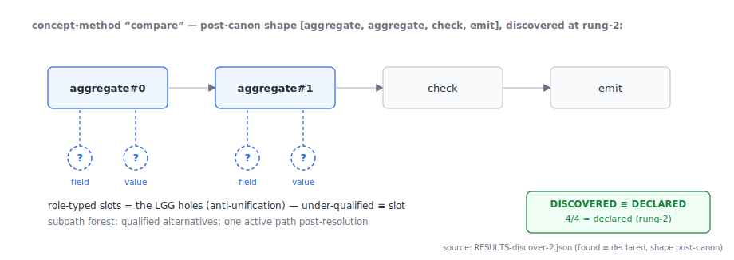
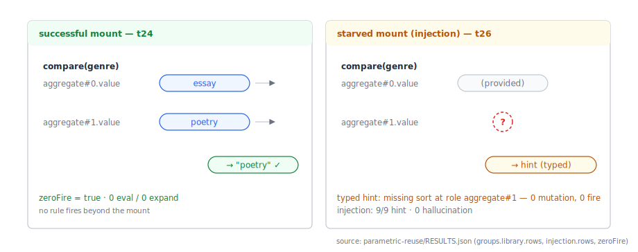
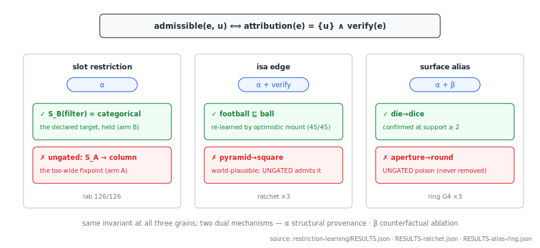
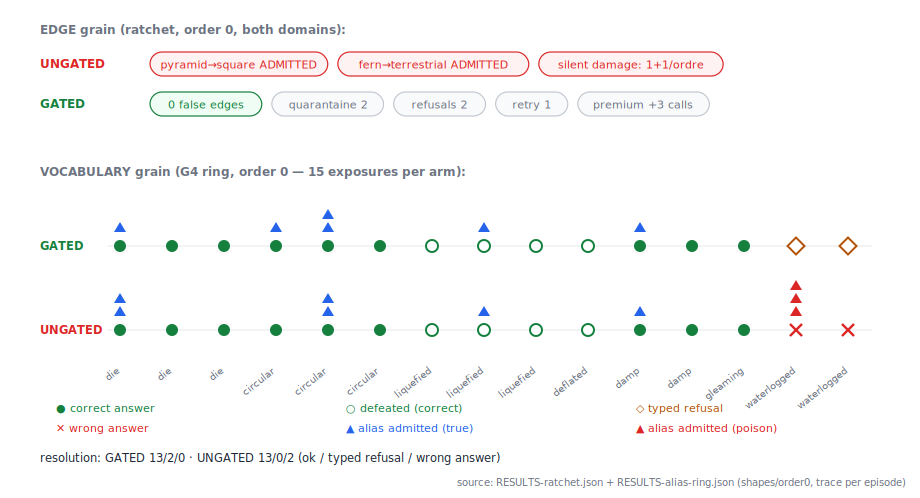
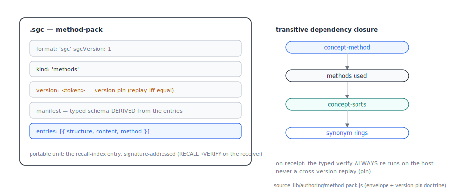

# Sound Online Growth of a Typed *isa* Lattice from Noisy LLM Extraction: Candidate Elimination Made Noise-Tolerant by a Localized-Blame Admission Gate

**Nathanael Braun** — independent researcher

> **Draft v0.1 — 2026-07-04.** Internal working draft; not for distribution before deposit. Figures F1–F8 are
> placeholders to be generated from the recorded experimental artifacts (see Appendix A). Companion code and
> replayable traces ship with the deposit. **The French version (`.fr.md`, same basename) is the MASTER text
> for the owner's correction pass (terminology, style); this English text will be realigned afterward.**

---

## Abstract

A language model knows a great deal and asserts it freely; a knowledge base asserts only what it can defend
but must be told everything. Systems that couple the two today choose one of two failure modes. Either the
symbolic side is authored by hand and never learns, or the model writes into the knowledge base directly and
the base slowly absorbs the model's world-plausibility — the drift that ended NELL's experiment. This paper
presents the third option, and measures it. We grow a typed *isa* lattice online, from the extractions of a
small local language model, under a single admission rule: **evidence is admitted for exactly one unit —
one slot restriction, one *isa* edge, or one surface alias — only when its success or failure is uniquely
attributable to that unit, by structural provenance or by counterfactual ablation, and verifies against the
declared oracle.** One gate, three grains. The theoretical observation is that this localization gate is what
candidate elimination was missing: the version-space method is provably intolerant to noise, and LLM
incompetence noise is one-sided and competence-correlated, the kind statistical noise models do not cover;
localizing blame turns a noisy query on a conjunction into a clean query on the responsible literal, restoring
noise-free convergence rates by construction. We price the mechanism in a deterministic laboratory (126/126
pre-registered checks: the gate halves over-generalization at zero over-restriction, while the unsound control
self-seals), then demonstrate it live with one embedded 27B model as the only oracle of world knowledge:
300/300 correct at tight confidence intervals versus 245/300 direct across three domains; zero false lattice
edges and zero false aliases admitted across permuted streams, where the ungated variant absorbs the model's
ontology and propagates silent errors — the NELL signature reproduced, and blocked, at both grains. On the
third-party DeFAb benchmark the typed path scores 34/35 (30/35 with zero model calls) against 30/35 direct in
both reasoning regimes, and every direct loss is an over-general cut — the exact class the gate's
conservativity check blocks by construction. What retrieval pipelines re-pay in context on every call, this
system compiles once into a typed, versioned, episode-auditable library — knowledge accumulates outside the
context window, and the gate is what makes that accumulation safe. None of the bricks is new; the composite
is: an LLM as extractor, a lattice that decides, and an admission gate that lets the lattice grow without
drifting.

**Keywords:** selectional restrictions; version spaces; candidate elimination; *isa* lattice; defeasible
reasoning; knowledge-base drift; blame attribution; neurosymbolic systems; online learning; LLM extraction.

---

## 1. Introduction

### 1.1 Who decides, and who learns

Large language models are excellent organs of world knowledge and unreliable arbiters of it. Asked to place a
ball into one of three holes, a strong model answers correctly almost every time; asked to place a *pyramid*
into holes it cannot fit, the same model — especially when reasoning is enabled — produces a fluent, plausible,
wrong answer, because a canonical pyramid does have a square base and world-plausibility is precisely what the
model optimizes. The failure is not ignorance. It is that the model follows the world it has read about, not
the specification it was given, and it does so in both reasoning regimes (we measure this in §6.3).

The classical remedy is to let a symbolic structure decide: extract typed facts from the prose, match them
deterministically against a declared ontology, and refuse in a typed way when nothing matches. This division
of labor is old and sound, and recent neurosymbolic pipelines implement it well (§2). It has one structural
cost, named explicitly by its own practitioners: the knowledge base is a *manual bottleneck*. Every sort,
every subsumption edge, every surface synonym must be authored. The obvious escape — let the model write the
missing edges itself — is the one documented catastrophe of the field: NELL, the longest-running self-growing
knowledge base, drifted despite co-training and periodic human correction, because nothing in its admission
path could tell a fact the world supports from a fact the model finds plausible.

This paper is about the admission path. We keep the division of labor (the model extracts, the lattice
decides) and add the third capability the division was thought to preclude: **the lattice grows online, from
the model's own noisy proposals, without absorbing the model's ontology.** The instrument is a single
admission rule applied at three grains of the structure.

### 1.2 The claim

> A defeasible generalization drawn from an LLM episode — a slot restriction, an *isa* edge, or a surface
> alias — is admitted **iff** its success or failure is *uniquely attributable* to that single unit (by
> structural provenance or by counterfactual ablation) **and** verifies against the declared oracle.

We call this the **localized-attribution admission gate**. The theoretical content of the paper is the
following chain, developed in §4 and priced in §5:

1. Our hypothesis class — conjunctions of cuts on a finite *isa* lattice, one cut per role-typed slot — has
   finite elasticity, hence is identifiable in the limit from positive examples alone. Negative evidence is
   *not* a logical necessity; it buys convergence speed and control over the generalization frontier.
2. The negative evidence an LLM pipeline actually produces is noisy in the worst way: one-sided (a valid sort
   fails because the model was incompetent on it, not because the sort is wrong) and competence-correlated
   (rare and hard sorts fail systematically). This is not random classification noise; statistical tolerance
   results do not transfer, and classical candidate elimination is provably fragile to even a single such
   error.
3. Localization repairs this by construction rather than statistically: an episode failure is admitted as a
   negative for slot *i* only when the runtime contract localizes the violated atom to *i*. This converts a
   noisy membership query on the whole conjunction into a clean membership query on the responsible literal,
   driving the effective noise rate on admitted negatives toward zero and restoring the noise-free rates.
4. The same rule, applied symmetrically, governs positive credit (a success credits only the slots whose
   atoms were actually exercised), *isa*-edge admission (an edge proposed by the model is mounted
   optimistically, verified, and credited only on de-confounded episodes), and surface-alias admission (an
   out-of-vocabulary token joins a synonym ring only if it is load-bearing under counterfactual ablation).
   One gate, three grains — a unification of invariant, not of implementation.

Everything else in the system is deliberately old: Fillmore's role-typed slots, Mitchell's version spaces,
an *isa* lattice as the subsumption order, defeasible edges tagged with source and confidence, truth-maintenance
retraction. The contribution is the composite and its gate, and the fact that the whole loop runs on one small
local model.

### 1.3 How the evidence is organized

The paper follows its evidence through three levels, from the most controlled to the most exposed:

- **Theory (§4).** What is learnable, under which noise, and why localization is the principled fix — with
  the known results this rests on, and the exact points where they do not transfer.
- **Deterministic laboratory (§5).** The learning rule isolated from any model: four arms on identical
  permuted streams, 126/126 pre-registered exact checks. This is where the gate's value is *priced* — what it
  buys, what it costs, and what the unsound alternatives do instead.
- **Live existence (§6–§7).** The full circuit with an embedded 27-billion-parameter model as extractor and
  proposer: constancy across fresh instances, domains and volume (§6), the drift baselines at both grains
  (§6.5–§6.6), and external validity on a third-party benchmark with a machine-verifiable oracle (§7).

We state the scope honestly up front: the live results are existence results on declared toy lattices, at
existence-level N in several cells, with the oracle circularity that the design entails said in place. What
the three levels establish together is that the mechanism exists, is priced, and survives contact with a
third-party oracle — not that it is complete, nor that its constants are final.

---

## 2. Prior art, and the two empty cells

The bricks are decades old and we claim none of them. Defeasible inheritance and retraction date to Reiter;
version spaces and candidate elimination to Mitchell; selectional restrictions as learnable lattice cuts to
Resnik's information-theoretic model over WordNet; inductive logic programming with exceptions is mature
(Popper and its noisy-MDL descendants). What follows situates the composite.

**LLM + symbolic solver, live.** The strongest current line couples an LLM front-end to a logic programming
back-end. Logic-LM and Logic-LM++ translate problems into solver input and self-refine on solver errors — a
per-problem formulation repair with no persistent store and no blame. The closest mechanism twin, the
self-correcting LLM-as-ASP-programmer pipeline (arXiv:2604.27960), is explicit about its own boundaries:
single-shot correction, no learning system, no blame attribution, no defeasible reasoning. The s(CASP)
socialbot line and ProSLM have native defeasance and typed abstention — over a knowledge base and rules that
are authored by hand, a bottleneck their authors name. The sound-and-complete neurosymbolic reasoner of
arXiv:2507.09751 delivers exactly the faithfulness face of our claim (typed refusal, fidelity to a declared
theory) with a static KB and no learning of any kind.

**The defeasance evals.** DeFAb (arXiv:2606.18557), DEFREASING (NAACL 2025), and the generics-and-defaults
study (arXiv:2508.13718) document, with volume, that current LLMs fail defeasible overrides — they do not
retract a default when a modifier defeats it. These are foils in the strict sense: they establish the failure
our demo exercises. We use one of them (DeFAb) as our external oracle in §7. Because this cell is both
occupied and well-measured, *defeasance is the demonstration of this paper, never its contribution*.

**Self-growing knowledge bases.** NELL is the canonical positive-and-cautionary tale: years of autonomous
growth, with drift that co-training and human spot-checks did not stop. Recent taxonomy-induction work
(LLMs4OL 2025; SC-Taxo) names "semantic drift and hallucinated nodes" as the open problem and answers with
semantic-coherence filters — consistency, not localization. Provenance-favoring KG completion
(arXiv:2606.15833) is the nearest admission-gate relative: it *favors* provable edges, but does not mount
optimistically, verify, and credit locally.

**Learning selectional restrictions.** The learning theory ended in the 1990s corpus-batch setting (Resnik;
class-based estimation); the LLM era inverted the question into probing whether the model already knows the
restrictions. Online learning of restrictions *from failures*, with localized blame, is — as far as our
survey reaches — an empty cell.

The position, then, in one table:

| Twin | Has | Lacks |
|---|---|---|
| LLM-as-ASP self-correction (2604.27960) | live extraction → solver, correction loop | persistent learning · blame · defeasance |
| Sound & complete neurosymbolic (2507.09751) | soundness, typed refusal, fidelity | any learning (static KB) · credit/blame |
| ProSLM / s(CASP) socialbot | extraction ÷ application, native defeasance | hand-authored KB (named bottleneck) · learning |
| NELL | online growth at scale | a sound admission path (drift) |
| Popper / noisy-MDL ILP | noise-tolerant induction with exceptions | any connection to a live LLM intake |

Two cells are empty in the 2024–2026 literature, and they are this paper's (c) and (c′): **sound online
learning of lattice edges under LLM competence noise**, and **localization as the admission criterion that
makes candidate elimination noise-tolerant**. We do not claim typed refusal, extraction-decides pipelines, or
defeasible reasoning as contributions; all three exist. We claim the gate, and the measured composite.

---

## 3. The system by example

This section walks the entire circuit once, on the actual task family of §6, so that the formal and
experimental sections land on prepared ground. One example is threaded throughout: a riddle about balls and
holes, and its descendants. Every panel forward-references the section that carries its evidence, and every
figure is generated from the recorded traces of the real runs (Appendix A).

**The host system, in one paragraph.** The substrate is a rule-driven knowledge-graph engine in which every
unit of structure is a *concept*: **concept-rules** are the atomic authored units (preconditions, assertions,
a mutation to cast); **concept-sorts** are the nodes of the *isa* lattice — kinds, categories, facets — whose
child edges *are* the subsumption relation, and on whose keys the synonym rings live; **concept-methods** are
learned, parametrically re-mountable derivation structures with role-typed slots; **concept-meta** are the
reactive concepts that drive learning at the engine's stabilization fixpoint. Epistemic status is a qualifier,
never a type: any sort, edge or alias is either an *axiom* (authored) or *learned* — defeasible, tagged
`{source, confidence}`, retractable. The same engine and discipline carried our previous system paper
[Braun 2026]; this paper needs only the lattice, the intake, and the gate. Figure F3 documents the host
(the method-pack export, F8, is in §8).

*Figure F3 — the anatomy of a concept-method: the post-canon shape of the "compare" frame discovered at
rung-2, with its role-typed slots — the LGG's holes. Generated from `RESULTS-discover-2.json` (discovered
slots ≡ declared).*

**Panel 1 — prose in, typed facts out.** An episode begins as paraphrased prose — the paraphrase is produced
by the model itself, so the surface form is never ours:

> "Could you drop the sunshine-yellow ball into the circular opening?"

A dedicated extraction prompt returns typed facts, and only typed facts: an object of kind `ball` with facet
`color=yellow`; a set of holes `{star, square, round}`; a requested placement. Two disciplines apply at this
boundary. First, the *typed-fact discipline*: everything downstream keys on discrete, typed facts — enums,
identifiers, booleans — never on prose, so every decision is memoizable and replayable. Second, surfaces are
extracted **verbatim**: the model reports the words the prose used (`"circular opening"`), and does not get to
canonicalize them — canonicalization is the system's job, and keeping it out of the model's hands is what
later makes alias learning attributable (§6.6).

*Figure F1 — a real episode (durable memo, replayable): the model-paraphrased prose, annotated, and its
verbatim typed extraction — the kind, the defeating condition, the distractor facet, the holes.*

**Panel 2 — the canonicalization barrier.** Extracted surfaces are snapped against the lattice's declared
vocabulary: an exact match snaps; a unique containment match snaps; anything else — including an *ambiguous*
containment, such as a bare hypernym that several kinds contain — stays out-of-vocabulary, kept raw,
fail-closed. OOV is not an error state; it is the honest channel through which unknown surfaces reach the
learning machinery instead of silently corrupting the match (§6.4 shows what the ambiguous-containment rule
prevents; §6.6 shows what OOV feeds).

*Figure F7 — the same barrier, structural face: the digram fold `[filter → aggregate] ⟹
aggregate(field,value)`, the only fold admitted by the MDL criterion over the system's captured shapes
(ΔL = −59.3, support 30; the seven other digrams rejected — rung-2 LOG). The structural canon is no longer
declared: it is learned.*

**Panel 3 — the lattice, and a restriction as a cut.** The declared ontology is a finite *isa* lattice of
concept-sorts: `marble ⊑ ball ⊑ round-thing`, `die ⊑ cube-thing`, facets like `shape` and `size` alongside.
A *selectional restriction* for a slot is a **cut** through this lattice: the round hole accepts anything
subsumed by `round-thing`; a deeper riddle ("drop the sugar cube…") is insoluble without the depth-2 chain
`sugar-cube ⊑ cube ⊑ cube-thing`, which is exactly how the probes make the lattice load-bearing by
construction (§6.2). Edges carry their epistemic qualifier: authored edges are axioms; learned edges are
defeasible, `{source, confidence}`.

*Figure F2 — the declared isa lattice of the shapes domain (read from the probe's source), the round hole's
restriction drawn as a cut, the `deflated ⊘ round` defeater (V5), and the synonym ring actually learned at
G4 (`circularhole · circular · circularaperture → round`), attached to the sort's key.*

**Panel 4 — deterministic match, layered resolution.** Matching a typed object against the holes' cuts is a
deterministic lattice walk — zero model calls, microseconds, memoizable under the typed-fact discipline. The
resolution doctrine is layered and this ordering is load-bearing: **the *isa* path is authoritative whenever
the kind is known; explicitly extracted facets serve only as a fallback for OOV kinds.** The reason is
measured in §6: if explicit facets may override the lattice, the model's world knowledge leaks through the
extraction ("a ball is round, so I'll just write `shape=round`") and the lattice silently stops being the
decision-maker *(figure F4, left panel)*.

**Panel 5 — typed refusal.** Hand the system a pyramid and the holes `{star, round, crescent}`: no cut admits
it. The answer is not a guess; it is a typed refusal — `impracticable`, with a structured hint naming the
missing requirement ("no hole accepts sort `pyramid`; nearest cuts: …"). Rendering any placement here is, by
definition, a structural hallucination. §6.3 hardens this cell until the direct model has no plausible-world
escape, and it still hallucinates in 2 of 6 instances in both reasoning regimes, where the typed path refuses
6 of 6.

*Figure F4 — two real episodes of the parametric probe: on the left the successful mount (t24 — params
placed into role-typed slots, correct answer, no rule fires beyond the mount); on the right the starved
mount (t26, injection — the missing role yields a typed hint, never a complete-looking answer: 9/9,
0 hallucinations).*

**Panel 6 — defeasance, and its vacuity guard.** "Put the *deflated* football in the round hole." The
condition `deflated` is extracted as a typed fact; a defeater edge `deflated ⊘ round` fires; the default
conclusion is retracted, and — in the remap variant — re-derived toward the flat slot the deflated ball now
fits. The direct model, at both reasoning budgets, pattern-matches *through* the modifier ("a football is
round") in the majority of instances (§6.3). The mechanism has a guard the demo needs: *benign* modifiers
(wet, gleaming, brand-new — surviving paraphrase as damp, shiny, fresh) must defeat **nothing**, and do not
(3/3 per domain) — the system discriminates defeaters; it has not merely learned "modifier ⇒ refuse".

**Panel 7 — learning a missing edge.** Ablate the lattice: remove the edges under a kind, hand the system
"drop the trout in one of the enclosures". The strict lattice path now fails closed — and the failure is where
learning begins. The model is asked for the missing placement; the proposal (`trout ⊑ fish`, `fish ⊑ aquatic`)
is **mounted optimistically**, exercised, verified against the episode's oracle, and *credited only if the
episode localizes the success to that edge* — no co-present unknown, no confounded verdict. Admission is
provisional at first support; confirmation requires a second, de-confounded exposure. A later localized blame
retracts it. This circuit recovers 45/45 ablated edges across the probes of §6.2, and — the point of the
paper — admits **zero** false ones on the same streams where the ungated variant absorbs six cells' worth
(§6.5).

**Panel 8 — learning a surface alias.** The paraphrases keep manufacturing vocabulary: "die" arrives as
"dice", "round" as "circular", "melted" as "liquefied". Each unknown surface lands OOV (Panel 2) and becomes a
proposal for the **synonym ring** of some lattice key. The gate here is counterfactual and per-unit: the alias
is admitted only if the episode's verdict *passes with it and fails without it* — an ablation performed
deterministically on the lattice-pure path, at zero model calls — then confirmed at support ≥ 2 on verified
re-uses. On the live stream this admits exactly the six spec-true aliases the flux produces (two of which
nobody planted — the paraphrase invented them, the gate caught them), and refuses the model's spontaneous
world-mapping `aperture/cavity/hole → round`, which the ungated variant permanently absorbs — two wrong answers
downstream and a poisoned ring *(figure F6, §6.6 — the ratchet timeline: UNGATED drifting, GATED converting
the same episodes into typed refusals and retractions)*.

**The one sentence the example was built to earn.** The slot restriction of Panel 4, the *isa* edge of
Panel 7 and the alias of Panel 8 are admitted by the *same* rule — unique attribution plus verification —
realized by two dual mechanisms: structural provenance where the structure can name its unit, counterfactual
ablation where it cannot. One gate, three grains *(figure F5, §4.4)*. The rest of the paper prices that
sentence (§4–§5) and then defends it live (§6–§7).

---

## 4. The formal layer

### 4.1 Objects

Fix a finite lattice of sorts `(L, ⊑)` — in the engine, concept-sorts under `childConcepts` subsumption;
formally a finite poset with multiple parents allowed (joins need not be unique, which matters below). A task
schema exposes `r` role-typed slots. A **restriction** for slot `i` is a cut `C_i ⊆ L`; a sort `s` satisfies
it iff `s ⊑ c` for some `c ∈ C_i`. A full restriction is the conjunction over slots — a *monomial of
sort-cuts*. The language is deliberately capped at monomials (per-slot cuts, optionally k-CNF over them):
learning arbitrary DNF over sorts is NP-hard (Pitt–Valiant), and the cap is enforced at author time.

Learning maintains, per slot, `S_i = LGG` of the verified positives — the least general generalization,
computed by joins in `L`; because joins are non-unique in a multi-parent poset, `S_i` is a set of **parallel
cuts** collapsed only by evidence (parallel is safe; collapse is a collision). Negatives are recorded as
exclusions. The G-frontier of the version space is **never materialized**: for conjunctions it can be
exponential even in trivial cases (Haussler), and for our class it is unnecessary — `S` plus exclusions *is*
the hypothesis.

### 4.2 Learnability without negatives

The class of per-slot cuts on a finite lattice has **finite elasticity**; unions and conjunctions over
finitely many slots preserve it. Consequently the class is identifiable in the limit **from positive data
alone** (Angluin 1980; Wright 1989; Motoki–Shinohara–Wright 1991). Gold's negative result does not apply —
it bites superfinite classes, not this one. The PAC-style sample complexity is friendly:
`m = O((1/ε)(r·d·ln b + ln(1/δ)))` for depth-`d`, branching-`b` hierarchies over `r` slots (Haussler 1988) —
linear in depth, logarithmic in branching. With *informative* negatives, exact identification needs only
`O(r·(d+b))` well-placed examples.

The design consequence deserves emphasis, because it inverts the usual framing: **negative evidence is not a
logical necessity for this class.** The positives identify in the limit by themselves. What failure-driven
negatives buy is *speed* and *control of the frontier* — how fast `S` stops over-generalizing, and whether it
converges to the declared target or to something laxer. That is exactly what §5 measures: the LGG-only arm
*converges* — to the wrong, too-wide fixpoint.

### 4.3 The noise that breaks candidate elimination

Where do negatives come from in an LLM pipeline? A mounted restriction whose runtime contract fails. This is
a **membership query** in Angluin's sense, but a degenerate one: one-sided (only "no" is informative, and only
on sorts that happen to arrive), distribution-restricted (no arbitrary queries), with no equivalence oracle.
The EQ absence is benign — simulable by sampling. The noise is not.

The failure channel is **competence noise**: a *valid* sort gets labeled negative because the model failed the
episode for reasons of its own ignorance, not because the sort violates the restriction. This noise is
(i) one-sided — it only manufactures false negatives, which push the frontier *down*, toward
over-restriction — and (ii) **correlated with competence** — rare and hard sorts fail systematically, not at
a fixed flip rate. Both properties matter:

- Classical candidate elimination is provably fragile to *any* mislabeled example: a single bad negative can
  expel the target concept from the version space permanently (Mitchell). Naive CE is unsound here — this is
  a theorem-grade statement, not a caution.
- Random-classification-noise remedies (disagreement minimization at ×1/(1−2η)² cost; statistical-query
  robustness of conjunctions) assume a rate that is independent of the example. Competence noise is closer to
  the malicious model (Kearns–Li), where the tolerable rate is bounded by ε and cannot be out-sampled.
  **The statistical guarantees do not transfer.**
- K-corroboration (demand K failures before admitting a negative) tests `P(fail | sort)` — it filters random
  noise and *passes* systematic noise: K correlated failures of the same rare sort clear the bar and
  over-restrict anyway, at K times the cost, on sorts too rare to recur K times.

And one-sidedness has a dynamic consequence that any design must face: **over-generalization is
self-correcting** (a too-wide `S` will eventually cover a bad arrival, fail, and be cut back), but
**over-restriction is self-sealing** — a sort rejected by mistake is never mounted again, so the positive that
would exonerate it is never collected. The asymmetry is not cosmetic; it decides which errors are recoverable.

### 4.4 The gate

The principled fix is not a noise model but credit assignment:

> **Admission rule.** Evidence `e` from an episode is admissible for unit `u` **iff**
> `attribution(e) = {u}` — the success or failure is uniquely attributable to `u` — **and** `verify(e)` holds
> against the declared oracle.

For the blame side: an episode failure becomes a negative for slot `i` only when the runtime contract
**localizes the violated atom** to `i` (single-role unanimity over the atoms' provenance); a failure whose
causes are a disjunction — several slots, or any co-present unknown such as an unresolved OOV token — is
**discarded**, never down-weighted. The effect is structural: a noisy MQ on the conjunction becomes a clean MQ
on the responsible literal. The effective noise rate η on *admitted* negatives is driven toward zero **by
construction**, which restores the noise-free rates of §4.2. This is the entire theoretical trick, and it is
deliberately not statistical.

Attribution is realized by two dual mechanisms, and the duality is worth naming because the three grains split
across it:

- **(α) Structural provenance** — the atom carries a tag naming its unit (per-slot postcondition provenance,
  minted when the structure is declared). Where the structure can name the unit, attribution is a lookup.
- **(β) Counterfactual ablation** — the verdict changes iff the unit changes: `verdict(P) ∧ ¬verdict(P∖{u})`,
  an intervention in Pearl's sense, evaluated deterministically on the lattice-pure path with fallbacks
  disabled (a redundant fallback path would mask decisiveness).

Slot restrictions use α; *isa*-edge admission uses α plus verification; alias admission uses **both** — α as
credit-forward provenance, β as the per-unit decisiveness test. The unification claim is at the level of the
**invariant** (unique attribution ∧ verify), never of the implementation.

*Figure F5 — the gate at its three grains: the same admission predicate, with, for each grain, one unit
actually admitted and one actually refused in our runs — arm B's held cut against arm A's drift (lab), the
re-learned edge against `pyramid→square` (ratchet), the confirmed alias `die→dice` against the
`aperture→round` poison (G4 ring).*

### 4.5 What "sound" means here: recoverability, and its two-tier envelope

One admission test per episode cannot be sound in the strongest sense, and we do not claim it. The residual
hole is the **episode confound**: a wrong unit can pass a single counterfactual test when the episode's gold
is fixed by an orthogonal factor that the wrong unit happens to reproduce — and because proposal and
verdict-fit come from the same correlated source (the model's world-model), concordance checks do not
de-confound it. The envelope that bounds this hole is two-tiered and defeasible:

- **Provisional at support 1**: admitted, but quarantined from load-bearing use in scoring new episodes;
- **Confirmed at support ≥ 2** on episodes with *different* orthogonal factors (de-confounded re-exposure),
  via verified re-use credit — and *confirmed* still means *defeasible*: a later localized blame retracts;
- **Blame admissibility mirrors credit admissibility**: an episode with a co-present unknown cause (an OOV
  hole in the very structure being scored) localizes nothing, so it can neither credit nor blame — without
  this rule, a *correct* learned alias oscillated admitted↔retracted under paraphrase attrition in our runs
  (§6.6), which is how the rule earned its place in the library rather than in a footnote.

Soundness, as sold in this paper, is therefore **recoverability**: no admission is irreversible, every
admission is auditable to the episode that produced it, and the poisoning path that requires no further
interaction — the NELL signature — is closed. The self-sealing direction (§4.3) is handled by the dual
policy: **optimism under uncertainty** — rejected sorts are re-mounted at a doubling horizon, so a false
blame costs extra mounts rather than a permanently expelled truth. §5 prices both policies.

### 4.6 The credit dual

Blame is only half the rule. A global success naively credits every slot of a composite — and over-credits
exactly where a slot was *not exercised*: the filter that matched zero rows did not demonstrate anything about
its sort, yet global credit generalizes `S` over it. The dual rule — **positive credit only for roles whose
atoms carry exercised provenance** — is the same localization applied with opposite polarity, with one
deliberate asymmetry: credit is per-atom (a verified atom is direct evidence for its own role), while blame
requires unanimity (a failure is a disjunction of causes until localized). §5.3 prices the dual: the naive
arm silently admits unverified generalizations at exactly the zero-side successes; the localized arm pays a
transitory lag (one arrival per zero-side event) and converges to the evidence cut.

---

## 5. The deterministic laboratory

Before any model enters the loop, the learning rule itself is put on a bench: pure code, zero GPU, exact
pre-registered expectations, permuted streams. The question is not whether the rule *works* — §4.2 says LGG
alone identifies in the limit — but what the gate *buys and costs* against its unsound alternatives, cell by
cell, never averaged.

### 5.1 Setup

Two declared lattices (branching ≥ 3 under every target cut; one deliberately multi-parent pair, so parallel
cuts are exercised), three stream permutations, two noise regimes. Two divergent oracle atoms — a permissive
surface-success (a wrong filter can match rows by accident: the false positive that lifts an LGG) against a
deep per-slot contract (localizing) — because without divergence between the admission oracle and the blame
contract, the wedge cannot exist and the experiment would be vacuous. Two noise channels, both
**correlated-rare** by design: N1 flips the first occurrence of each rare sort into a non-localizable failure
(∝ 1/frequency — the competence profile of §4.3); N2 flips blame toward the *good rare* sort of the other
slot (wrong-blame at rate ρ). The learner reads only pass/fail atoms — never the type table.

Four arms on bit-identical streams:

| Arm | Rule |
|---|---|
| **A** | LGG-only (positives alone — the §4.2 baseline) |
| **B** | + negatives admitted **only** when blame-localized (the gate) |
| **C** | + *every* failure admitted as negative (the unsound control) |
| **D** | B + optimism (doubling-horizon re-mount of rejected sorts) |

### 5.2 Results — 126/126 pre-registered exact checks

Four dynamics were predicted; all four are measured in every cell:

1. **The wedge exists and equals its theoretical bound.** A's over-generalization errors: **16** (every bad
   arrival — LGG alone never brakes). B: **8** at ρ=0 — exactly one unavoidable first exposure per
   (facet × bad sort), the floor. The gate buys **−50 % over-generalization at zero over-restriction**
   (B's good-refusals: 0, identical to A).
2. **A converges — to the wrong fixpoint.** In every cell, `S_filter(A)` settles on `column` (lifted there by
   the permissive oracle's accidental matches); `S_filter(B)` holds `categorical`, the declared target. The
   wedge is not "A fails to learn"; it is "A learns *too wide*, stably" — which is worse, because it looks
   like convergence.
3. **The unsound control self-seals, monotonically, on the rares.** C refuses 2–14 *good* tasks per cell,
   concentrated exactly on the rare sorts N1 struck — and never recovers them. B at ρ=0: zero. This is §4.3's
   asymmetry made visible, and it is the measured answer to "why not just count all failures as negatives".
4. **Wrong-blame degrades B; optimism recovers it, at a visible premium.** At ρ>0, B seals good-rares
   (3 per cell); D ends with ≤ sealed (2–3) at the price of 2 extra mounts and over-generalization 5–6
   versus 4. Insurance is not free, and at ρ=0, D ≡ B — the premium is only paid when there is something to
   insure.

One unpredicted dynamic is reported because it will recur in live metrics: at ρ>0, B's over-generalization
*drops* (8→4) — a wrong seal on a good-rare collaterally refuses bad events carrying that sort on the other
slot. A false blame can "protect" by accident while inflating over-restriction. Moral: the two error counters
must always be read together; either alone can be gamed by the other's failure.

### 5.3 The credit dual, priced — 108/108 exact checks, 18 cells

Same discipline, opposite polarity. Streams are constructed with **zero-side successes** — global PASS while
one slot matched nothing (the signature actually observed live: a compare episode whose one side is empty
because the queried entity is absent from the data). Arms: P-glob (success credits both slots) versus P-loc
(credit only through exercised per-atom provenance); the blame gate is active in both, and is arm-invariant —
which is itself a finding: **credit poisoning is not recoverable through the blame channel** on these streams.
Results: P-glob's unverified admissions equal the number of zero-side events, and its `S` lifts to the
too-wide cut; P-loc admits zero and converges to the evidence cut, paying a transitory lag of one arrival per
zero-side event, with endpoints equal from the first exercised evidence. The control stream without zero-side
events renders the arms bit-identical — the divergence, not the mechanism, is what creates the wedge, exactly
as in §5.1.

### 5.4 The gate's own failure envelope — deterministic control, 12/12

Finally the gate itself is attacked deterministically: a forced-confound episode admits a wrong alias
(the §4.5 hole, made real); the envelope then retracts it — provisional → localized blame → retract →
de-lock — and re-admits the displaced correct unit. The per-unit counterfactual admits the load-bearing alias
and refuses the episode-vacuous one; a masked fallback is unmasked by the lattice-pure scoring. All twelve
transitions land as pre-registered. The confound hole is *real*; the claim survives because the envelope
bounds it — which is precisely the recoverability semantics of §4.5, exercised.

---

## 6. Live existence

The laboratory prices the rule; the live layer asks whether the whole circuit — extraction, canonicalization,
lattice decision, refusal, defeasance, and both learning grains — holds together when a real model supplies
every noisy input. One embedded model plays every role (extractor, paraphraser, proposer, and the DIRECT
baseline): a 27-billion-parameter open-weights model at 2-bit quantization, run locally, reasoning budget 0
unless stated. Every episode is memoized durably: all results replay bit-for-bit.

### 6.1 Protocol

The task family of §3: placement riddles over declared toy lattices, in four mechanism-isolating variants —
**V1** facet-distractor (salient irrelevant color), **V2** depth-2 *isa* (prose names only the subtype:
insoluble without the chain — the lattice is load-bearing by construction), **V3** no-match (typed-refusal
cell), **V4** axis-product (shape alone ambiguous; size discriminates) — plus **V5** defeasible modifiers with
benign controls. Three arms: **SYS** (typed path: the model only extracts; the lattice decides), **ABLATED**
(kind edges removed: must fail closed, then learn them through the gate), **DIRECT** (the model answers alone,
same paraphrased prose). The prose is always model-paraphrased — the surface is never ours. Where the oracle
is the declared lattice itself, the circularity is assumed and stated: those cells measure the *division of
labor* (extraction × match × fail-closed × learning), not world knowledge; the external oracle lives in §7.

### 6.2 Constancy, defeasance, and edge learning

Across fresh instances and a full domain transposition (animals/enclosures: `trout ⊑ fish ⊑ aquatic`, an
aviary, a terrarium):

| cell | SYS | ABLATED (strict path) | DIRECT |
|---|---|---|---|
| shapes V1–V4, fresh (24) | **24/24** | fail-closed 24/24 → learned & solved 24/24 | 20/24 |
| shapes V5 defeasible (3) | **3/3 retracted** | — | 1/3 (2 hallucinations) |
| shapes V5 benign (3) | **3/3 mounted** | 3/3 → 3/3 | 3/3 |
| animals V1–V4, transposed (24) | **24/24** | fail-closed 18/18 → learned & solved 18/18 | 16/24 |

SYS: 54/54, zero structural hallucinations. The ablated arm recovers **45/45** missing edges across probes
1–2 via the optimistic-mount + localized-credit circuit — and every pre-learning failure is fail-closed
(never a wrong hole). The defeasance cell shows the intended contrast: DIRECT pattern-matches through
"deflated" in 2 of 3; the typed path extracts the condition 3/3, defeats, retracts — and the benign controls
defeat nothing, so the discrimination is real. DIRECT's overall 40/54 on this table (42/54 on the memo-served
re-run of §7.1) is the honest headline *for* the baseline: the model alone is nearly as knowledgeable. The typed path's value is concentrated precisely where knowing is not
the issue: refusal, fidelity, auditability, and learnability.

### 6.3 Hardening the oracles — and what it revealed about both regimes

An early reading of V3 ("the model hallucinates on no-match") did not survive our own scrutiny, and the
correction is more interesting than the original cell. With reasoning enabled, the model's V3 answers are
*world-plausible*: a canonical pyramid does have a square base ("it fits base-first"); ferns do live in
terrariums. Those oracles were contestable, so we hardened them until no plausible-world escape remained —
and reported the collapse of the artifact as such:

| hardened cell | SYS | DIRECT rb=0 | DIRECT reasoning-on |
|---|---|---|---|
| V3h-shapes (square hole removed) | **6/6 none** | 6/6 | 6/6 — the old V3 "hallucinations" were the *oracle's* artifact |
| V3h-animals (terrarium removed) | **6/6 none** | 4/6 (2 hallucinations) | 4/6 (2 hallucinations) |
| V5h-remap (deflated: round→flat slot, positive gold) | **9/9** (6 retract+remap · 3 benign) | 3/9 | 3/9 |

Two findings carry into every later section. First, the surviving refusal cell (V3h-animals) is non-vacuous
and incontestable: with every escape removed, the direct model still fabricates a placement in 2 of 6 — **in
both reasoning regimes** — where the typed path refuses 6 of 6. Second, and more generally: reasoning repairs
the model's *knowledge* cells but not its *fidelity* cells. The clean statement of the contrast is not "the
model hallucinates"; it is **"the model follows world-plausibility; the typed path follows the declared
specification — in both regimes."** That reframing strengthens the governance reading of the claim (fidelity
to a declared ontology is what regulated deployments need) and it is the honest one.

### 6.4 Volume and a virgin domain — 300/300 vs 245/300

Scaling to n=24 per cell across three domains — the third (plugs/sockets: `europlug ⊑ round-pin …`, defeater
"bent", world-aligned by the §6.3 lesson) onboarded from scratch — with exact Clopper–Pearson 95 % intervals:

| 16 cells, n=300 | SYS | DIRECT rb=0 |
|---|---|---|
| **total** | **300/300** [99–100 %] | 245/300 [77–86 %] |

The direct deficit concentrates exactly on the claim's cells: animals-V3 no-match **0/24 with 24
hallucinations**; V5-defeasible 1/3 and 0/3 across the defeater domains; plugs-V2 12/24 (the model does not
know pin geometry that the declared lattice states). Onboarding the virgin domain paid three instrument-grade
findings, each folded back into the library: ambiguous containment must stay OOV (a bare hypernym surface was
snapping onto an arbitrary kind and *overriding* a correct explicit category — fail-closed fixed it);
multi-word kinds need the domain's declared kind-hints at intake; and scoring must be by hole identity, never
index. We report them because a method whose onboarding produces exactly the failure classes its architecture
predicts — surface vocabulary to the ring, structure to the canon barrier, and never a silent wrong mount —
is evidence of the *shape* of the design, not just its numbers. Caveat stated: V5 remains n=3 per cell —
existence, not a rate.

### 6.5 The ratchet — "the model writes the edge itself" vs the gate

The decisive baseline for any self-growing claim is the obvious shortcut: the model proposes the missing edge
and the system just takes it. DIRECT's 22/24 says the model usually *knows* — so why gate? Two arms on
identical streams, two domains × three permutations:

| ×3 orders | UNGATED (model writes the edge) | GATED (localization + verification) |
|---|---|---|
| false edges admitted | **6/6 cells** (pyramid→square · fern→terrestrial — the model's plausible-world ontology, absorbed) | **0 everywhere** |
| silent downstream damage (0-call wrong answers, uncorrectable) | 1–2 per cell, robust to order | 0 (residual: 1 on 2 cells — the vocabulary miss below) |
| premium | — | +2–3 calls (quarantines, refusals, one retry) |
| amortization | ≤1 proposal/kind ✓ | identical ✓ — correct edges admit and serve the same |

The ungated arm reproduces the NELL signature in miniature: plausible-but-false edges enter, then answer
later episodes at zero calls with no remaining correction channel — *silent* damage, the kind that no
downstream check ever sees. The gate admits zero false edges on the same streams at a bounded premium, and —
the architectural point — the correct edges still admit and amortize identically: the gate is a ratchet, not
an average. Its one residual damage traced to a defeater word arriving as an unplanned synonym ("melted" →
"liquefied"), the fourth independent occurrence of the same need in one evening (kinds, hole-names,
facet-words, defeater-conditions) — which is exactly the motivation for extending the gate to the vocabulary
grain.

### 6.6 The learned alias ring — the same gate at the vocabulary grain

The full circuit: exogenous OOV (the *source prose* carries the variant; surfaces extracted verbatim —
the ring canonicalizes, never the model) → context-free, facet-worded, grammar-free proposal → **per-unit
counterfactual intervention** (deterministic, zero calls: `u` admissible iff `verdict(P) ∧ ¬verdict(P∖{u})`,
scored on the lattice-pure path, fallbacks off) → provisional admission → confirmation at support ≥ 2 on
verified re-uses → retraction on localized, OOV-free blame. Fifteen episodes, three stream orders:

| ×3 orders | GATED | UNGATED |
|---|---|---|
| admissions | exactly the **6 spec-true aliases** the flux produces | the same 6 **+ 3 poison** |
| false aliases admitted / confirmed | **0 / 0** | **3** (aperture/cavity/hole→round), never retracted |
| task resolution (ok / typed refusal / wrong) | **13 / 2 / 0** | 13 / 0 / **2** |
| cost | 14 proposals/arm, ≤1 per (key, token), re-proposals memo-blocked | identical |

*Figure F6 — the ratchet, generated from the real traces (order 0): top, the edge grain (UNGATED absorbs
`pyramid→square` and `fern→terrestrial`, silent damage; GATED zero false edges at bounded premium); bottom,
the G4 ring timeline, exposure by exposure — true admissions (▲ blue), the poison absorbed by UNGATED alone
(▲ red, the waterlogged episodes), wrong answers (✕) converted into typed refusals (◇) on the GATED side,
at equal resolution 13 == 13.*

Three observations give this table its weight. First, two of the six admitted aliases were never planted by
the protocol — the paraphrase invented them (sphere→ball, circular-aperture→round) and the gate caught them
anyway; the mechanism does not depend on knowing where its work will come from. Second, the spontaneous
false channel fired **where nobody planted it**: the model maps generic hole-words (`aperture`, `cavity`,
`hole`) to `round` — pure world-plausibility, on an incontestable oracle (no spec anywhere says an aperture is
round). The ungated arm absorbs all three, across every order: two wrong answers downstream plus a permanently
poisoned ring — the NELL signature at the *vocabulary* grain, live. Third, at equal resolution (13 == 13),
**the gate costs zero availability on this stream and converts the wrong answers into typed refusals** — the
trade a governed deployment wants.

Scope, stated as the confrontation review fixed it: this is the same localized-attribution gate applied
unchanged at the surface-vocabulary grain — a unification of *invariant* across slot, edge and alias, realized
by dual mechanisms (provenance α, counterfactual β; the ring uses both), never an identity of implementation.
The ring targets the **exogenous** surface variance of source prose; facts *emitted* by the model are already
canonicalized by the strong extraction prompt, so a ring there would be redundant — and admission soundness
remains *recoverability* (the episode confound of §4.5 exists; the two-tier envelope and the 12/12
deterministic control bound it). Paraphrase attrition consumed 5 of 15 episodes' re-exposures; it is counted
and reported, never silent.

---

## 7. Baselines and external validity

Three objections structure this section, each answered by an arm. *"Just let the model reason"* — §6.3 and
below: reasoning repairs knowledge, not fidelity. *"Just put the ontology in the prompt"* — §7.1. *"Your
oracle is your own lattice"* — §7.3.

### 7.1 Ontology-in-context (the RAG arm)

The complete declared ontology (taxonomy, holes, exceptions, and the lowest-derivable rule) is placed in the
prompt, marked authoritative, on the same 54 memo-served tasks:

| cell | RAG-context | DIRECT | SYS |
|---|---|---|---|
| V1/V2/V4 knowledge (×2 domains) | 36/36 | 32/36 | 36/36 |
| V5 defeasible + benign | 6/6 | 4/6 | 6/6 |
| V3 no-match, shapes | **0/6** (3 hallucinations + 3 format-broken) | 6/6 | 6/6 |
| V3 no-match, animals | **3/6** (3 hallucinations) | 0/6 | 6/6 |
| **total** | **45/54** | 42/54 | **54/54** |

Honesty first: context helps *on average* (45 > 42) — it repairs exactly the knowledge cells (V1/V2 to 6/6;
the provided exception fixes V5). The claim is about where it fails, and the failures concentrate on the
claim's own cells. Two distinct modes, verified on the raw outputs: the context *induces derivation chatter*
that breaks the answer discipline (the pyramid cell degenerates into recitation — a fourth reproduction of a
grammar-collapse family we first met elsewhere: added context at the semantic touchpoint produces narration
instead of an answer); and world-plausibility *survives* an authoritative context (the fern is placed
"terrestrial" against the very ontology in the prompt, 3/6). Even given its ontology, the model is not a
reliable evaluator of it. The deterministic matcher is thus justified on *correctness of the governance
cells* — before the structural economics (context pays one call per episode forever, where the typed match
memoizes to zero; no audit trail; no localized learnability). The economics generalize: an ontology carried
in the prompt is a recurring cost that grows with what the system knows, while an ontology carried in the
library is an asset — knowledge accumulates outside the context window, and per-call context stays bounded
however much has been learned (measured in the companion system paper [Braun 2026]).

### 7.2 The static-rules arm

The foil for the learning claim is the same typed path with its lattice **frozen** (the ProSLM/s(CASP)
configuration). On full declared lattices it is simply SYS: 54/54 — the static pipelines' soundness story,
reproduced. On the ablated starts it stays at zero *by construction* — fail-closed forever — where the gated
circuit recovers 45/45 edges and the tasks behind them (§6.2). The delta between those two rows *is* the
contribution (c), isolated: everything else in the two arms is identical code.

### 7.3 External validity — the typed path on DeFAb

Both riddle oracles are ours; the external test is not. **DeFAb** (Cooper & Velasquez 2026) provides
defeasible-reasoning instances whose gold labels are certified by the authors' own polynomial-time solver —
a third-party, machine-verifiable oracle with zero circularity against our golds. Their headline: rule-based
solver 100 %, versus frontier LLMs 65 % — degrading to 23.5 % under rendering variation.

Level-3 (defeater abduction — an instance gives a theory, an anomaly, and six typed candidates: one gold, five
distractors including over-broad, wrong-head, irrelevant, positive and wrong-condition cuts) maps directly
onto our cell: pick the defeater that is *load-bearing* (the ring-admission decisiveness test), on the *right
slot and polarity*, **conservative** (kills no preserved expectation of any covered individual — the
vacuity/over-generalization tooth), and *minimal* (fewest posited facts, then coverage). Residual formal ties
(≤2 verified candidates) go to the model — the layered doctrine of §3, at the knowledge frontier only.

| arm (N=35, three domains) | all | notes |
|---|---|---|
| **SYS (gate + in-set tie-break)** | **34/35** | 30/35 purely structural at **zero** model calls |
| SYS-extract (prose → extraction → gate) | 33/35 | extraction noise costs one cell, fail-closed |
| DIRECT rb=0 | 30/35 | |
| DIRECT reasoning-on | 30/35 | thinking relocates the errors; it does not correct them |

The attribution matters more than the margin: **all five DIRECT losses are over-general cuts** (`no_novel` ×3,
`broad` ×2 — defeaters that would kill the preserved default of *another* covered individual). That is
exactly the error class the gate's conservativity tooth blocks *by construction* — the paper's mechanism,
measured on someone else's oracle. The single SYS loss is a near-synonym distractor pair (by the benchmark's
own design); we report it untouched — flipping one cell by prompt-tuning would be gold-fitting. On Level-2
(374 dev instances), the typed selector scores **374/374 at zero calls** — the regime of their symbolic
solver — while the published frontier number is 77.2 %, and 19.1 % under their hardest rendering modality;
on our clean rendering even the local 27B saturates (30/30 sampled), which locates the frontier failure in
**rendering variance, not knowledge** — precisely the exogenous surface variance that the canonicalization
barrier and the learned ring target in our own pipeline. Caveats, stated exactly: tier-0 slice, selection
mode (their published numbers are generation-mode — not comparable; our comparison is internal, same model,
same protocol); their evaluation harness is not public at the time of writing, so the verifier semantics were
reimplemented from the instance fields and are flagged as a reproduction limit for the deposit.

---

## 8. Limits, threats, and the governance reading

**Scale of evidence.** Every live result is an existence result: declared toy lattices, N=6–24 per cell
(V5: n=3), one model, one family of task schemas per domain. The volume section (§6.4) gives tight intervals
*within* this family; nothing here estimates cross-family rates. The population-scale study (vocabulary
growth-laws across hundreds of episodes) is a separate campaign and is not claimed by this paper.

**Oracle circularity, where it exists.** Riddle cells whose oracle is the declared lattice measure the
division of labor, not knowledge; this is stated at each table. The cells that carry the external claim are
the hardened refusal cell (§6.3), the ratchet and ring drift baselines (§6.5–6.6, where the oracle is the
declared spec against which drift is defined), and DeFAb (§7.3, third-party oracle).

**Admission soundness is recoverability.** The episode confound (§4.5) is a real hole in single-episode
counterfactual admission; the two-tier envelope bounds it and the deterministic control exercises the full
poison→retract→recover cycle, but a unit that never re-occurs de-confounded can persist provisionally. We
count "admitted, never re-exercised" as an at-risk bucket rather than pretending it is empty.

**Attrition and nondeterminism.** Paraphrase attrition consumed re-exposures in the ring runs (5/15 —
counted, reported); confirmation support is therefore conservative. Model outputs vary across process
boundaries on this GPU stack; all comparisons are within-process with durable memoization, and replays are
bit-exact given the memo.

**Costs not yet lifted.** The lattice must still be declared before it can be grown — the ontology-authoring
cost (our K6 risk) is reduced (edges, aliases and, in the wider system, frames are learned) but not removed.
The gate's premium is bounded and measured on these streams (+2–3 calls; zero availability cost on the ring
stream); adversarial streams could price it differently.

**The governance reading.** The reframed contrast of §6.3 — the model follows world-plausibility, the typed
path follows the declared specification, in both reasoning regimes — is, we believe, the durable value
proposition. A deployment that must answer *"why did the system say no?"* gets: a typed refusal naming the
missing requirement; an admission audit from every learned unit back to the episodes that earned it; a
retraction path for every unit that stops earning it; and a knowledge substrate that grows from use without
absorbing its extractor's ontology — accumulating outside the context window, at bounded per-call context,
so the working memory never saturates however long the deployment runs. None of this requires the model to
be honest about its own knowledge — only the gate to be strict about attribution.

*Figure F8 — the substrate's export and audit unit: the `.sgc` method-pack (the real envelope of
`method-pack.js`) ships a concept-method with the transitive closure of its dependencies — methods used,
concept-sorts, rings — its contract and its provenance; the version pin forbids cross-version replay, and
the typed verify always re-runs on the receiving host.*

---

## 9. Conclusion

Candidate elimination has been sound and brittle for forty years; large language models are knowledgeable and
unfaithful today. The composite in between — an LLM that only extracts and proposes, a typed *isa* lattice
that decides, and an admission gate that admits a generalization only when its evidence is uniquely
attributable and verified — turns out to be more than the sum: the lattice keeps the model's fidelity
failures out of the answers (300/300 vs 245/300; refusal cells at 6/6 vs 4/6 in both reasoning regimes), and
the gate keeps them out of the *knowledge* (zero false edges and aliases where the ungated ratchet absorbs
the model's ontology and propagates silent damage — the NELL signature, reproduced and blocked at two
grains). The mechanism is priced in a deterministic laboratory (−50 % over-generalization at zero
over-restriction; the unsound control self-seals; localization is what makes the difference, on both the
blame and the credit side), and it survives a third-party oracle, where every direct loss is precisely the
over-general cut the gate's conservativity check forbids.

One gate, three grains: restriction, edge, alias. What was missing between a knowledge base that cannot learn
and a model that cannot be trusted was never more intelligence — it was an admission rule.

---

## Appendix A — The figures (v0.1: generated and embedded)

All eight figures are **generated from the recorded artifacts** of the actual runs (result JSONs, the
durable memo, the lattice declaration in the probe's source, final rings, computed LGGs) by
`figures/generate-figures.js` (zero dependencies, shipped with the deposit) — never redrawn from memory.
Each SVG embeds its provenance as a comment. Regenerate: `node figures/generate-figures.js`.

- **F1** (§3 P1) — one paraphrased sentence, annotated: prose spans → typed facts; object/slot indicators.
  Source: an intake trace from the riddle RESULTS.
- **F2** (§3 P3, §4.1) — the shapes lattice with one restriction drawn as a cut; defeasible edges marked
  `{source, confidence}`. Source: the declared lattice + a learned-edge record.
- **F3** (§3 host) — anatomy of a concept-method: subpath forest, role-typed slots, parallel qualification
  segments. Source: a crystallized method from the parametric-reuse artifacts.
- **F4** (§3 P4/P5) — mount: successful (params→slots, zero-fire) vs starved (→ typed hint). Source: mount
  traces, both outcomes.
- **F5** (§4.4) — THE gate, three columns (slot / edge / alias): same invariant (unique attribution ∧ verify),
  dual mechanisms α/β marked per grain. Schematic, but the three example rows are real admitted units.
- **F6** (§6.5–6.6) — the ratchet timeline: UNGATED absorbing false units and answering wrong at zero calls
  vs GATED refusing, quarantining, retracting. Source: RESULTS-ratchet + RESULTS-alias-ring, per-episode.
- **F7** (§3 P2, canon) — an affinity/digram fold: `[filter→aggregate]` folded by MDL admission. Source:
  the fold admission record (ΔL, support).
- **F8** (§8) — a method-pack export: one concept-method with the transitive closure of its dependencies
  (methods, sorts, rings) + contract + provenance. Source: an `.sgc` pack.

## Appendix B — Reproducibility

All live runs use one embedded open-weights model (27B, 2-bit quantization) with reasoning budget 0 unless
stated (reasoning-on arms: budget 1024, answer budget sized above the thinking budget — an early arm that
starved the answer is reported and discarded in the logs). Every model call is durably memoized
(content-addressed); every table replays bit-for-bit from the shipped memo. Deterministic laboratory and
control experiments are pure code (zero GPU). The DeFAb data is public (MIT); the authors' evaluation harness
was not available at the time of writing — our verifier semantics are reimplemented from the instance fields
and flagged as such (§7.3). [v0 note: artifact bundle layout + DOI to be finalized at deposit.]

## References

*(v0 — complete author lists and pages to be finalized at deposit; arXiv identifiers as resolved in the
prior-art pass of 2026-07-03.)*

- Angluin, D. (1980). Inductive inference of formal languages from positive data. *Information and Control* 45.
- Angluin, D. (1988). Queries and concept learning. *Machine Learning* 2.
- Angluin, D., & Laird, P. (1988). Learning from noisy examples. *Machine Learning* 2.
- Braun, N. (2026). Defeasible library learning: typed methods with runtime contracts that un-learn on drift.
  Zenodo preprint. [companion system paper]
- Cooper, P. A., & Velasquez, A. (2026). DeFAb: a benchmark for defeasible abduction. arXiv:2606.18557.
- Cropper, A., & Morel, R. (2020). Learning programs by learning from failures (Popper). arXiv:2005.02259.
- —— noisy/MDL Popper line: arXiv:2502.01232 (2025).
- DEFREASING (2025). *NAACL 2025*, long.529. [defeasible-reasoning eval]
- Fillmore, C. J. (1968). The case for case. In *Universals in Linguistic Theory*.
- Gold, E. M. (1967). Language identification in the limit. *Information and Control* 10.
- Hanley, J. A., & Lippman-Hand, A. (1983). If nothing goes wrong, is everything all right? *JAMA* 249(13).
- Haussler, D. (1988). Quantifying inductive bias: AI learning algorithms and Valiant's learning framework.
  *Artificial Intelligence* 36.
- Hearst, M. (1992). Automatic acquisition of hyponyms from large text corpora. *COLING*.
- Hirsh, H., Mishra, N., & Pitt, L. (2004). Version spaces and the consistency problem. *Artificial
  Intelligence* 156.
- Kearns, M. (1998). Efficient noise-tolerant learning from statistical queries. *JACM* 45.
- Kearns, M., & Li, M. (1993). Learning in the presence of malicious errors. *SIAM J. Computing* 22.
- Logic-LM: Pan, L., et al. (2023). arXiv:2305.12295 (EMNLP Findings); Logic-LM++: arXiv:2407.02514.
- LLMs as ASP programmers: self-correction (2026). arXiv:2604.27960.
- LLMs4OL / SC-Taxo (2026). arXiv:2605.00620. [taxonomy induction; names semantic drift]
- Generics and defaults (2025). arXiv:2508.13718. [LLMs fail defeasible overrides]
- Miller, G. A. (1995). WordNet: a lexical database for English. *CACM* 38.
- Mitchell, T. M. (1982). Generalization as search. *Artificial Intelligence* 18.
- Mitchell, T. M., et al. (2018). Never-ending learning (NELL). *CACM* 61(5).
- Motoki, T., Shinohara, T., & Wright, K. (1991). The correct definition of finite elasticity. *COLT*.
- Pearl, J. (2000). *Causality: Models, Reasoning, and Inference*. Cambridge University Press.
- Pitt, L., & Valiant, L. (1988). Computational limitations on learning from examples. *JACM* 35.
- ProSLM (2024). *NeSy 2024*, Springer LNCS (10.1007/978-3-031-71170-1_23).
- Provenance-favoring KG completion (2026). arXiv:2606.15833.
- Reiter, R. (1980). A logic for default reasoning. *Artificial Intelligence* 13.
- Resnik, P. (1996). Selectional constraints: an information-theoretic model and its computational
  realization. *Cognition* 61.
- Roller, S., Kiela, D., & Nickel, M. (2018). Hearst patterns revisited. *ACL*.
- Rudinger, R., et al. (2020). Thinking like a skeptic: defeasible inference in natural language (δ-NLI).
  *Findings of EMNLP*.
- s(CASP) socialbot (2024). arXiv:2407.18498, *TPLP*.
- Selectional-restriction probing (2020). arXiv:2011.02417.
- Sound and complete neurosymbolic reasoning with typed abstention (2025). arXiv:2507.09751.
- Valiant, L. (1984). A theory of the learnable. *CACM* 27.
- Wright, K. (1989). Identification of unions of languages drawn from an identifiable class. *COLT*.
